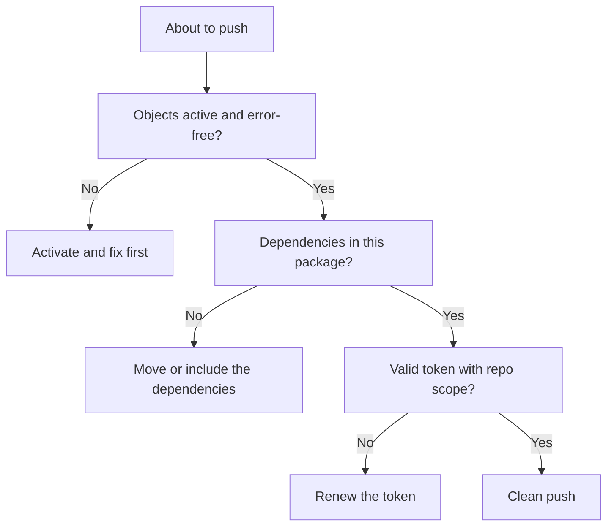

abapGit is solid, but it isn't magic. After a few projects you learn that the problems are almost always the same five or six, and all of them are avoidable. This is the honest list of what goes wrong and how not to step in the puddle.

## The typical mistakes

- **Unsupported objects**: not every development object serializes. abapGit supports classes, CDS, reports, structures, tables and a long list more, but there are exotic or heavily configuration-dependent types that don't travel. If an object doesn't show up in staging, check whether the type is supported before assuming a bug.
- **Phantom dependencies**: a push carries the objects in your package, not the objects in other packages you depend on. You pull in the target, activate, and it blows up because a dictionary element or a base class that lived in another package is missing. **The repo doesn't resolve dependencies for you.**
- **Expired token or missing permissions**: the classic Personal Access Token defaults to 30 days and needs the `repo` scope. The day it expires, every push fails with an authentication error that misleads you.
- **Badly set master language**: if `.abapgit.xml` declares a master language different from your texts, texts serialize oddly or get lost between pull and push.
- **Inactive objects**: pushing objects with syntax errors or inactive puts garbage into the repo. Activate before you confirm.

## The best practices

Nothing revolutionary, all of it what experience keeps repeating:

- **One self-contained package per repo**: group into the package everything that forms a logical, deployable unit, so a pull brings something that activates with nothing missing.
- **Small commits with a real message**: we've said it, but it's the practice that gets you the most out of the history.
- **Always activate before confirming**: the repo should contain only code that compiles.
- **Token with controlled expiry**: note the expiry date and renew it before, not once it has already broken your pipeline. Use the minimum scope needed (`repo`).
- **Set `.abapgit.xml` at the start**: master language and folder logic decided in the first commit, not mid-project.
- **Review the diff before the push**: abapGit shows you what's about to change. Look at it. Accidental pushes of objects you didn't want to move are among the most common mistakes.

> abapGit's costliest failure isn't a tool bug: it's pulling into the wrong system or pushing a package with dependencies left behind. The tool does exactly what you ask. Professionalism is in asking it the right thing.

In short: abapGit almost never fails on its own. It fails when you feed it inactive objects, incomplete dependencies or a dead token. Control those three fronts and the rest of the cycle (staging, commit, push, pull) is as boring and reliable as good tooling should be.
