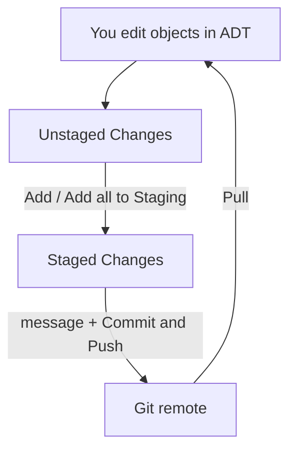

Once you have the package linked to an online repo, the thing you'll do every day begins: prepare changes, confirm them and send them. abapGit doesn't reinvent Git, it **translates it into ADT**. If you understand Git's `add > commit > push` cycle, you already know abapGit; only the wrapper changes.

## The daily cycle

The **abapGit Staging** view is the operations center. It splits your changes into two zones:

- **Unstaged Changes**: modified objects you haven't marked for commit yet.
- **Staged Changes**: what will go into the next commit.



The mapping to terminal Git is direct:

```text
Drag to Staged Changes          ->  git add
Commit Message + Commit & Push  ->  git commit && git push
Open in abapGit Staging         ->  open the repo to work
Pull                            ->  git pull
```

Moving all the package's objects at once is done with **Add all to Staging Area**. Then you write the message in **Commit Message** and hit **Commit and Push**. abapGit will ask for user and token if you didn't provide them when linking.

## Commit messages that help

A commit isn't a save button. It's a history entry someone will read a year from now, maybe you:

- Bad: `changes`, `fix`, `.`
- Good: `Add currency validation in create_project`

Each commit should be one logical unit: a change that makes sense, not "everything I touched today". That's what makes the history worth something when you go looking for when and why something broke.

## Branches: where abapGit stops being a backup and becomes version control

Always working against `main` is fine for a one-person sandbox. As soon as there's more than one developer, or you want to isolate an experiment, you need **branches**:

- You create a branch (say `feature/new-validation`) from the repositories view.
- abapGit positions you on that branch: your commits go there, not to `main`.
- When the work is ready, it's integrated into `main` via a pull request on GitHub, review included.

The tricky bit in ABAP: **the system only holds one active version of each object**. Switching branch in abapGit brings that branch's version into the system (a pull), so you can't keep two branches "live" simultaneously in the same package of the same system the way you would on your laptop with local Git. That's why feature branches usually live in separate systems or packages, or get integrated quickly.

> abapGit doesn't force you to use branches, just as Git doesn't. But always working on `main` with several developers is asking for a conflict. The branch isn't bureaucracy: it's the place where your experiment doesn't break someone else's work.

The mature flow: branch per feature, small descriptive commits, frequent push, pull before starting the day so you don't diverge. Boring, yes. Which is exactly why it works.
