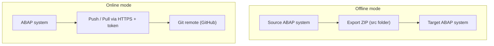

When you link a package in abapGit, the first decision isn't the repo name: it's **whether the repository will be connected to a remote or not**. abapGit supports two modes, online and offline, and confusing them is the number one cause of broken workflows I've seen on projects.

## Online repository

An online repo is **linked to a remote Git URL** (GitHub, GitLab, Azure Repos, whatever). abapGit talks directly to that remote:

- You `pull` to bring changes from the remote into the ABAP system.
- You `push` (commit and push) to send your objects to the remote.
- It requires the ABAP system to have **HTTPS egress** to the remote and a **Personal Access Token** to authenticate.

It's the default mode and the one you want whenever the system has connectivity. The whole versioning cycle happens without leaving ADT.

## Offline repository

An offline repo **has no remote**. abapGit still serializes your objects, but instead of pushing them to GitHub, it produces a **ZIP** you download. And the other way around: you import a ZIP to bring code into a system.



Offline exists for one very concrete reason: **systems with no internet access**. Many SAP production environments sit behind firewalls that will never let a request reach github.com. There, the ZIP is your only bridge.

## When to use each

- **Online** for daily development, sandboxes, training and any system with internet egress. That's where it shines: history, branches, collaboration.
- **Offline** to move code to isolated systems, to hand a snapshot to a customer who doesn't share your GitHub, or to archive a specific version as an artifact.

A common, very useful pattern: you develop on an online system against GitHub, and for the isolated production system you export a ZIP from the repo and import it there.

```text
Online repo (dev)  --push-->  GitHub  --clone/download ZIP-->  Offline repo (isolated prod)
```

> Online isn't "better" than offline. Offline isn't a degraded mode: it's the correct answer when the network says no. Choose by your landscape topology, not by fashion.

The practical rule: if the system can reach the remote, go online without hesitation. If it can't, go offline and stay disciplined with the ZIPs. What you must not do is force online on a system without connectivity and burn half a morning fighting proxy timeouts.
