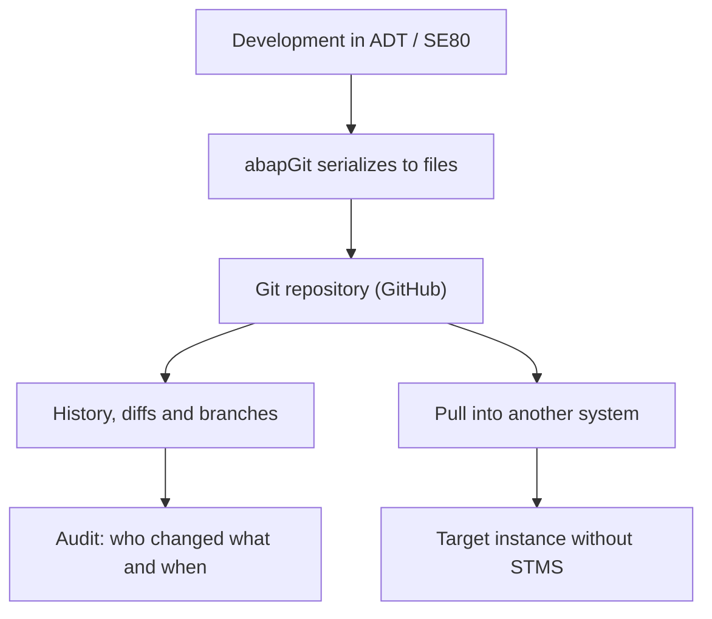

For twenty years, version control in ABAP was a database table and a transport request. It worked, but nobody in the wider software world would call that version control. **abapGit changes that**: it's a Git client written in ABAP that runs inside the system itself and serializes your development objects into files Git understands.

## What it actually is

abapGit is an open source tool, created and maintained by Lars Hvam, compatible from ABAP 702 SP8 onwards. The idea is simple and powerful at once:

- It takes your development objects (classes, CDS, reports, structures) and **serializes them into text files** inside a `src` folder.
- Those files live in a Git repository, usually on GitHub.
- From there you can import and export them between systems, view diffs, create branches and roll back.

The key point: it doesn't replace the standard transport, it **coexists** with it. abapGit isn't some obscure proprietary plugin; it's part of the ABAP open source ecosystem you can find catalogued at `dotabap.org`, alongside abaplint and others.

## Why version ABAP for real



The benefits are not theoretical:

- **Real history**: every commit carries author, date and message. You know why each line exists.
- **Readable diffs**: comparing two versions of a class is a text diff, not opening two SE80 windows and squinting.
- **Live backup**: if a training system or a sandbox gets recreated, your code is safe in the repository.
- **Collaboration**: branches, pull requests and reviews, the same practices the rest of the industry uses.

## The plugin in ADT

In ABAP Cloud and modern on-premise you use the abapGit plugin for ADT (Eclipse). You install it from `https://eclipse.abapgit.org/updatesite/` via **Help > Install New Software**, and it shows up with two key views:

```text
Window > Show View > Other... > abapGit
  - abapGit Repositories   (link and manage repos)
  - abapGit Staging        (prepare and confirm changes)
```

With that you get the whole Git cycle inside the IDE you already work in, without dropping to a terminal.

> The transport tells you what changed. Git tells you why it changed, who did it and how to undo it. That difference is what separates a maintainable codebase from an archaeological mystery.

In the next posts we go into the detail: online vs offline repos, the anatomy of `.abapgit.xml`, branch-based workflows, and why abapGit can move code between systems without touching STMS.
