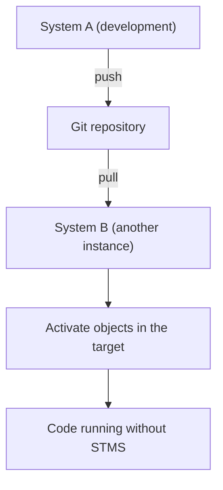

Here's the abapGit capability that keeps some administrators up at night: **it can move objects from one ABAP system to another without STMS**, without a transport request, without the official DEV > QAS > PRD path. The Git repository is the vehicle. It's powerful. It's also easy to misuse.

## How the move works

The mechanism is the same old push/pull, just repurposed as a bridge between systems:

1. On the source system, you push the package to the repository.
2. On the target system, you link the same repository to a package.
3. You pull: abapGit creates or updates the objects in the target.
4. You activate and you're done. No transport request crossed the landscape.

For isolated systems, the same result is achieved with an offline ZIP instead of the remote.

## When this is exactly what you want

- **Sandboxes and training**: carry an example to several practice instances without setting up transport routes.
- **Systems with no shared STMS**: two landscapes that don't share a transport domain, for example a customer and your internal environment.
- **Sharing open source code**: installing a community tool (abapGit itself installs this way) or handing a component to a third party.
- **Recovering after recreating a system**: a sandbox that gets destroyed and stood up from scratch recovers its code with a pull.

## When you should NOT do it

And here comes the part people would rather not hear. In a governed production landscape, **STMS exists for good reasons**:

- The transport records, approves and orders changes towards production. An abapGit pull bypasses that control.
- STMS manages dependencies and import sequence. abapGit brings whatever is on the branch, without the transport system's safety net.
- Audit and compliance in many organizations **require** the STMS trail into production.

> abapGit can bypass STMS. That it can doesn't mean you should. For sandboxes and shared code it's a blessing. For the path to production in a governed system, skipping the transport means skipping the controls, and that isn't agility, it's risk debt.

The line I draw: use abapGit to **move code between development, training and isolated systems**, and to **distribute** components. Leave the path to production to STMS unless your organization has consciously, and in writing, decided otherwise. The tool is fantastic; the discipline of knowing where to stop is what separates the professional from the one who someday pulls unreviewed into the wrong system.
