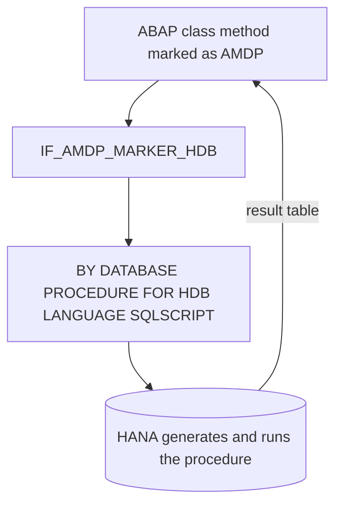

When ABAP SQL falls short (you need procedural logic, intermediate tables, several stateful steps executed inside HANA) **AMDP: ABAP Managed Database Procedure** steps in. It's a class-based ABAP framework to write and call HANA stored procedures **without connecting to the database** and without a database user.

## What it is and what it saves you

An AMDP is a HANA procedure whose body is written in SQLScript but lives inside a method of an ABAP class. Two non-trivial advantages:

- **No database user**: the procedure is generated in HANA the first time the method runs and updated every time you change the method in ABAP.
- **Transported like a normal class**: it goes into the transport request like any ABAP object. There's no separate database artifact to manage.

It only works on HANA. From ABAP 7.50, besides procedures, AMDP supports functions with a tabular return value.



## The declaration rules you must respect

The class implements the marker interface `IF_AMDP_MARKER_HDB`. The method is static, all input and output parameters are passed **by value** (no `RETURNING`), and the implementation declares the database procedure clauses:

```abap
CLASS zcl_amdp_flights DEFINITION PUBLIC.
  PUBLIC SECTION.
    INTERFACES if_amdp_marker_hdb.
    CLASS-METHODS get_flights
      IMPORTING VALUE(iv_carrid) TYPE s_carr_id
      EXPORTING VALUE(et_flights) TYPE tt_flights.
ENDCLASS.

CLASS zcl_amdp_flights IMPLEMENTATION.
  METHOD get_flights
    BY DATABASE PROCEDURE FOR HDB
    LANGUAGE SQLSCRIPT
    OPTIONS READ-ONLY
    USING sflight.

    et_flights = SELECT carrid, connid, fldate, price, currency
                   FROM sflight
                  WHERE carrid = :iv_carrid;
  ENDMETHOD.
ENDCLASS.
```

Note `USING sflight`: every dictionary table you use inside the AMDP must be declared. And `OPTIONS READ-ONLY` when you only read, which also helps the optimizer.

## Called like a method, debugged like code

From ABAP the call is that of any class method. And since 7.5 you can debug the AMDP step by step: you set breakpoints on the application server and in the AMDP, and the debugger hops between the ABAP thread and HANA's database thread with no extra setup. It's one of the things that surprises people coming from native SQL, where debugging was an act of faith.

> AMDP is powerful precisely because it's the escape hatch. If you're using it for something a `SELECT` with `CASE` already solved, you added complexity for nothing.

The rule is simple: ABAP SQL first, and only when procedural logic demands it, AMDP. In the next post we combine it with CDS through Table Functions, which is where AMDP truly shines.
