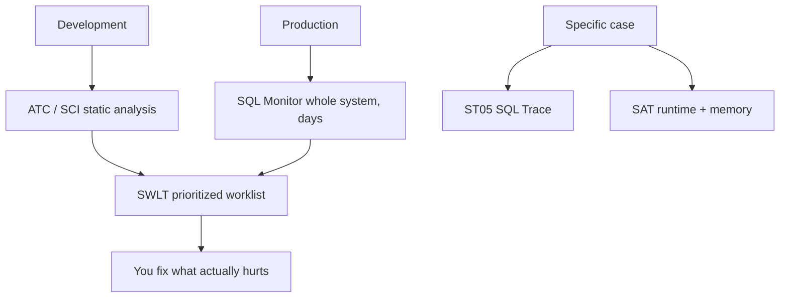

The worst optimization is the one you do on a hunch. You change a `SELECT`, feel better, and measured nothing. HANA and ABAP ship an arsenal of analysis tools, and the usual mistake is not knowing which to use when. Each one answers a different question.

## The tooling map

- **ATC (ABAP Test Cockpit) and SCI (Code Inspector)**: **static** analysis. They review the code without running it: syntax, conventions, suspicious performance patterns. Ideal during development and as a Q-Gate when releasing transports. Careful: static analysis doesn't predict real performance, it only flags smells.
- **ST05 (SQL Trace)**: the classic tool for one specific case. You run the program (several times, to fill buffers) and see each SQL statement with its time. Only one trace active per application server, so switch it off as soon as you're done.
- **SAT (Runtime Analysis, successor to SE30)**: runtime analysis of one specific program, including memory consumption. For when the bottleneck isn't only the SQL.
- **SQLM (SQL Monitor)**: the gem for production. It monitors **all** SQL statements across an entire system for days, with negligible overhead, and links each one to its business process.
- **SWLT (SQL Performance Tuning Worklist)**: combines the static (ATC/SCI) with the dynamic (SQLM) into a single worklist prioritized by impact.

## Why SQLM changes the game

Before migrating to HANA or S/4HANA you must review your custom code, and the right question isn't "which SELECT looks ugly?" but "which SELECT actually consumes database time in the real business processes?". ST05 and SAT trace one-off requests; they aren't meant to watch a system for weeks.

SQLM is. It traces Open SQL, CDS, ADBC, native SQL and AMDP; it aggregates statistics (number of executions, max, min, average times and standard deviation); and it identifies the entry point (transaction, report, RFC or URL) of each statement. Its collection is kernel-optimized, so you can leave it running in production without fear.

## The order that works

1. In development, **ATC** warns you as you type. Cheap and constant.
2. In production, **SQLM** tells you what actually hurts, with data, not opinions.
3. **SWLT** crosses both and gives you a list ordered by business relevance.
4. For the specific case you've already isolated, you drop to **ST05** and **SAT**.

> Static analysis tells you what might go wrong; dynamic analysis tells you what's actually going wrong. Optimizing with only the first is polishing code nobody runs.

That closes the ABAP for HANA series. From the code-to-data paradigm to the tools to verify it: the same idea runs through all of it, push the work to the database and measure before you touch anything.
