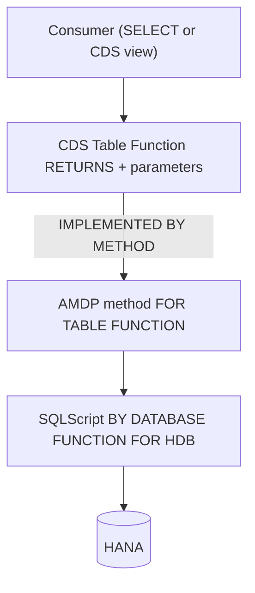

Regular CDS views are declarative: a `SELECT` with joins, associations and aggregations. Powerful, but there's a ceiling. When the logic demands procedural SQLScript (loops, intermediate tables, something a `define view` can't express) **CDS Table Functions** come in. They're CDS objects that extend modeling with HANA's code-pushdown capability, implemented by an AMDP method.

## Two pieces wired together

A Table Function isn't a single object: it's two artifacts pointing at each other.

- **The CDS object**: declares the input parameters and, in `RETURNS`, the tabular structure. The `IMPLEMENTED BY METHOD` clause names the class and AMDP method that resolve it.
- **The AMDP class**: implements the logic in SQLScript. The definition is marked `FOR TABLE FUNCTION` with the CDS name; the implementation uses `BY DATABASE FUNCTION FOR HDB LANGUAGE SQLSCRIPT`.



The CDS object looks like this:

```abap
@ClientDependent: true
define table function ZTF_SALES_BY_CARRIER
  with parameters @Environment.systemField: #CLIENT
                  p_clnt : abap.clnt
  returns { client   : s_mandt;
            carrid   : s_carr_id;
            total    : s_price; }
  implemented by method zcl_tf_sales=>get_sales_by_carrier;
```

And the AMDP method that implements it:

```abap
METHOD get_sales_by_carrier
  BY DATABASE FUNCTION FOR HDB
  LANGUAGE SQLSCRIPT
  OPTIONS READ-ONLY
  USING sflight.

  RETURN SELECT mandt AS client,
                carrid,
                SUM( price ) AS total
           FROM sflight
          WHERE mandt = :p_clnt
          GROUP BY mandt, carrid;
ENDMETHOD.
```

The best part comes next: that Table Function is consumed like any CDS source. You can `SELECT` from it or use it inside another CDS view. You model as CDS, you execute as SQLScript.

## The detail that trips people up: SELECT-OPTIONS

Table Functions **do not support SELECT-OPTIONS filtering** natively. It's a real limitation that surprises everyone on their first project. The pattern to solve it:

- Declare a long `CHAR` parameter in the Table Function that carries the dynamically built filter.
- In the AMDP method apply that filter with the `APPLY_FILTER` function.
- In the program, build the `SELECT-OPTIONS` string with `CL_SHDB_SELTAB=>COMBINE_SELTABS`, which returns the filter as a `STRING` ready to pass into the parameter.

It isn't elegant, but it's the supported path, and once you've wired it up it's reusable.

> A Table Function is the right answer to a very specific question: "I need SQLScript but I want to consume it as CDS". If you're not asking that question, you don't need it.

That closes the trio of code-to-data, AMDP and Table Functions. The next posts get practical: the golden rule of SELECT and HANA's tooling to measure instead of guess.
