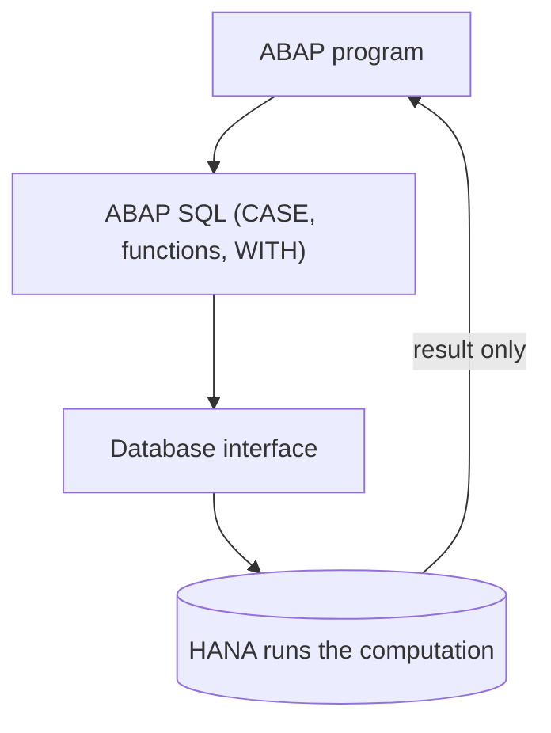

Code-to-data is the principle; **code pushdown** is the technique. Pushing means writing the logic so the database executes it instead of the application server. The good news: modern ABAP SQL (from 7.40) brings almost everything you need without dropping to native SQL or AMDP.

## What you can already push with ABAP SQL

- **CASE expressions**, simple and complex, to classify without an ABAP `IF`.
- **SQL functions**: numeric (`ROUND`, `DIV`, `MOD`, `ABS`), string (`CONCAT`, `SUBSTRING`, `UPPER`, `LPAD`), date (`DATS_DAYS_BETWEEN`, `DATS_ADD_MONTHS`) and conversion (`CURRENCY_CONVERSION`, `UNIT_CONVERSION`).
- **CTEs with WITH**: break a complex query into named steps, all in a single trip to the database.
- **Set operators**: `UNION`, `INTERSECT`, `EXCEPT`.



## A CASE that used to be a LOOP

Classifying orders by amount used to be a loop with `IF`. Pushed to HANA it becomes a computed column:

```abap
SELECT vbeln,
       netwr,
       CASE WHEN netwr >= 100000 THEN 'A'
            WHEN netwr >= 10000  THEN 'B'
            ELSE 'C'
       END AS category
  FROM vbak
  WHERE erdat >= @lv_from
  INTO TABLE @DATA(lt_orders).
```

No `LOOP`, no `IF`, no fetching `netwr` just to compare it in ABAP. HANA evaluates the `CASE` row by row in memory and returns the category already computed.

## Decompose with WITH instead of chaining SELECTs

When the logic has several steps, the temptation is three SELECTs stitched together in ABAP. With a CTE you do it in a single trip:

```abap
WITH
  +sales AS ( SELECT carrid, SUM( price ) AS total
                FROM sflight
                GROUP BY carrid )
  SELECT c~carrname, s~total
    FROM +sales AS s
    INNER JOIN scarr AS c ON c~carrid = s~carrid
    ORDER BY s~total DESCENDING
    INTO TABLE @DATA(lt_ranking).
```

## How far to push: hints are the last resort

ABAP SQL lets you force the optimizer with `%_HINTS`, telling it which index to use, for example. It sounds tempting and it's almost always a mistake. A hint freezes a decision the database would make better on its own, and you must review it on every version upgrade or configuration change.

> Hints are the aspirin of performance: they relieve one specific symptom, they don't cure the design. Use them when everything else has failed and document why.

Pushdown has a natural limit: purely declarative logic (aggregate, filter, transform) pushes beautifully. Complex procedural logic, with loops and state, is where AMDP comes in. That's the next post.
