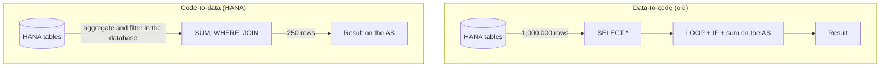

For twenty years classic ABAP did the opposite of what made sense: it pulled raw data up to the application server and processed it there, row by row, inside a `LOOP`. With slow disks and dumb databases that had some logic. With HANA, it doesn't. The **code-to-data** paradigm flips the rule: **push the computation to where the data lives**, not the other way round.

## Data-to-code versus code-to-data

- **Data-to-code (the old pattern)**: `SELECT *`, everything into an internal table, then ABAP sums, filters and groups in memory. The database only reads; the heavy lifting happens on the AS.
- **Code-to-data (the HANA pattern)**: aggregation, filtering and joins are expressed in SQL and run by the database. Only the reduced result reaches the AS.

The difference isn't cosmetic. Moving a million rows across the database interface to discard 99% in an `IF` is exactly the waste HANA was designed to eliminate.



## The antipattern you'll find in every legacy system

```abap
" NO: fetch everything and sum in memory
DATA lv_total TYPE p DECIMALS 2.
SELECT * FROM vbap INTO TABLE @DATA(lt_items).
LOOP AT lt_items INTO DATA(ls_item).
  IF ls_item-matnr = lv_matnr.
    lv_total = lv_total + ls_item-netwr.
  ENDIF.
ENDLOOP.
```

That code reads the whole item table, copies it entirely to the AS and throws almost all of it away. The code-to-data version lets HANA do the work:

```abap
" YES: the database aggregates and returns only the total
SELECT SUM( netwr ) AS total
  FROM vbap
  WHERE matnr = @lv_matnr
  INTO @DATA(lv_total).
```

One row travels the wire instead of a million. And HANA, columnar and in-memory, sums that column at a speed no ABAP `LOOP` will ever match.

## It's not just SUM

Code-to-data covers much more than aggregation. It's pushing `CASE` expressions, SQL functions (`CONCAT`, `SUBSTRING`, `ROUND`), currency conversion with `CURRENCY_CONVERSION`, common table expressions with `WITH`. Everything you used to do in ABAP with loops and function calls now has an equivalent that runs inside HANA.

> Mental rule: if you're about to write a `LOOP` to compute something the database already knows how to compute, you've pulled the data too far.

Next post we go deeper: what code pushdown actually is, how to tell whether your SELECT exploits it, and where the optimizer stops helping you.
