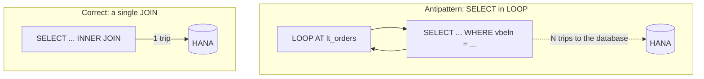

There's a dangerous belief: "since we run on HANA now, performance no longer matters". It's false. HANA is brutally fast, but a badly written `SELECT` is still a badly written `SELECT`, and on a columnar in-memory database some mistakes hurt even more. These are the rules we don't negotiate.

## Rule 1: never SELECT *

`SELECT *` fetches every column, and HANA stores data by column. Asking for columns you don't use forces the database to reconstruct full rows and move bytes you'll throw away. Always specify the fields:

```abap
" NO
SELECT * FROM vbak INTO TABLE @DATA(lt_all).

" YES: only what you need
SELECT vbeln, erdat, netwr, waerk
  FROM vbak
  WHERE vkorg = @lv_vkorg
  INTO TABLE @DATA(lt_orders).
```

## Rule 2: never a SELECT inside a LOOP

This is the cardinal sin. One `SELECT` per iteration means a thousand, ten thousand or a million trips to the database. The fix is to read everything at once and use `FOR ALL ENTRIES` or, better, a `JOIN`.



```abap
" YES: one JOIN instead of N SELECTs
SELECT k~vbeln, k~erdat, p~posnr, p~netwr
  FROM vbak AS k
  INNER JOIN vbap AS p ON p~vbeln = k~vbeln
  WHERE k~vkorg = @lv_vkorg
  INTO TABLE @DATA(lt_result).
```

## Rule 3: filter and aggregate in the database, not in ABAP

This is code-to-data in one sentence. Every `WHERE`, `SUM`, `GROUP BY` and `CASE` you can push, push it. If your program reads a million rows to keep two hundred, you put the filter in the wrong place.

## Rule 4: beware of empty FOR ALL ENTRIES

`FOR ALL ENTRIES` over an empty internal table **reads the entire database table**, ignoring the `WHERE` that depended on it. Always check the table isn't empty first:

```abap
IF lt_keys IS NOT INITIAL.
  SELECT vbeln, netwr FROM vbak
    FOR ALL ENTRIES IN @lt_keys
    WHERE vbeln = @lt_keys-vbeln
    INTO TABLE @DATA(lt_data).
ENDIF.
```

## Rule 5: measure, don't guess

Performance intuition fails. Before optimizing, measure with the SQL Trace (ST05) or the SQL Monitor (SQLM). The code you think is slow sometimes isn't, and the real bottleneck is almost always where you weren't looking.

> HANA doesn't fix bad SQL, it makes it faster. A `SELECT` in a `LOOP` on HANA is still a `SELECT` in a `LOOP`: it just takes less time to hurt you.

These rules are the minimum hygiene. To go from hygiene to engineering you have to measure for real, and that's where HANA's analysis tooling comes in. That's the last post.
