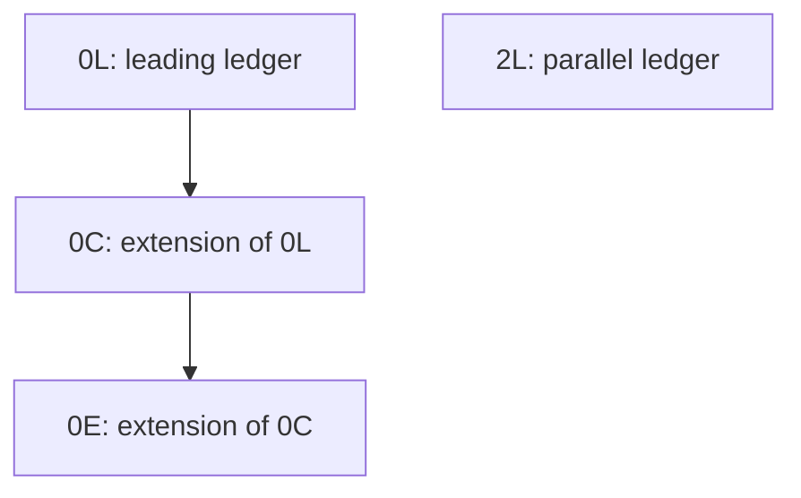
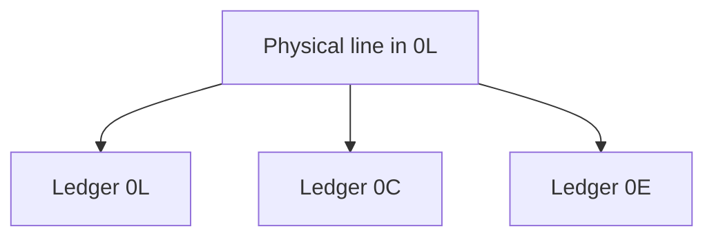

In SAP S/4HANA, the same journal entry line item can appear once, twice or four times depending on where it is read from and how it is filtered. This is not a data error: it is the way the Universal Journal combines the standard ledgers with the extension ledgers. A query that does not take that combination into account returns a plausible and wrong amount, without any warning.

This second article in the SAP FI Journal Entry series explains the mechanism using a real journal entry from an SAP S/4HANA 2025 system, measures the result of each way of filtering and sets out the rule, along with its limits. All queries were run on September 30, 2026.

## Standard ledger and extension ledger

- A **standard ledger** is self-contained: it contains all its line items. There is one leading ledger and there can be non-leading ledgers, for example to valuate with another accounting principle.
- An **extension ledger** (the Spanish dictionary translates it as "ledger de apéndice") is defined on a base ledger and contains only its own journal entries. Its content is that of the base ledger plus those entries. The advantage is one of volume: a thousand adjustments occupy a thousand rows, not a copy of the base ledger.

The configuration of the test system, read from table `FINSC_LEDGER` and `I_LedgerText`:

| Ledger | Name | Type | Leading |
|---|---|---|---|
| `0L` | Ledger 0L | Standard ledger | Yes |
| `2L` | Ledger 2L | Standard ledger | No |
| `0C` | Accounting | Extension ledger | No |
| `0E` | Commitment/Forecast | Extension ledger | No |

The released view `I_LedgerSourceLedger` indicates which source ledgers each ledger is fed from:

| Ledger | Source ledgers |
|---|---|
| `0L` | `0L` |
| `2L` | `2L` |
| `0C` | `0C`, `0L` |
| `0E` | `0E`, `0C`, `0L` |

Extension ledgers can be stacked: `0E` is not based directly on `0L`, but on `0C`, which in turn is based on `0L`.



## What ACDOCA stores: four rows

The test system contains a two-line journal entry in company code 1010. The Universal Journal table stores it like this:

```sql
SELECT rldnr, rbukrs, gjahr, belnr, docln, racct, hsl, rhcur
  FROM acdoca
  ORDER BY belnr, docln, rldnr
```

| `RLDNR` | `BELNR` | `DOCLN` | `RACCT` | `HSL` |
|---|---|---|---|---|
| 0L | 0100000000 | 000001 | 0011001000 | 1,003.00 |
| 2L | 0100000000 | 000001 | 0011001000 | 1,003.00 |
| 0L | 0100000000 | 000002 | 0011001090 | -1,003.00 |
| 2L | 0100000000 | 000002 | 0011001090 | -1,003.00 |

Each line exists once per standard ledger. There are no rows for the extension ledgers, because none of them has entries of its own.

### The first obvious solution: filter the table by the extension ledger

```sql
SELECT COUNT(*) FROM acdoca WHERE rldnr = '0E'
```

The query returns **0 rows**. The immediate conclusion, that ledger `0E` has no postings, is wrong: `0E` contains all the lines from `0L` and `0C`. The inheritance is not materialized in the table, and a direct read of ACDOCA loses it. This is one of the reasons why SAP marks the table as not released, as explained in [the first article of the series](/blog/vistas-cds-liberadas-journal-entry/).

## What I_JournalEntryItem returns: eight rows

The same information, read with the released view:

```sql
SELECT Ledger, SourceLedger, CompanyCode, AccountingDocument,
       LedgerGLLineItem, GLAccount, AmountInCompanyCodeCurrency
  FROM I_JournalEntryItem
  ORDER BY AccountingDocument, LedgerGLLineItem, Ledger
```

| `Ledger` | `SourceLedger` | `LedgerGLLineItem` | `GLAccount` | Amount |
|---|---|---|---|---|
| 0C | 0L | 000001 | 0011001000 | 1,003.00 |
| 0E | 0L | 000001 | 0011001000 | 1,003.00 |
| 0L | 0L | 000001 | 0011001000 | 1,003.00 |
| 2L | 2L | 000001 | 0011001000 | 1,003.00 |
| 0C | 0L | 000002 | 0011001090 | -1,003.00 |
| 0E | 0L | 000002 | 0011001090 | -1,003.00 |
| 0L | 0L | 000002 | 0011001090 | -1,003.00 |
| 2L | 2L | 000002 | 0011001090 | -1,003.00 |

The view does not duplicate data: it resolves the inheritance that the table does not contain. To do this, its key includes two ledger fields with different meanings:

- **`SourceLedger`** is the source ledger: the one in which the line was physically posted. It comes directly from the `RLDNR` field in ACDOCA.
- **`Ledger`** is the ledger from which it is viewed: the source ledger itself or any extension ledger that includes it.

The mechanism lies in the definition of the view. Each physical line is joined with all rows of the ledger mapping that have that source ledger in that company:

```cds
define view entity I_JournalEntryItem
as select from I_GLAccountLineItemRawData as I_GLAccountLineItemRawData
     inner join   I_CoCodeLedgerSourceLedger  on  I_GLAccountLineItemRawData.SourceLedger = I_CoCodeLedgerSourceLedger.SourceLedger
                                              and I_GLAccountLineItemRawData.CompanyCode  = I_CoCodeLedgerSourceLedger.CompanyCode
// ...
key I_GLAccountLineItemRawData.SourceLedger,
// ...
key I_CoCodeLedgerSourceLedger.Ledger,
```

A line posted in `0L` therefore appears three times:



## Five ways to filter, five results

Actual amount of account `0011001000` in any of the ledgers: **1,003.00 EUR**. Result of each filter on `I_JournalEntryItem`, measured in the test system:

| Filter | Rows | Amount | Reading |
|---|---|---|---|
| No ledger filter | 4 | 4,012.00 | Adds up all four ledgers |
| `SourceLedger = '0L'` | 3 | 3,009.00 | The same physical line, seen from 0L, 0C and 0E |
| `Ledger IN ('0L', '0E')` | 2 | 2,006.00 | Two ledgers that contain the same line |
| `Ledger = '0L'` | 1 | 1,003.00 | Correct |
| `Ledger = '0E'` | 1 | 1,003.00 | Correct: the line inherited from 0L |

### The second obvious solution: filter the source ledger

Filtering `SourceLedger = '0L'` seems like the way to keep only what was posted in the leading ledger. The result is three times the actual amount, because the same physical line appears once for each ledger that includes it. The error is not detected by looking at the number: in this system the factor is three because there are two extension ledgers on `0L`; in another system it will be different.

## The rule: filter Ledger with a single value

On `I_JournalEntryItem`, every sum filters `Ledger` with a single value, the one for the ledger to be queried:

```abap
SELECT FROM I_JournalEntryItem
  FIELDS GLAccount, CompanyCodeCurrency,
         SUM( AmountInCompanyCodeCurrency ) AS Amount
  WHERE Ledger      = @lv_ledger
    AND CompanyCode = @lv_company_code
    AND FiscalYear  = @lv_fiscal_year
  GROUP BY GLAccount, CompanyCodeCurrency
  INTO TABLE @DATA(lt_totals).
```

In a custom CDS view built on top, the ledger arrives as a parameter or as a mandatory filter of the consumption view, never as an optional value that the consumer can omit. The article [Parameters in CDS](/en/blog/cds-parametros/) develops that pattern.

`SourceLedger` has a legitimate use: breaking down an already fixed ledger by origin.

```sql
SELECT SourceLedger, COUNT(*) AS filas, SUM( AmountInCompanyCodeCurrency ) AS importe
  FROM I_JournalEntryItem
  WHERE Ledger = '0E'
  GROUP BY SourceLedger
```

In the test system only `0L` appears, because `0C` and `0E` do not have their own journal entries. According to the mapping of `I_LedgerSourceLedger`, in a system with own journal entries in both ledgers, `0C` and `0E` would also appear, and the combination `Ledger = '0E' AND SourceLedger = '0E'` would isolate the own adjustments of `0E`.

## Limits

1. **The carry-forward of balances.** `I_JournalEntryItem` does not include the carry-forward of balances from period 000. For balance sheet balances, the view is `I_GLAccountLineItem`, which uses the same union with the ledger mapping and is therefore filtered with the same rule.
2. **The raw view does not resolve inheritance.** `I_GLAccountLineItemRawData` only has `SourceLedger`. SAP's comment in the view itself warns that its result is incomplete for ledgers that are not leading ledgers.
3. **The assignment to the company code.** The union includes the company code: an extension ledger only projects lines in the company codes to which it is assigned. In the test system, company code 1010 has all four ledgers assigned.
4. **Stacked ledgers.** Filtering an extension ledger also returns the lines of all the ledgers it is built on: `0E` includes `0L` and `0C`.
5. **The parallel ledger is not an extension.** `2L` has its own lines, with `Ledger` and `SourceLedger` being the same. Adding it together with `0L` mixes two valuations of the same journal entry.
6. **The volume.** Without a ledger filter, the view returns one row for each combination of line and ledger: in the test system, 8 rows where the table has 4. The ledger filter must reach the view from the very first moment.
7. **ABAP Cloud.** `I_LedgerSourceLedger` appears in the catalog of objects released for cloud development, so the mapping between ledgers can also be queried from a custom development in ABAP Cloud.

## Summary

1. ACDOCA only contains what has been physically posted: an extension ledger without its own entries has no rows in the table.
2. `I_JournalEntryItem` projects each line once for each ledger that includes it. `SourceLedger` indicates where it was posted; `Ledger`, which ledger it is viewed from.
3. Each sum filters `Ledger` with a single value. Filtering only `SourceLedger`, or several ledgers at once, multiplies the amount.
4. `SourceLedger` is used to break down an already fixed ledger by origin.
5. For balance sheet balances, `I_GLAccountLineItem` is used, with the same filtering rule.

Work with CDS views on the Universal Journal is developed through guided exercises in the course [SAP ABAP Cloud CDS: Core Data Services](/courses/sap-abap-cloud-cds-core-data-services/) and in the book [ABAP Cloud: Data Modeling with CDS](/books/abap-cds/).
