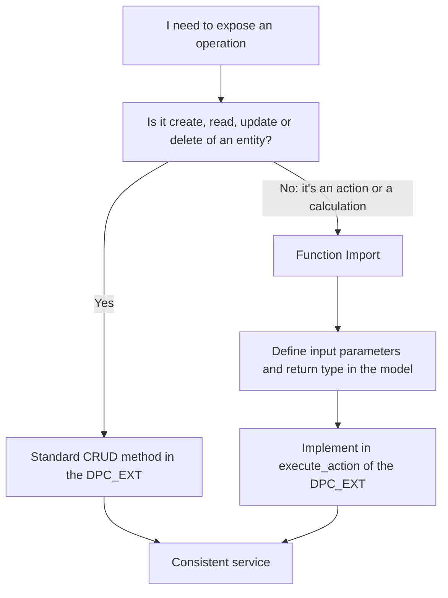

Every OData service starts with the same four operations: create, read, update, delete. And almost everything fits there. The problem appears with operation number five: "I want an endpoint that queries the status of a payment". That's not a CREATE, not a DELETE, it doesn't fit CRUD. That's where people start forcing things, and that's where the Function Import comes in.

## CRUD, each operation in its method

In the classic Gateway model, each operation of an entity is a specific method you redefine in the DPC_EXT:

```abap
" CustomersSet entity: full CRUD
METHOD customersset_create_entity.   " CREATE: add a customer
ENDMETHOD.

METHOD customersset_get_entity.      " READ:   one customer by key
ENDMETHOD.

METHOD customersset_get_entityset.   " QUERY:  list of customers
ENDMETHOD.

METHOD customersset_update_entity.   " UPDATE: modify a customer
ENDMETHOD.

METHOD customersset_delete_entity.   " DELETE: remove a customer
ENDMETHOD.
```

The rule is simple: **one operation per method, one entity per set**. If you catch yourself putting an `IF operation = 'check_status'` inside a GET_ENTITYSET, stop. That's not CRUD.

## The Function Import: the operation that isn't CRUD

A Function Import is an operation with its own name, with input parameters, that returns whatever you decide. The canonical example: a `PaymentStatus` that takes a payment identifier and returns its status. It creates nothing, deletes nothing, fits no letter of CRUD.



In SEGW you define the Function Import in the model (name, parameters, return type) and implement it in the DPC_EXT's generic action-execution method, branching on the function name. That's the legitimate place for logic that isn't CRUD.

## The mistake that dirties the service

Putting business logic inside CRUD because "it's faster". A GET that also fires a calculation, a CREATE that also sends an email. It works day one and dooms you after: a client that only wanted to read ends up triggering side effects nobody expects from a GET.

Also, there are operations neither CRUD nor Function Import cover well: **deep entity**, where you create or read a header with its items in a single call (say a customer with its orders). Those have their own pair of methods, and deserve their own post.

> CRUD isn't an obligation to cram everything inside. It's a contract: if the operation isn't one of the four letters, don't disguise it as CRUD. Give it a Function Import and keep the service readable.

Next post: expand and navigation through associations, how to bring a header and its items without making ten calls.
