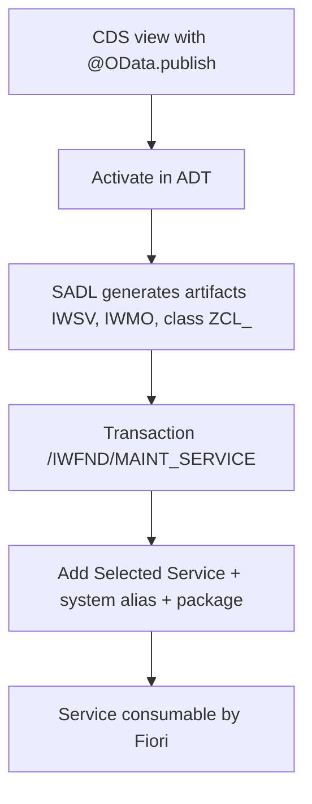

Exposing data as OData from ABAP had a before and after the day `@OData.publish: true` appeared. Suddenly a CDS view became a service with one line. Good. But like every shortcut, it has fine print, and on a project you need to know when the shortcut is fine and when you need the long road (Service Definition plus Service Binding).

## The shortcut: @OData.publish

You put the annotation on the view and, on activation, the SADL framework (Service Adaptation Description Language) generates all the SAP Gateway scaffolding for you.

```cds
@AbapCatalog.sqlViewName: 'SQL_VIEW_NAME'
@OData.publish: true
define view CDS_VIEW_NAME as select from ...
```

On activation, SADL generates several artifacts stored in the application server back-end:

- The service with technical name `<CDS_VIEW>_CDS` (R3TR IWSV).
- A SAP Gateway model (R3TR IWMO) with the same name.
- An ABAP class `ZCL_<CDS_VIEW>` that provides the model metadata.

And here's what people forget: **generating the service does not activate it**. You still have to go to transaction `/IWFND/MAINT_SERVICE` in the Gateway hub, add the service with **Add Selected Service**, assign the system alias and the package. Only then is it consumable.



## When the shortcut does NOT serve you

`@OData.publish` is convenient but rigid. It's OData V2, tied to that view, and its lifecycle lives inside the DDL. As soon as you need control over the binding, versions, or you want V4 or modern Fiori elements, the shortcut falls short. That's where the **Service Definition + Service Binding** pair comes in:

- The **Service Definition** declares what exposure you offer (which entities, with which names).
- The **Service Binding** decides the protocol (OData V2, V4, UI or Web API) and publishes.

Separating definition from binding is the same as separating the what from the how. You can switch from V2 to V4 without touching the view, version the contract, and activate from ADT itself without a pilgrimage to the hub.

## The honest criterion

- Prototype, internal report, quick demo: `@OData.publish` and go.
- Service headed to production, consumed by another team, or that you want in V4: Service Definition plus Service Binding, no exceptions.

> `@OData.publish` gives you a service in a minute. Service Definition gives you a contract that outlives the project. Don't mistake speed for architecture.

Next post: the SAP Gateway model with SEGW versus the modern CDS approach, and why SEGW isn't dead even if they tell you it is.
