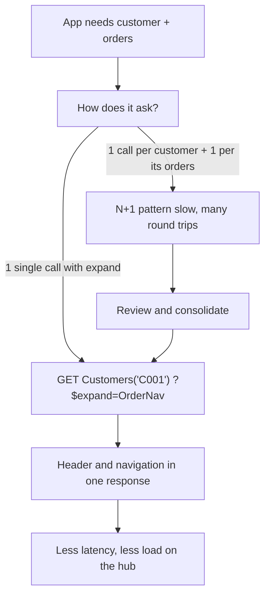

There's a pattern that keeps showing up in badly built Fiori apps: they ask for the customer list, and then, for each customer, fire another request to fetch its orders. Ten customers, eleven calls. A hundred customers, a hundred and one. It's the classic N+1 problem disguised as OData. The solution has existed since day one and it's called `$expand`.

## Navigation by association

In OData, entities relate through associations, and those associations are navigable. A `Customers` entity with navigation to `Orders` lets you ask, in a single URL, for the customer and its orders together:

```abap
" Single read request with expand from customer to its orders
" GET /CustomersSet('C001')?$expand=OrderNav
"
" Direct navigation also works:
" GET /CustomersSet('C001')/OrderNav
"
" And chained expand on a payments entity:
" GET /PaymentsSet('P100')?$expand=OrderNav
```

In the classic Gateway model, `$expand` doesn't resolve itself: you implement it by redefining the DPC_EXT's deep-read methods (`GET_EXPANDED_ENTITY` and `GET_EXPANDED_ENTITYSET`), where you fill header and navigated items in the same response. In CDS, on the other hand, if the association is well declared, SADL resolves `$expand` generically without you writing anything.



## When to expand and when NOT to

`$expand` is powerful, but not free. Fetching everything always has its own problem: you ask for a customer with its orders, and their line items, and the materials of each item, and suddenly one call drags half the system. The criterion:

- **Expand** what the screen will show immediately. If master and detail are seen together, one call with `$expand`.
- **Don't expand** what the user may never open. Leave that association as on-demand navigation: it resolves only when someone asks.

That's the same discipline as associations in CDS: they're declared, but not materialized until navigated. An unnecessary `$expand` is a join nobody asked for.

> OData doesn't commit the N+1: you do, by not using `$expand`. And expanding everything isn't the answer either: expand what's shown, navigate what's explored.

Next post: paging and `$filter` plus `$select`, how not to fetch a million rows when the screen shows twenty.
