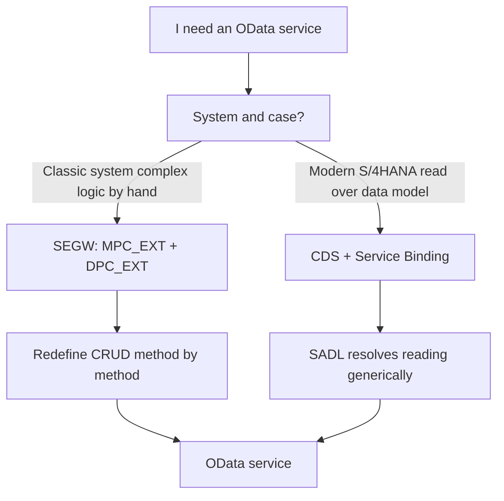

There's a line that keeps coming up in talks and on LinkedIn: "SEGW is dead, it's all CDS now". It's half true, and the other half is what gets you in trouble when you land on a real system with two hundred services built the old way. Let's understand the SAP Gateway model without dogma.

## The classic model: SEGW with MPC and DPC

In SEGW you define a project with entities, properties, entity sets and associations. On generation you get two pairs of classes:

- **MPC / MPC_EXT** (Model Provider Class): describes the model, the types, the annotations. The `_EXT` is where you put your stuff without a regeneration overwriting it.
- **DPC / DPC_EXT** (Data Provider Class): this is where the logic lives. Each operation is a method you fill in.

Full CRUD is implemented by redefining specific methods in the DPC_EXT:

```abap
" Methods you redefine in the DPC_EXT for each entity
METHOD customersset_get_entity.      " READ  (single read)
  " read one record by its key
ENDMETHOD.

METHOD customersset_get_entityset.   " QUERY (list + filters)
  " read a collection, apply $filter, $orderby, paging
ENDMETHOD.

METHOD customersset_create_entity.   " CREATE
ENDMETHOD.

METHOD customersset_update_entity.   " UPDATE
ENDMETHOD.

METHOD customersset_delete_entity.   " DELETE
ENDMETHOD.
```

And UI annotations are wired in the MPC_EXT, for instance `UI.HeaderInfo` for a list header or `UI.DataField` over specific columns of an `Orders` entity. All by hand, all explicit.

## The modern model: CDS

With CDS you declare the model once and SADL provides the runtime. You don't write GET_ENTITY or GET_ENTITYSET: the framework resolves reading, filtering, paging and `$expand` generically from your view and its associations. Less code, fewer methods to maintain, fewer places to get it wrong.



## When each one, honestly

- **CDS** when your service is fundamentally reading over a data model, or when you build modern Fiori elements. It's the default path on new systems.
- **SEGW** when you inherit hundreds of services that already exist, when the write logic is so specific it doesn't fit the generic flow, or when the system doesn't give you the CDS stack you need.

The mistake isn't using SEGW. The mistake is starting a new service in SEGW in 2026 out of inertia, with CDS available. And the symmetric mistake is throwing away a stable SEGW service to "modernize" it when nobody asked.

> SEGW isn't dead: it became the place where the things CDS doesn't do well yet still live. Knowing where that border is is half the craft.

Next post: CRUD and Function Imports, when an operation doesn't fit standard CRUD and needs an import of its own.
