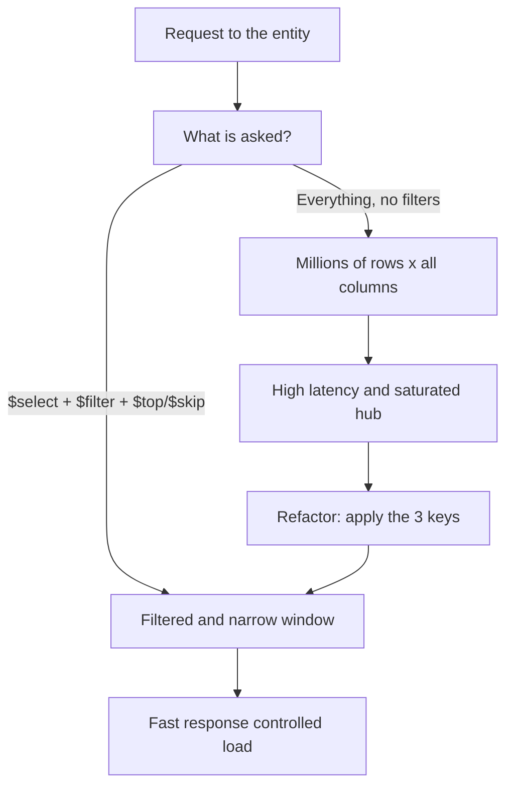

The service works in the demo with fifty records. It goes to production, the table has two million rows, and the app takes eight seconds to paint a list of twenty. The service hasn't changed; the volume has. Performance in OData isn't magic: it's three keys you either press or pay for. `$select`, `$filter` and paging.

## The three keys

- **`$select` trims the width**: you ask only for the columns the screen shows. `$select=Customerid,Name,City` instead of dragging the entity's forty fields.
- **`$filter` trims the height**: you cut rows at the source, not on the client. `$filter=shipvia eq 'DHL'` filters in the backend, you don't fetch everything to discard in the browser.
- **Paging avoids fetching the world**: `$top` and `$skip` fetch a window. `$top=20&$skip=40` is the third page of twenty.

And to know how many pages exist without fetching them all, `$count`.



## How it's implemented, not just how it's asked

Asking well from the client isn't enough: the backend has to honor the request. In the classic Gateway model, inside `GET_ENTITYSET` you receive the query parameters and **must push them to the source**:

```abap
METHOD paymentsset_get_entityset.
  " Paging: read $top and $skip to bound the read
  DATA(lv_top)  = io_tech_request_context->get_top( ).
  DATA(lv_skip) = io_tech_request_context->get_skip( ).

  " $filter: get the filtering options from the context
  DATA(lt_filter) = io_tech_request_context->get_filter( )->get_filter_select_options( ).

  " The performance key: apply top, skip and filter IN the SELECT,
  " don't read everything and trim afterward in ABAP.
  " Reading all and filtering in memory is the Gateway's most expensive mistake.
ENDMETHOD.
```

The cardinal sin: doing a `SELECT *` with no `WHERE` and then applying the filter in a `LOOP` over the internal table. You brought two million rows into the application server's memory to keep twenty. The `$filter` has to reach the SELECT's `WHERE`.

## The correct mental order

1. **Filter** first (fewer rows to move).
2. **Select** next (fewer columns per row).
3. **Page** last (a window, not everything).

That order isn't cosmetic: it's the one that minimizes the data traveling in each layer, from HANA to the browser.

> An OData service isn't slow because of OData. It's slow because someone fetched the million rows when the screen showed twenty. Filter, select, page: all three or none.

With this we close the ABAP OData series: from version choice to production performance. The common thread is the same as always: deciding before writing the first line.
