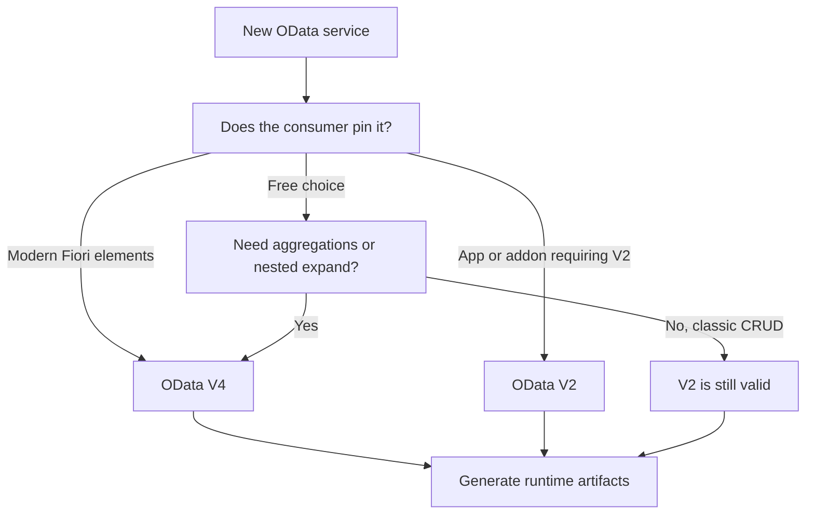

The question shows up in every new project: do we build the service in OData V2 or V4? And it usually gets answered badly, for two opposite reasons. Some pick V2 "because it's what we know" and drag a ten-year-old decision along. Others pick V4 "because it's new" without knowing what they gain. Let's set the criterion.

## What actually changes from V2 to V4

V4 is not "V2 with a bigger number". These are differences you feel at runtime:

- **Lighter payload**: V4 trims the response JSON. Fewer repeated metadata per record, fewer bytes on the wire.
- **Richer queries**: V4 extends what you can ask with `$filter`, nested `$expand`, `$apply` for aggregations. With V2 many of those you had to solve by hand in the backend.
- **OASIS standard**: V4 is a truly open standard, not a SAP variant. That matters when the consumer isn't Fiori.
- **Different tooling**: in SEGW you create the project explicitly marking V2 or V4, and the runtime class model you generate is not the same.

## The criterion I use on projects



The short rule: **if the consumer doesn't force you into V2 and you're starting from scratch, begin with V4**. What you must not do is rewrite a stable, tested V2 service just to "modernize". That's cost with no return.

## A real V4 project, step by step

In SEGW a V4 project (say `ZBILLING`) starts from your dictionary tables, imports the entities and defines the navigation between them. The practical sequence is this:

```abap
" V4 model in SEGW: entities are defined from DDIC tables
" InvoiceHeader  -> invoice header table
" InvoiceItems   -> line items table
" and a navigation InvoiceHeader --> InvoiceItems (1..*)

" After modeling, the step you can NOT skip:
" Generate the service runtime artifacts.
" In V4 the service becomes ready without going through the classic
" hub the same way V2 did.
```

Notice the step everyone forgets: in V4 you must **generate the runtime artifacts** after modeling. Without that step the service does not exist, even if the model is perfect. It is the modern equivalent of the hub activation we dragged from V2.

## The expensive mistake

Migrating from V2 to V4 by touching only the version and hoping the consumer won't notice. The JSON changes, the navigation changes, the way you ask for `$expand` changes. A client written against V2 breaks. If you migrate, you migrate both ends or you don't migrate.

> V4 isn't better for being new. It's better when the consumer asks for what V4 does well. Choosing by fashion costs the same as not choosing.

Next post: how to expose an OData service straight from a CDS view without touching SEGW, and when that's a good idea and when it isn't.
