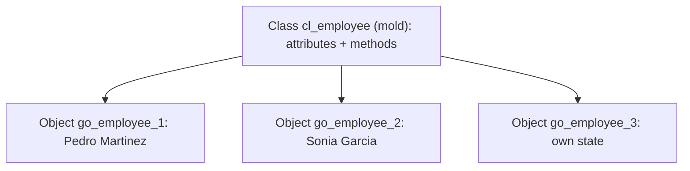

Most of the object-oriented ABAP you see in projects isn't object-oriented at all. It's procedural code stuffed inside a static class, with one giant `CLASS-METHODS` doing everything. The root cause is almost always the same: **confusing the class with the object**.

## The mold and the furniture

A class is a mold: it defines attributes (variables) and methods (functions) common to a type of thing. An object is what comes out of the mold: an instance with its own identity and its own state. Two objects of the same class can hold identical values and still not be the same object, just as two identical coffee cups are still two cups.

That ability to create many instances at runtime, each with its own state, over the same code, is the defining trait of object orientation. If your class is never instantiated, you're not doing OO: you're doing a bag of functions under another name.



## The reference, not the object

In ABAP you never hold an object directly: you hold a reference pointing to it. The reference variable is either `INITIAL` or points to an existing instance. You declare it with `TYPE REF TO` and create the object with `NEW` (recommended in ABAP Cloud) or the classic `CREATE OBJECT`.

```abap
CLASS cl_employee DEFINITION.
  PUBLIC SECTION.
    METHODS constructor IMPORTING iv_name TYPE string.
    METHODS get_name RETURNING VALUE(rv_name) TYPE string.
  PRIVATE SECTION.
    DATA mv_name TYPE string.
ENDCLASS.

CLASS cl_employee IMPLEMENTATION.
  METHOD constructor.
    mv_name = iv_name.
  ENDMETHOD.
  METHOD get_name.
    rv_name = mv_name.
  ENDMETHOD.
ENDCLASS.

DATA go_employee TYPE REF TO cl_employee.
go_employee = NEW #( iv_name = 'Pedro Martinez' ).
```

Notice the constructor: it's a special method the system calls by itself, once, right after the object is created with `NEW`. You never invoke it by hand. It's your only chance to leave the object in a valid initial state, which is exactly why the state should never be allowed to exist half-built.

## Instance versus static

The other important cut: instance attributes and methods (one per object, with `DATA` and `METHODS`) versus static ones (one per class, with `CLASS-DATA` and `CLASS-METHODS`). A static attribute is shared: change it on one object and it changes for all. Instance members are reached with `->`, static ones with `=>`.

```abap
go_employee->get_name( ).      " instance method
cl_file=>word.                 " static constant of the class
```

The classic mistake is declaring everything static "because it's easier to call". Easy today; the day you need two states running in parallel, your static class won't let you and you rewrite.

> A class that is never instantiated is not object orientation: it's a bag of functions in a new coat.

Next post: real encapsulation, the three visibility sections, and why a public attribute is almost always a debt you pay back during maintenance.
