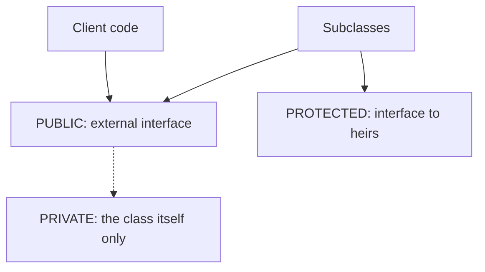

Encapsulation means binding an object's data and behavior together and treating the object as a black box: only its own methods touch its data. Sounds like a training slide. In practice it boils down to an uncomfortable rule: **every component you declare public is a promise you can't break without breaking someone else's code**.

## The three sections are a contract

A class's declarative part splits into three visibility areas, and every component lives in exactly one:

- `PUBLIC SECTION`: reachable by everyone. It's the class's external interface.
- `PROTECTED SECTION`: reachable by the class and its subclasses. It's the interface toward your heirs.
- `PRIVATE SECTION`: visible only inside the class itself. It's your kitchen.



The design rule is harsh and counterintuitive: **declare as little public as you can**. Everything you expose in `PUBLIC SECTION` enters the contract with your clients. If tomorrow you want to change a type, a name, or remove a method, every consumer that used it breaks. Private members, by contrast, you change whenever you like: nobody outside sees them.

## The public attribute, almost always a mistake

If you truly want to encapsulate an object's state, don't declare any public attribute. Expose state through methods, not fields. And when you genuinely need something readable from outside but modifiable by no one, you have `READ-ONLY`:

```abap
CLASS cl_account DEFINITION.
  PUBLIC SECTION.
    DATA mv_balance TYPE p LENGTH 13 DECIMALS 2 READ-ONLY.
    METHODS deposit IMPORTING iv_amount TYPE p.
  PRIVATE SECTION.
    METHODS validate IMPORTING iv_amount TYPE p
                     RETURNING VALUE(rv_ok) TYPE abap_bool.
ENDCLASS.

CLASS cl_account IMPLEMENTATION.
  METHOD deposit.
    IF validate( iv_amount ) = abap_true.
      mv_balance = mv_balance + iv_amount.
    ENDIF.
  ENDMETHOD.
  METHOD validate.
    rv_ok = xsdbool( iv_amount > 0 ).
  ENDMETHOD.
ENDCLASS.
```

Anyone can read `mv_balance`, but only `deposit` changes it, and only if it passes `validate`. The validation method is private because it's an internal detail: nobody outside needs to know how you check an amount, and if you change the rule tomorrow you break no one.

## Constants and types encapsulate too

The same three sections apply to `CONSTANTS` and `TYPES`. A type declared in the public section is used from outside with `=>`; one in the private section lives only inside. Placing each declaration in its section is not decoration: it's an explicit decision about what is part of the contract and what isn't.

```abap
CLASS cl_file DEFINITION.
  PUBLIC SECTION.
    CONSTANTS word TYPE char4 VALUE 'DOCX'.
ENDCLASS.

" from outside:
DATA(lv_ext) = cl_file=>word.
```

> Over-declaring costs a minute today. Undoing it costs hunting down every consumer that coupled to what you should never have exposed.

Next post: interfaces versus inheritance, and why ABAP solves multiple inheritance without allowing it.
