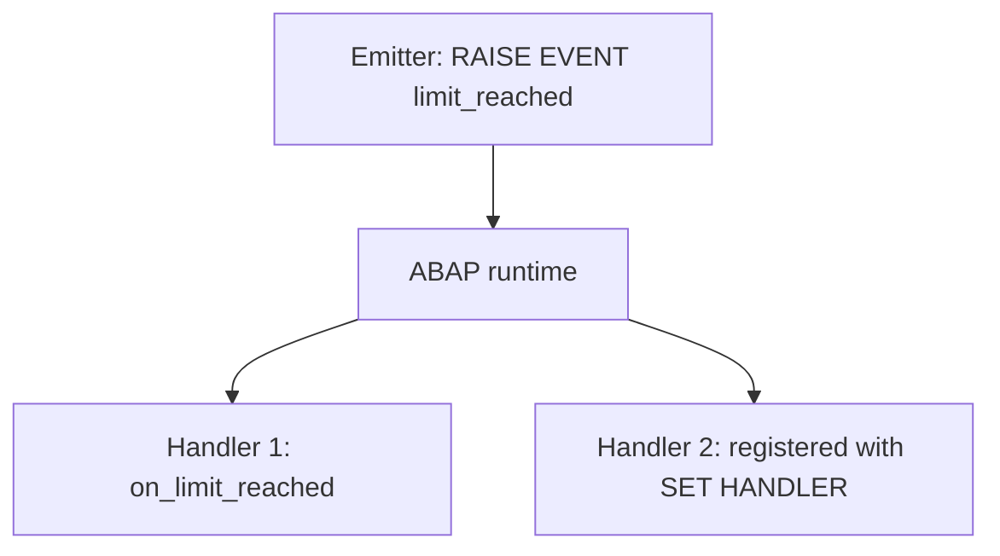

Attributes and methods are the two components everyone knows. The third one, events, is the one almost nobody uses well, which is a shame, because it's the cleanest way ABAP has to truly decouple two parts of a system. The uncomfortable but powerful idea: **the object that triggers the action doesn't know, and doesn't need to know, who is going to react**.

## Cause and effect, separated

In a normal method call, the client decides whom to call and when. With events it flips: the emitting class raises an event and the ABAP runtime automatically invokes the registered handlers. The emitter calls nobody by name. While you develop the class that fires the event you need to know nothing about the one that will handle it; not even how many there will be.



## Define, raise, handle

Instance events are declared with `EVENTS` (static ones with `CLASS-EVENTS`) and only accept exporting parameters passed by value. They fire with `RAISE EVENT`. A method is declared a handler with `FOR EVENT ... OF`, and whatever the event exports arrives at the handler as importing parameters.

```abap
CLASS lcl_main DEFINITION.
  PUBLIC SECTION.
    DATA    lv_counter TYPE i.
    METHODS process IMPORTING iv_number TYPE i.
    EVENTS  limit_reached.
ENDCLASS.

CLASS lcl_main IMPLEMENTATION.
  METHOD process.
    lv_counter = iv_number.
    IF iv_number >= 2.
      RAISE EVENT limit_reached.
    ENDIF.
  ENDMETHOD.
ENDCLASS.

CLASS lcl_handler DEFINITION.
  PUBLIC SECTION.
    METHODS on_limit_reached FOR EVENT limit_reached OF lcl_main.
ENDCLASS.

CLASS lcl_handler IMPLEMENTATION.
  METHOD on_limit_reached.
    WRITE 'Event processed'.
  ENDMETHOD.
ENDCLASS.
```

## Registration is what turns it all on

A declared handler does nothing on its own. The event only reaches whoever explicitly registered with `SET HANDLER`. Without that step, `RAISE EVENT` fires into the void:

```abap
DATA lo_main    TYPE REF TO lcl_main.
DATA lo_handler TYPE REF TO lcl_handler.

lo_main    = NEW #( ).
lo_handler = NEW #( ).

SET HANDLER lo_handler->on_limit_reached FOR lo_main.

lo_main->process( 5 ).   " fires the event and the handler runs
```

Registration only lives during program execution. You can deregister with `ACTIVATION ' '`, and with `FOR ALL INSTANCES` register a handler for all instances of the class, even ones that don't exist yet: the only way to listen to future objects.

## Two traps that bite

- **Order is not guaranteed.** If you register several handlers for the same event, ABAP makes no promise about the sequence in which it calls them. If your logic depends on order, events are the wrong tool.
- **SENDER is your anchor.** Besides the event's parameters, you can always declare the predefined `SENDER` parameter in the handler: it hands you a reference to the object that fired the event. Without it, a handler registered on several emitters can't tell which one spoke.

> Events shine when the cause is already fired and the only thing changing over time is who reacts. You add a handler and that's it; the emitter never notices.

That closes the ABAP OO fundamentals series: classes and objects, encapsulation, interfaces versus inheritance, polymorphism, exceptions and events. The natural next step is taking all of this into ABAP Cloud and RAP, where these same principles stop being theory and become the only way to build.
