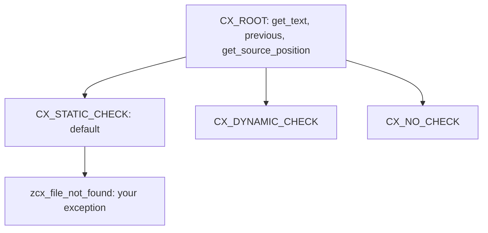

There is still new code that checks `sy-subrc` after every operation and trusts the next reader to figure out what a `4` meant on that line. Since SAP Web AS 6.10 you have something far better: **class-based exceptions**, where an error is an object with state, not a numeric code you have to decode from memory.

## An error is an object

A class-based exception is an instance of an exception class. Its attributes carry the error information. Raising it means instantiating that class and setting its attributes; handling it means evaluating that object. It's raised with `RAISE EXCEPTION` and caught with `TRY ... CATCH ... ENDTRY`.

```abap
TRY.
    DATA(lo_reader) = NEW zcl_file_reader( ).
    lo_reader->open( iv_path = lv_path ).
  CATCH zcx_file_not_found INTO DATA(lx_error).
    MESSAGE lx_error->get_text( ) TYPE 'E'.
ENDTRY.
```

`GET_TEXT` gives you the descriptive text and `GET_SOURCE_POSITION` the program and exact line where it fired. You don't reconstruct that yourself: it comes inside the object.

## The hierarchy rules

Every exception class descends from `CX_ROOT`, but you can't inherit directly from it. Your own class must derive from one of its three subclasses, and that choice changes how the syntax check treats it:

- `CX_STATIC_CHECK`: the default group and the one to use almost always. Maximum syntax checking: the compiler forces you to declare or handle the exception.
- `CX_DYNAMIC_CHECK`: checked at runtime. For specific cases.
- `CX_NO_CHECK`: not checked. Reserved for errors that can occur anywhere.



Since they all derive from `CX_ROOT`, a `CATCH cx_root` catches anything. Use it with judgement: catching too generically hides errors you'd rather see.

## Chain with PREVIOUS: don't lose the root cause

Here's the detail that separates a useful log from a worthless one. An exception object stops being valid when its `CATCH` is left. If you catch a low-level exception and raise a higher-level one without more, **you lose the original cause**. The fix is to chain: every exception class exposes the public attribute `PREVIOUS` (of type `REF TO CX_ROOT`) and its constructor accepts a `PREVIOUS` parameter.

```abap
TRY.
    lo_db->select( ).
  CATCH cx_sy_open_sql_db INTO DATA(lx_sql).
    RAISE EXCEPTION TYPE zcx_order_load_failed
      EXPORTING previous = lx_sql.
ENDTRY.
```

Now `zcx_order_load_failed` points to the SQL exception that caused it, which in turn can point to its own predecessor. The handler above walks the `PREVIOUS` chain and reconstructs the full story: what failed, where and why. It's the difference between "error loading the order" and "error loading the order because the DB connection dropped at that line".

And if a `TRY` needs to clean up resources even when an exception fires that is handled further up, you have the `CLEANUP` block, which runs when the structure is left without a handler of its own.

> An error that only says what failed is half an error. Chain with PREVIOUS and keep the why as well.

Next post: events in object orientation, how to decouple the one that triggers the action from the one that reacts, with neither knowing the other.
