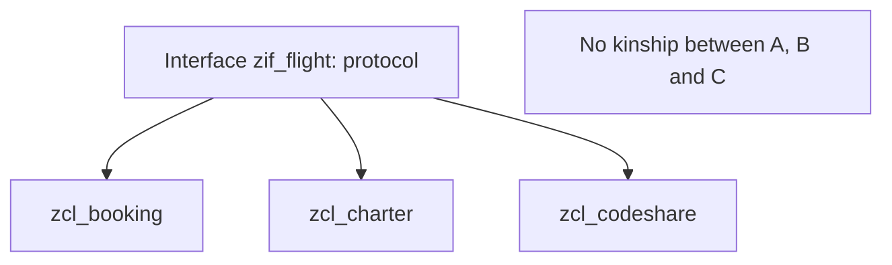

When two classes share behavior, the ABAP developer's reflex is to create a superclass and inherit. Sometimes that's right. Often it's tying yourself to a family tree you can no longer leave. **ABAP only supports single inheritance**: one class, one parent. And that limitation, far from being a problem, is a hint about what you should be using.

## Inheritance: reuse and specialize

With `INHERITING FROM`, a subclass receives the public and protected components of its superclass (private ones exist but stay invisible) and can specialize any public or protected method with `REDEFINITION`. The signature doesn't change; only the implementation. Inside the redefinition you can call `super->` to reuse what the parent already did.

```abap
CLASS cl_vehicle DEFINITION.
  PUBLIC SECTION.
    METHODS describe RETURNING VALUE(rv_text) TYPE string.
ENDCLASS.

CLASS cl_car DEFINITION INHERITING FROM cl_vehicle.
  PUBLIC SECTION.
    METHODS describe REDEFINITION.
ENDCLASS.

CLASS cl_car IMPLEMENTATION.
  METHOD describe.
    rv_text = |{ super->describe( ) }, car subtype|.
  ENDMETHOD.
ENDCLASS.
```

The cost is coupling: touch the superclass and you alter every subclass. A deep hierarchy is hard to understand and dangerous to change.

## Interfaces: same protocol, different implementations

An interface is a top-level class that isn't instantiated, has no implementation and declares only public components. It's for what inheritance can't do well: **defining a uniform protocol that several unrelated classes fulfil in their own way**. And since a class can implement as many interfaces as it likes, this is how ABAP simulates multiple inheritance without allowing it.

```abap
INTERFACE zif_flight.
  METHODS get_flight RETURNING VALUE(rv_id) TYPE string.
ENDINTERFACE.

INTERFACE zif_customer.
  METHODS get_customer RETURNING VALUE(rv_name) TYPE string.
ENDINTERFACE.

CLASS zcl_booking DEFINITION.
  PUBLIC SECTION.
    INTERFACES: zif_flight, zif_customer.
ENDCLASS.

CLASS zcl_booking IMPLEMENTATION.
  METHOD zif_flight~get_flight.
  ENDMETHOD.
  METHOD zif_customer~get_customer.
  ENDMETHOD.
ENDCLASS.
```

Components are accessed with the `~` operator, or with `ALIASES` if you want a short form. A fact that decides many designs: usually **whoever defines the interface is the one consuming the service**, not the one providing it. The client describes what it expects and each class decides whether to fulfil it.



## How to choose

- If there genuinely is an "is a" relationship and you want to share already-implemented code, inherit from a superclass (or an abstract one).
- If you only need several classes to speak the same language without real kinship, define an interface.
- Remember the price of each: adding a method to an interface forces every implementing class to implement it; adding a non-abstract method to a superclass forces nothing.

> Inheritance shares implementation; an interface shares a contract. What you usually need to share is the contract.

Next post: polymorphism and casting, how a parent reference runs the child's method and when a cast blows up at runtime.
