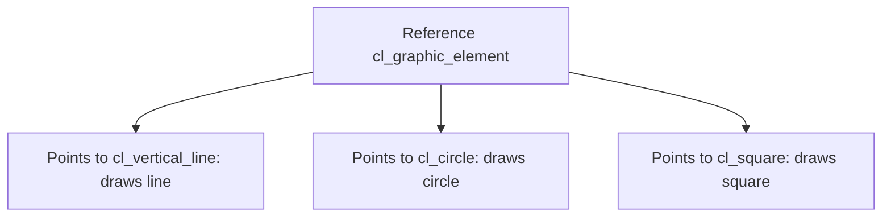

Polymorphism is the part of object orientation that looks like magic until you understand it, and then becomes the most useful tool you have for writing generic code. The idea: **one access point, different behaviors depending on the actual object behind it**. And in ABAP everything goes through references, because an object is only reachable through a reference.

## A parent reference that runs the child

If `cl_vertical_line` inherits from `cl_graphic_element` and redefines `draw`, you can declare a reference of the parent type, point it to a child object and call the method. The child's version runs, not the parent's:

```abap
CLASS cl_graphic_element DEFINITION.
  PUBLIC SECTION.
    METHODS draw.
ENDCLASS.
CLASS cl_graphic_element IMPLEMENTATION.
  METHOD draw.
    WRITE / 'Graphic element'.
  ENDMETHOD.
ENDCLASS.

CLASS cl_vertical_line DEFINITION INHERITING FROM cl_graphic_element.
  PUBLIC SECTION.
    METHODS draw REDEFINITION.
ENDCLASS.
CLASS cl_vertical_line IMPLEMENTATION.
  METHOD draw.
    WRITE / 'Vertical line'.
  ENDMETHOD.
ENDCLASS.

DATA go_element TYPE REF TO cl_graphic_element.
go_element = NEW cl_vertical_line( ).
go_element->draw( ).   " prints 'Vertical line'
```

That's the whole trick: you loop over a table of `cl_graphic_element`, call `draw` on each and every object draws its own thing. No `IF type = circle` anywhere. It works the same with interfaces: an interface-typed reference pointing to an implementing class runs the class's implementation.



## Narrowing and widening cast

For polymorphism to work you have to move references between types. This is where people get burned.

- **Narrowing cast** (specific to generic): you assign a subclass instance to a superclass reference. Always safe, because the child has at least everything the parent has. It's a plain assignment with `=`.
- **Widening cast** (generic to specific): you want to get back a subclass reference. Not safe, because the object might not be of that subclass. The compiler forces you to use the `?=` operator (or `CAST`), taking on the risk yourself.

```abap
DATA go_element TYPE REF TO cl_graphic_element.
DATA go_line    TYPE REF TO cl_vertical_line.

go_element = NEW cl_vertical_line( ).   " narrowing, safe

TRY.
    go_line ?= go_element.               " widening, can fail
  CATCH cx_sy_move_cast_error.
    " the object was not a cl_vertical_line
ENDTRY.
```

If the actual object doesn't match the target type, the widening cast raises `CX_SY_MOVE_CAST_ERROR` at runtime. Never do a bare widening cast unless you control the type 100%: wrap it in a `TRY ... CATCH`.

## The trap: creating the object on the generic reference

Remember you can't instantiate on an interface or abstract-class reference with a plain `NEW #( )`: the compiler doesn't know which concrete type to create. But you can tell it the class in the same statement:

```abap
DATA go_employee TYPE REF TO zif_employee.
go_employee = NEW zcl_administrator( ).   " explicit concrete type
```

> Polymorphism saves you the IF-by-type; casting is the price, and it's paid at runtime if you don't control it.

Next post: class-based exceptions, the CX_ROOT hierarchy, and why chaining exceptions with PREVIOUS saves your life in error analysis.
