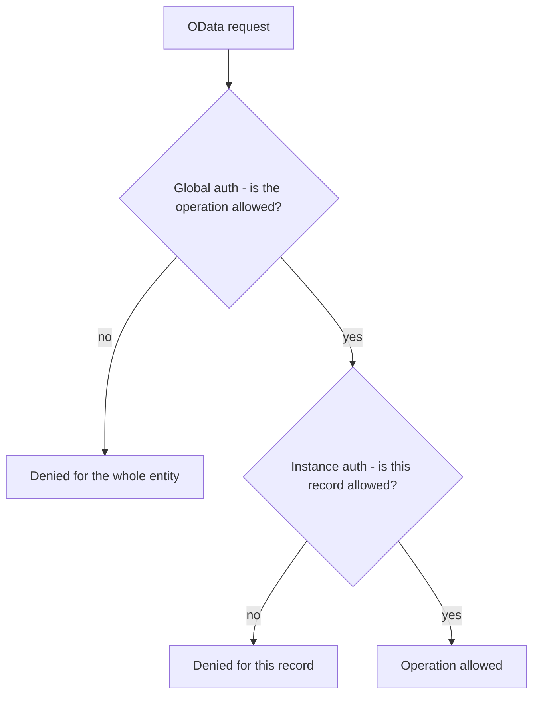

RAP has two authorization mechanisms that answer different questions. "Can this user delete records?" is global. "Can they delete **this** record, which belongs to a plant they cannot access?" is instance-level. Choosing wrong does not raise a compile error: it opens a silent security hole.

## The two levels

- **Global**: applies to the **whole** entity. It vetoes entire operations (for example, "this group of users cannot create or delete, only read"). It does not look at the record's content.
- **Instance**: evaluated **record by record** based on their data (company code, plant, status). A user may edit some records and not others, depending on what they contain.



## Declaring them in the behavior definition

They are enabled in the header with `authorization master ( ... )`. You can ask for one, the other, or both:

```cds
define behavior for I_SalesOrder alias SalesOrder
persistent table zsalesorder
lock master
authorization master ( global, instance )
{
  create;
  update;
  delete;

  // an action can also require its own check
  action ( authorization : update ) approve result [1] $self;
}
```

Each mode you declare generates a method you must implement in the Behavior Pool:

- `authorization master ( global )` generates `get_global_authorizations`: there you decide, with the classic authorization objects, which operations are enabled for the user.
- `authorization master ( instance )` generates `get_instance_authorizations`: you receive the record keys and decide, looking at their data, which ones the user can touch.

## The rule for choosing

Start with **instance** if access depends on content (the norm in business data: by company code, by sales organization, by document status). Add **global** only if there are also operations you want to veto in bulk for certain profiles. Many well-designed business objects use instance only; global comes in when there is a clear role segregation above the data.

And do not forget actions: a custom action like `approve` can carry its own `authorization : update`, `instance`, `global` or `none`. A sensitive action with no check is the back door nobody reviews until they audit it.

> "It compiles and works in the demo" does not mean "it is authorized". Instance authorization only protects if the `get_instance_authorizations` method is implemented; empty, it lets everything through.

Next post: EML, how to read and modify business entities from code without writing a single SELECT.
