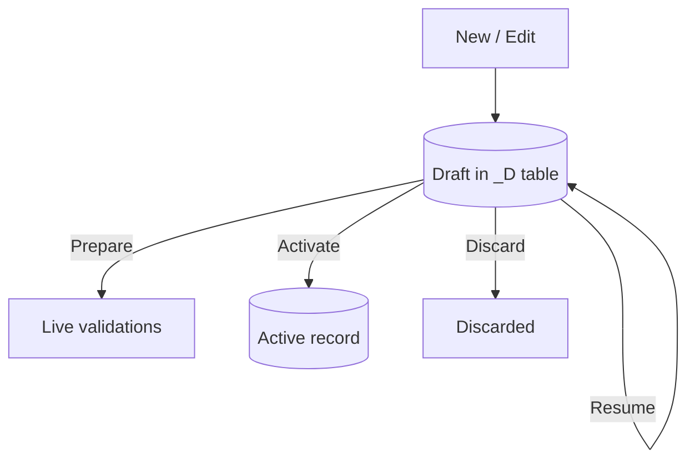

A user fills in half a form, leaves to look something up, and comes back. Without Draft, either the work is gone or you have pushed a half-baked record into the production database. RAP's Draft mode solves exactly that moment: it saves progress in a temporary table and only persists to the active one when the user commits.

## The lifecycle of a draft



Every arrow in the diagram is a **draft action** you declare; the framework implements it.

## Enabling it in the behavior definition

Draft is not a loose flag: it demands three things together. The draft table (with its `%admin` include), the `total etag`, and the draft actions block.

```cds
managed implementation in class zbp_i_salesorder unique;
strict ( 2 );
define behavior for I_SalesOrder alias SalesOrder
persistent table zsalesorder
draft table zsalesorder_d
lock master
total etag LastChangedAt
etag master LocalLastChangedAt
authorization master ( instance )
{
  create;
  update;
  delete;

  draft action Resume;
  draft action Edit;
  draft action Activate optimized;
  draft action Discard;

  draft determine action Prepare
  {
    validation validateCustomer;
  }

  mapping for zsalesorder { }
}
```

Three keys so it does not blow up:

1. **`total etag` is mandatory with Draft.** The draft manages concurrency over the total data volume, not just the instance; without the total ETag the framework cannot reconcile two edits.
2. **`Activate optimized`** skips the unnecessary re-read on commit. Use it unless you have custom activation logic.
3. **`draft determine action Prepare`** hooks your validations into the draft: they run live as the user types, not only on save. That is what makes error messages show up in real time.

## The Editing Status field is not decorative

When you enable Draft, the Fiori Elements UI gains the **Editing Status** filter: the user sees their drafts, the ones the app left halfway, and the records locked by others. It is free feedback that only appears if the data model (draft table plus `%admin`) is wired correctly. If you do not see it, check the include before anything else.

> Draft is not "one more UI feature". It is the difference between an app people use for real work and one they abandon at the first long form.

Next post: where to put each business rule, with validations that veto the save and determinations that fill fields on their own.
