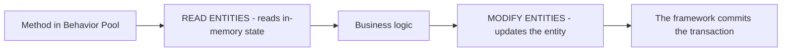

Inside a RAP business object you do not access data with `SELECT` nor commit with `COMMIT`. You do it with the **Entity Manipulation Language (EML)**, and the framework handles the transaction. If you come from classic ABAP, this is the biggest mental shift: you stop talking to the table and start talking to the entity.

## Why not a SELECT

The RAP framework keeps data in memory that is not yet in the database: drafts, pending changes from the same LUW. A direct `SELECT` would not see them. `READ ENTITIES ... IN LOCAL MODE` reads exactly that transactional state, the one the user is looking at.



## Reading an entity

```abap
READ ENTITIES OF i_salesorder IN LOCAL MODE
  ENTITY SalesOrder
  ALL FIELDS WITH CORRESPONDING #( keys )
  RESULT DATA(lt_orders)
  FAILED failed.
```

What matters is not the syntax but the technical keys the result carries, which govern everything else:

- **`%tky`**: the instance technical key. It is what you use to identify the record in any transactional operation.
- **`%is_draft`**: whether the instance is in draft mode.
- **`%pky`** and **`%key`**: persistent key and business key.

The `keys` parameter arrives as `importing` in your Behavior Pool methods: it is the table of records your operation must act on.

## Modifying an entity

No `UPDATE dbtab`. You declare which fields you touch and with what values, iterating over `keys` by `%tky`:

```abap
MODIFY ENTITIES OF i_salesorder IN LOCAL MODE
  ENTITY SalesOrder
  UPDATE FIELDS ( OverallStatus )
  WITH VALUE #( FOR key IN keys
                ( %tky          = key-%tky
                  OverallStatus = 'A' ) ).
```

And an action that returns a result transfers the updated data to the framework through the `result` table, using `%tky` and `%param`:

```abap
result = VALUE #( FOR ls_order IN lt_orders
                  ( %tky   = ls_order-%tky
                    %param = ls_order ) ).
```

## The rules that avoid 90% of the errors

1. **Never** `COMMIT WORK` or `ROLLBACK` inside the Behavior Pool. The framework manages the LUW; if you commit by hand, you break it.
2. Always work by **`%tky`**, not by the business key. The technical key is the one that survives the draft and chained operations.
3. Check `failed` and `reported`: that is where the framework tells you which instances failed and why. Ignoring them is swallowing errors silently.

> EML is not "SQL by another name". It is talking to the business object on its terms: entities, technical keys and a transaction you do not manage. Once you internalize it, RAP code becomes far harder to break.

This closes the RAP series: from the managed scenario to EML, through the data model, draft, business rules and authorizations. At [logalitech.com/masters](https://logalitech.com/masters) you have the live ABAP RAP master if you want the full path with exercises.
