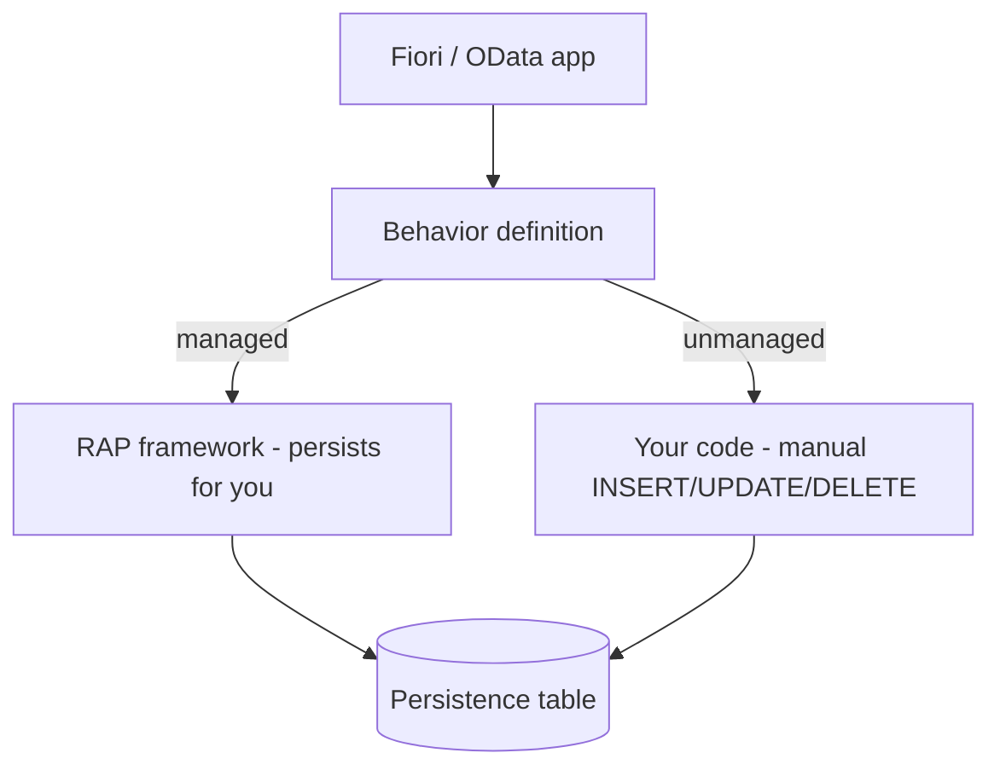

The first architectural decision when building a business object with the RESTful ABAP Programming Model (RAP) is not which fields you expose: it is **who persists the data**. And a single word in the behavior definition header answers it: `managed` or `unmanaged`.

## The two implementations

- **Managed**: the RAP framework automatically handles create, update and delete against the persistence table. It is the default and the one you will use 90% of the time.
- **Unmanaged**: you implement every operation by hand in the persistence layer. Reserve it for wrapping legacy logic (a BAPI function, a table that already owns its save logic) that you cannot rewrite.



## The behavior definition of a managed scenario

Notice what you declare and what the framework hands you back:

```cds
managed implementation in class zbp_i_salesorder unique;
strict ( 2 );
define behavior for I_SalesOrder alias SalesOrder
persistent table zsalesorder
lock master
authorization master ( instance )
etag master LocalLastChangedAt
{
  create;
  update;
  delete;

  field ( numbering : managed, readonly ) SalesOrderUuid;
  field ( mandatory ) CustomerId;

  mapping for zsalesorder
  {
    SalesOrderUuid = sales_order_uuid;
    CustomerId     = customer_id;
  }
}
```

Three decisions worth their weight in gold:

1. `strict ( 2 )` enables the latest strict mode: it forces you to declare the `lock` and catches errors that lax mode would only surface at runtime. Always use it on a new project.
2. `field ( numbering : managed )` lets the framework generate the key UUID. You never assign keys by hand again.
3. The `mapping for` block connects the OData names (UpperCamelCase) with the table columns. Without it, the framework does not know where to store each field.

## The rule for deciding

Always start with `managed`. Only drop to `unmanaged` when you wrap a persistence that **already exists and you do not control**: a legacy function module, a table with triggers, an old API. If you are creating the table from scratch, there is no reason to hand-write what the framework does for free and better.

> The managed scenario is not "the easy version": it is the one that leaves you the least bug surface. Every `INSERT` you do not write is an `INSERT` you cannot get wrong.

Next post: the data model behind all this, with its active table, its draft table, and the audit columns the framework expects.
