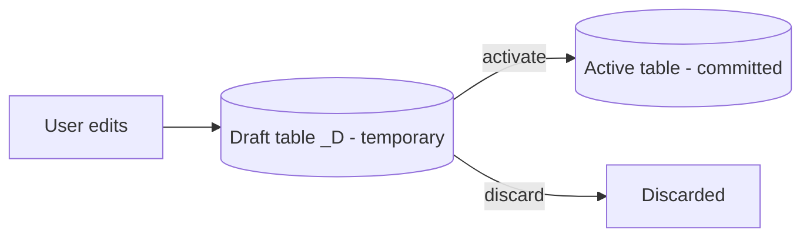

In ABAP Cloud the graphical table editor of the SAP GUI is gone: a database table is a DDL file with annotations. And for a RAP business object to work, that table must carry a very specific set of columns. Skipping them is the number one cause of "why does my draft not save".

## The active persistence table

This is the one backing the committed data. The framework expects three things from it: client, a UUID key, and audit columns with the standard `abp_*` data elements.

```cds
@EndUserText.label: 'Sales order'
@AbapCatalog.enhancement.category: #NOT_EXTENSIBLE
@AbapCatalog.tableCategory: #TRANSPARENT
@AbapCatalog.deliveryClass: #A
define table zsalesorder {
  key client            : abap.clnt not null;
  key sales_order_uuid  : sysuuid_x16 not null;
  customer_id           : /dmo/customer_id;
  @Semantics.amount.currencyCode: 'currency_code'
  net_amount            : /dmo/total_price;
  currency_code         : /dmo/currency_code;
  // audit columns
  local_created_by      : abp_creation_user;
  local_created_at      : abp_creation_tstmpl;
  local_last_changed_by : abp_locinst_lastchange_user;
  local_last_changed_at : abp_locinst_lastchange_tstmpl;
  last_changed_at       : abp_lastchange_tstmpl;
}
```

Two details people overlook:

1. The key is a **UUID** (`sysuuid_x16`), not a running number. The framework generates it; you never touch it.
2. There are two distinct change timestamps: `local_last_changed_at` (for the instance ETag) and `last_changed_at` (for the total ETag). They are not redundant: each one feeds a different concurrency layer.

## The draft table is a clone with rules

The draft experience needs a second table, twin of the active one, with two differences:

- Names in OData style (UpperCamelCase, no underscores), because that is where the technical key travelling to the frontend comes from.
- A `%admin` include with the standard `sych_bdl_draft_admin_inc` structure, which gives the framework the columns to know who created the draft and which operation it holds.

```cds
@EndUserText.label: 'Sales order draft'
@AbapCatalog.tableCategory: #TRANSPARENT
@AbapCatalog.dataMaintenance: #RESTRICTED
define table zsalesorder_d {
  key client           : abap.clnt not null;
  key salesorderuuid   : sysuuid_x16 not null;
  customerid           : /dmo/customer_id;
  netamount            : /dmo/total_price;
  currencycode         : /dmo/currency_code;
  "%admin" : include sych_bdl_draft_admin_inc;
}
```



## Why it matters

The data model is not upfront paperwork: it is the contract the framework reads to generate keys, resolve concurrency and hold the draft. An active table without `abp_*` columns compiles, boots and fails the day two users edit the same record. Half an hour of annotations today saves you an unreproducible ticket six months from now.

> If your draft table is not an exact mirror of the active one (same fields, OData names, `%admin` include), draft mode will give you errors that look like they come from another planet.

Next post: how that pair of tables becomes the Draft experience your users appreciate.
