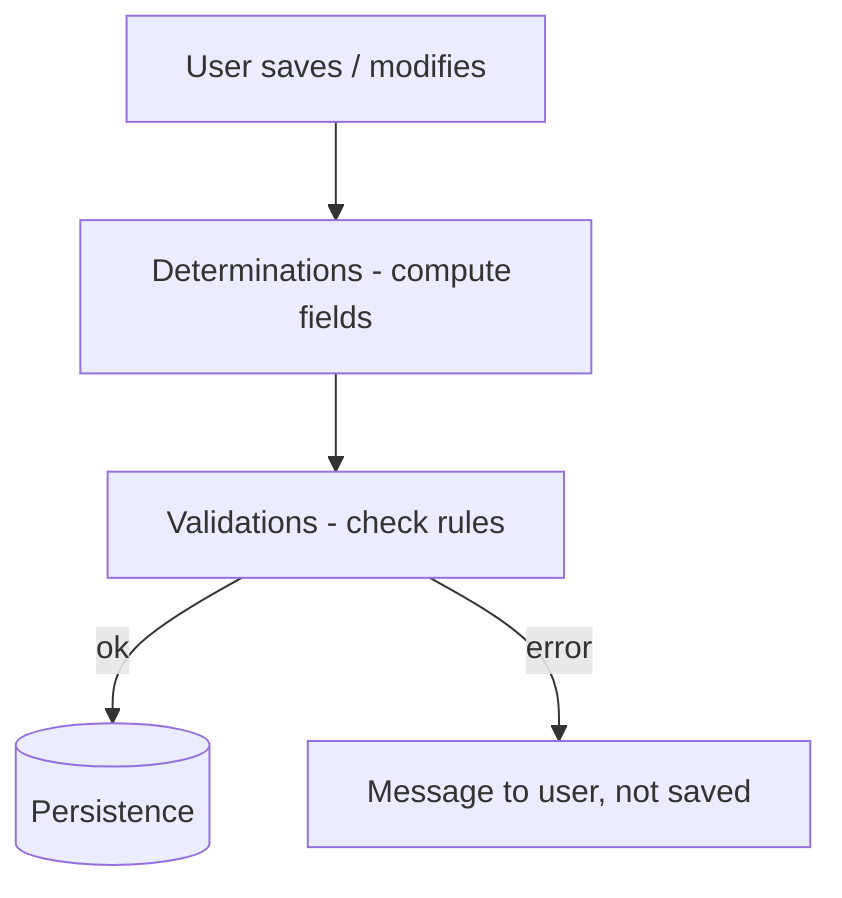

In RAP there are two homes for business logic that people constantly mix up: **validations** and **determinations**. The rule is simple: if your rule says "do not let this be saved", it is a validation; if it says "when this happens, compute that", it is a determination. Putting one where the other belongs is the source of half the weird bugs in RAP applications.

## The difference in one sentence

- **Validation**: checks data integrity and **blocks** the save if it is not met, returning a message to the user. It modifies nothing.
- **Determination**: **computes and assigns** field values automatically based on business rules. Determined fields are usually `readonly` (the user does not touch them).



## Declaring them in the behavior definition

Both hook onto a moment (`on save`, `on modify`) and are implemented in the Behavior Pool:

```cds
define behavior for I_SalesOrder alias SalesOrder
persistent table zsalesorder
lock master
authorization master ( instance )
{
  create;
  update;
  delete;

  // veto the save if the customer is not valid
  validation validateCustomer on save { create; field CustomerId; }

  // fill the total by summing the items, on save
  determination calculateTotal on save { create; update; }

  // set the initial status only on create
  determination setInitialStatus on modify { create; }
}
```

Two nuances people overlook:

1. Timing matters. `on save` fires when the transaction commits; `on modify` as soon as the field is touched. An initial-status determination goes `on modify { create; }` (only when the record is born); a total computation goes `on save` (once all items are in).
2. A validation declares **which fields** trigger it (`field CustomerId`). That way the framework does not re-run the validation when an unrelated field changes. Free performance.

## The classic mistake: validating while changing data

The temptation is to use a validation to "also" fix a value along the way. Do not: a validation that modifies data breaks the transactional model and produces behaviour that is impossible to debug (the framework assumes validating has no side effects). If you need to touch a field, it is a determination. Full stop.

> Always order the behavior definition: operations first, then fields, then actions, and finally validations and determinations. It is not mandatory, but a business object that reads top to bottom maintains itself.

Next post: authorizations in RAP, and why "global" and "instance" are neither the same thing nor implemented the same way.
