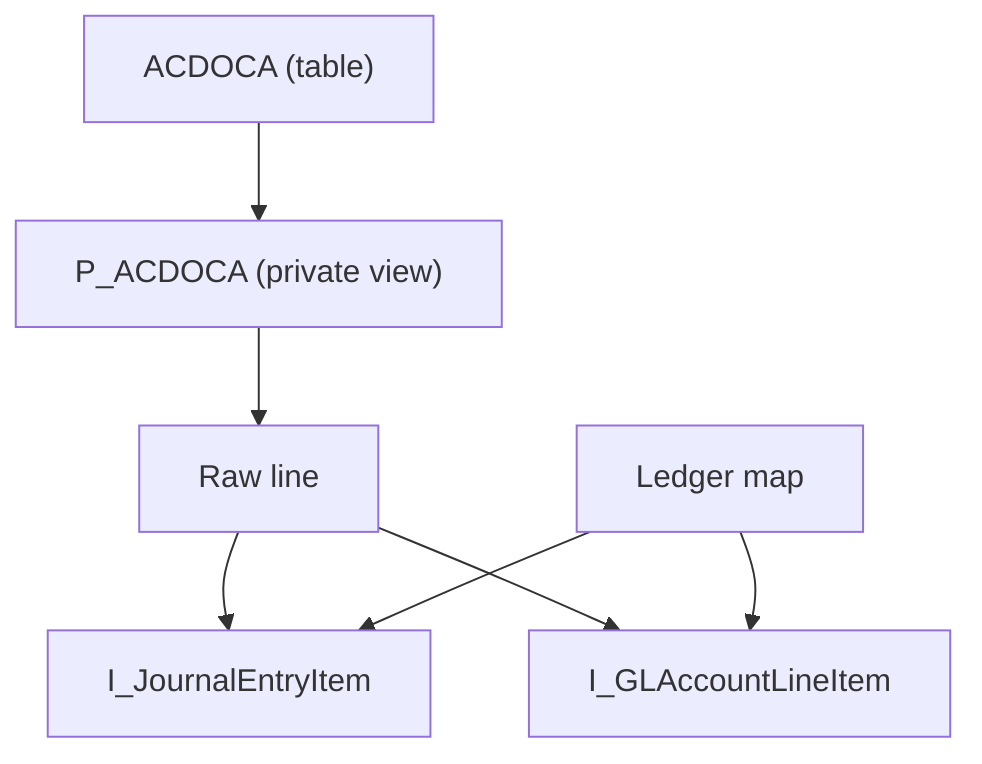

The Universal Journal in SAP S/4HANA is stored in a single table, ACDOCA. In SAP S/4HANA 2025 it has 545 entries in the dictionary, of which 41 are includes: 504 actual columns. Reading it directly seems like the shortest path, and it is precisely the one SAP expressly rules out. The reason is not only formal: the table does not contain all the information that accounting displays.

This article opens the SAP FI Journal Entry series with the inventory of the released CDS views that replace ACDOCA, the need each one covers and the limits worth knowing before building on top of them. All release statuses, code snippets and results come from an SAP S/4HANA 2025 system and were verified on September 30, 2026.

## Why ACDOCA is not read directly

The **API State** tab in ADT shows for ACDOCA the C1 contract, the one that enables customer development, in status **Not to Be Released**: SAP will not release it. In the same tab it indicates the successor objects that must be used instead: `I_JournalEntryItem`, `I_GLAccountLineItem` and `I_GLAccountLineItemRawData`. BSEG receives the same treatment, with a single successor: `I_OperationalAcctgDocItem`.

Reading the table directly has three consequences:

1. **It cannot be used in ABAP Cloud.** An object that has not been released cannot be used with the ABAP for Cloud Development language version: the syntax check rejects it.
2. **It does not apply access controls.** `I_GLAccountLineItemRawData`, `I_JournalEntryItem` and `I_GLAccountLineItem` declare `@AccessControl.authorizationCheck: #CHECK`. A read of the table does not go through those authorization rules.
3. **It returns incomplete data.** The table only contains what has been physically posted. An extension ledger stores only its own entries, and what it inherits from its base ledger is not in ACDOCA. In the test system, the query `SELECT ... FROM acdoca WHERE rldnr = '0E'` returns zero rows, whereas the released view returns for that same ledger all the lines it inherits.

## The stack of released CDS views for Journal Entry

The table is read at a single point. Everything else rests on layers:



- `P_ACDOCA` is SAP's private view that reads the table. It is not consumed.
- `I_GLAccountLineItemRawData`, the raw line in the diagram, exposes the business names (`CompanyCode`, `GLAccount`, `AmountInCompanyCodeCurrency`) and the authorization check, but it **does not resolve extension ledgers**. SAP states this in the header of the view itself:

```cds
// Documentation: This view does not implement the logic for extension ledgers
// Result will be incomplete for ledgers other than basis ledgers
// For correct data of all ledgers use
// I_JournalEntryItem (change flows)
// I_GLAccountLineItem (for calculation of balances of Balance Sheet Accounts (includes BCF for GL Account Balances calculation)
```

- `I_JournalEntryItem` and `I_GLAccountLineItem` add the mapping between each ledger and the ledgers it inherits from. They get it from `I_CoCodeLedgerSourceLedger`, the ledger map in the diagram. These are the two general-purpose views.

## Which view to use for each need

| Need | View | Reason |
|---|---|---|
| Line items, income statement, period movements | `I_JournalEntryItem` | Journal entry line grain, with extension ledgers resolved. Does not include balance carryforward |
| Balance sheet account balances | `I_GLAccountLineItem` | Same ledger logic and includes balance carryforward |
| Document header data | `I_JournalEntry` | One record per accounting document |
| Open items, clearing, due dates | `I_OperationalAcctgDocItem` | Operational document; successor to BSEG |
| Actual vs plan comparison | `I_ActualPlanJournalEntryItem` | Actual and plan at the same grain |
| Periodic documents | `I_RecurringJournalEntry` | Recurring posting templates |
| Ledger-to-ledger correspondence | `I_LedgerSourceLedger` | Which source ledgers feed each ledger |
| Analytical query or key user app | `I_JournalEntryItemCube`, `I_GLAccountLineItemCube` | Cube models. Not available in ABAP Cloud |
| Balances for the analytical engine | `I_GLAccountBalance` | Virtual cube. Not queried with SQL |

All views in the first seven rows appear in the system's catalog of objects released for cloud development. Those in the last two rows are released under other conditions, which are explained below.

## Three differences that decide the choice

### 1. Extension ledgers

`I_GLAccountLineItemRawData` only returns what is in the table. `I_JournalEntryItem` and `I_GLAccountLineItem` project each line once for every ledger that includes it: the ledger in which it was posted and every extension ledger that inherits from it. In the test system, a two-line journal entry occupies 4 rows in ACDOCA (ledgers 0L and 2L) and 8 rows in `I_JournalEntryItem` (ledgers 0C, 0E, 0L and 2L).

That is why the view key carries two ledger fields, `Ledger` and `SourceLedger`, and the filter applied to them decides whether the amount is correct, doubled or tripled. The next article in the series develops that case with all the variants measured.

### 2. Balance carryforward

`I_JournalEntryItem` expressly excludes balance carryforward. Its condition is this:

```cds
where ( I_GLAccountLineItemRawData.FiscalPeriod > '000' ) or
      ( I_GLAccountLineItemRawData.FiscalPeriod = '000'  and ( I_GLAccountLineItemRawData.AccountingDocumentCategory = 'J' or I_GLAccountLineItemRawData.AccountingDocumentCategory = 'L' ) )
```

The comment that accompanies it makes it clear: the view does not read period 000 with document category `C`, which is balance carryforward. Consequently, a balance sheet balance calculated on `I_JournalEntryItem` lacks the opening balance. For balance sheet balances, the correct view is `I_GLAccountLineItem`, which applies the same ledger logic and includes carryforward.

### 3. Released does not equal available in ABAP Cloud

A view can be released with contract C1 and not have the cloud development usage flag set (**Use in Cloud Development**). In that case it can be consumed from a classic package, but not from an ABAP Cloud one.

| View | C0 | C1 | Use in cloud development |
|---|---|---|---|
| `I_JournalEntryItem` | Released | Released | Yes |
| `I_OperationalAcctgDocItem` | Not released | Released | Yes |
| `I_JournalEntryItemCube` | Released | Released | No |
| `I_GLAccountLineItemCube` | Released | Released | No |
| `C_JournalEntryItemBrowser` | Released | Released | No |
| `I_GLAccountBalance` | Released | Not to Be Released, Stable | No |

`I_GLAccountBalance` requires careful reading. Its C1 status is not "not released", but "not to be released, stable": SAP commits to maintaining it, but does not authorize building customer development on top of it. Moreover, it is a virtual cube whose balances are calculated by an ABAP class for the analytical engine, and a direct SQL query returns zero rows without any error. The code itself warns of this:

```cds
// This is a virtual cube and serves only as metadata for the OLAP Engine.
// A SQL request shall never return any data.
where
  Ledger = ''
```

## How to check it in your own system

The view family evolves with each release, so the list is checked in each system. There are two ways:

- **ADT, API State tab** of any object: shows the C0, C1 and C2 contracts, the cloud development usage flag and, for unreleased objects, their successors.
- **SQL on the catalog** of objects released for cloud development, from the ADT SQL console:

```sql
SELECT ReleasedObjectName, ReleaseState
  FROM I_APIsForCloudDevelopment
  WHERE ReleasedObjectType = 'CDS_STOB'
    AND ReleasedObjectName LIKE '%JOURNALENTRY%'
  ORDER BY ReleasedObjectName
```

In the test system, this query returns 15 entities, among them `I_JournalEntry`, `I_JournalEntryItem` and `I_JournalEntryTP`. The catalog only includes the objects enabled for ABAP Cloud: the cubes, released with C1 but without that flag, do not appear, and for them you have to check the API State tab.

## Limits

- **The list depends on the version.** What is presented here corresponds to SAP S/4HANA 2025. In another version, a status or a successor may be different.
- **Consumption views are not a stable foundation.** `C_JournalEntryItemBrowser` is released with C0 and C1, but not for ABAP Cloud. It serves as an example of how SAP builds a consumption layer, not as a source for your own development.
- **The general views are very wide.** SAP classifies `I_JournalEntryItem` with `sizeCategory: #XXL`. A custom view built on top of it must project only the fields it needs and always filter the ledger.
- **The right view does not guarantee the right filter.** Choosing `I_JournalEntryItem` resolves the extension ledgers, but filtering `SourceLedger` instead of `Ledger` multiplies the amounts. This is the subject of the next article.

## Summary

1. ACDOCA and BSEG are marked by SAP as not released, with explicit successors on the API State tab.
2. The table does not contain what extension ledgers inherit from their base ledger: reading it directly returns incomplete data.
3. `I_JournalEntryItem` is the view for line items and movements; `I_GLAccountLineItem`, the view for balance sheet balances, because it includes the carryforward.
4. `I_GLAccountLineItemRawData` does not resolve extension ledgers and is only valid for base ledgers.
5. Released with C1 does not mean available in ABAP Cloud: the cubes and the consumption view are not, and `I_GLAccountBalance` is not queried with SQL.

To place these views in the layered architecture, [Well-structured CDS: the VDM layer](/en/blog/well-structured-cds/) explains the role of basic, composite and consumption views, and [Released APIs](/blog/released-apis-consumir-sin-acoplarte/) develops the release model. Modeling on the Universal Journal is covered with guided exercises in the course [SAP ABAP Cloud CDS: Core Data Services](/courses/sap-abap-cloud-cds-core-data-services/) and in the book [ABAP Cloud: Data Modeling with CDS](/books/abap-cds/).
