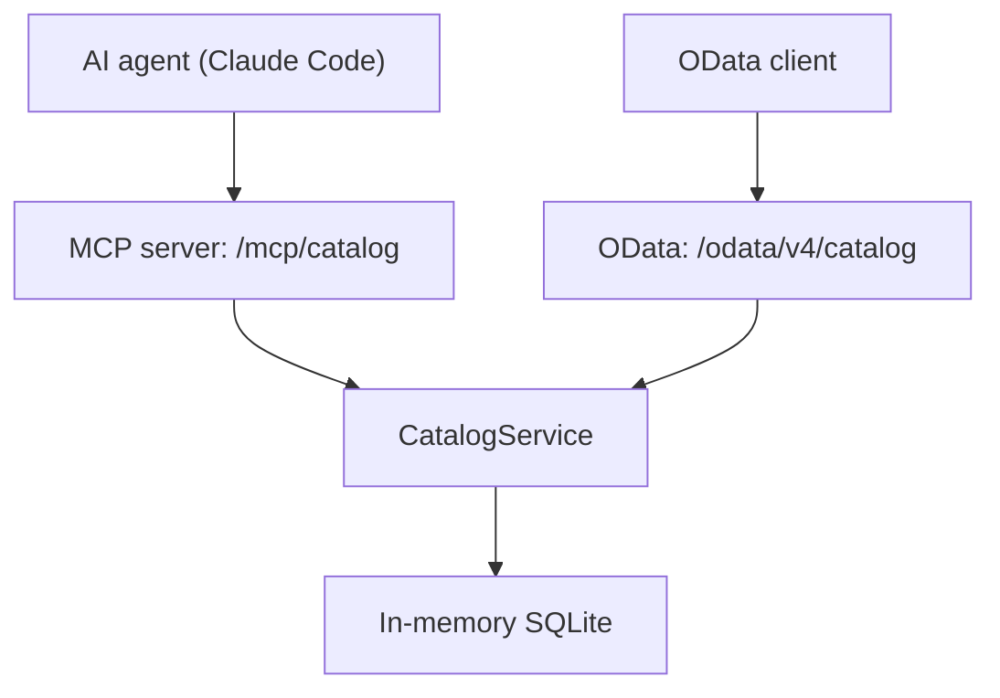

Publishing a SAP CAP service for an AI agent costs one annotation. With SAP's official `@cap-js/mcp` plugin, the line `@protocol: ['odata', 'mcp']` serves the same service over OData and over Model Context Protocol (MCP), without writing any server code. In testing, the agent answered business questions in Spanish correctly with CQL queries it built itself.

The obvious thing would be to call the job done there. Testing revealed three surprises worth knowing before using it:

1. **The plugin modifies Claude Code's global configuration.** In the development profile, by default it writes its entry to `~/.claude.json`, if that file exists, and deletes it when the server stops.
2. **The agent does not see everything documented in the model.** The `/** ... */` comments and `@title` with literal text do not reach the `describe` tool, even though the official documentation says they are used.
3. **The agent proposes an approach that does not work.** When faced with a write request it correctly refused, but it suggested a `PATCH` over OData that the service rejects with a 405.

This article opens a series on SAP CAP and AI agents with MCP. This first part sets up a demo service, publishes it over MCP, explains each surprise and what to do about it, and sets the limits of the reading. All tests were run locally, on 06-10-2026 and 07-10-2026, with made-up data.

## Test environment

| Component | Version |
|---|---|
| Node.js | 24.19.0 |
| npm | 11.17.0 |
| `@sap/cds-dk` (global) | 10.1.2 |
| `@sap/cds` | 10.1.1 |
| `@cap-js/mcp` | 1.5.0 |
| `@cap-js/sqlite` | 3.1.1 |
| `express` | 5.2.1 |
| Claude Code (MCP client) | 2.1.276, model `claude-sonnet-5` |

The `@cap-js/mcp` plugin is published by SAP's CAP team at [github.com/cap-js/mcp](https://github.com/cap-js/mcp), under the Apache 2.0 license. Its official documentation is the [Model Context Protocol Adapter](https://cap.cloud.sap/docs/guides/ai/cap-mcp) guide. The README of package 1.5.0 still links to an earlier address that returns a 404.

Test architecture: the same service is served simultaneously over OData and over MCP.



## From the CAP project to the MCP server

### Project creation

```bash
cds init cap-mcp
cd cap-mcp
npm i @cap-js/mcp @sap/cds express
npm i -D @cap-js/sqlite
```

With `@sap/cds-dk` 10.1.2, `cds init` does not generate `package.json`: it is created by the first `npm i` with the dependencies. The project name, the `start` and `watch` scripts and the `cds` section are added afterwards by hand.

### Data model

The model is a warehouse with two entities. The `@description` annotations play an important role, as will be seen later: they are what the agent reads to understand each field.

```cds
namespace demo.almacen;

using { cuid, managed, Currency } from '@sap/cds/common';

@description: 'Familias de productos del almacén.'
entity Categorias : cuid {
  nombre    : String(60) @mandatory;
  productos : Association to many Productos on productos.categoria = $self;
}

@description: 'Artículos a la venta con su precio y su nivel de stock.'
entity Productos : cuid, managed {
  nombre       : String(100) @mandatory;
  descripcion  : String(500);
  categoria    : Association to Categorias;
  precio       : Decimal(9, 2)  @description: 'Precio unitario sin impuestos';
  moneda       : Currency;
  stock        : Integer default 0 @description: 'Unidades disponibles en el almacén';
  stockMinimo  : Integer default 0 @description: 'Umbral de reposición: por debajo de este valor hay que pedir más unidades';
}
```

The test data, in `db/data/*.csv`, consists of 3 categories (Laptops, Peripherals and Monitors) and 7 products with prices in euros. Three products are below the minimum stock: USB-C Dock (0 of 6), 16-inch Laptop (3 of 4) and Mechanical Keyboard (8 of 10).

### The service: one annotation

```cds
using { demo.almacen as db } from '../db/schema';

@protocol: ['odata', 'mcp']
service CatalogService {
  @readonly entity Productos  as projection on db.Productos;
  @readonly entity Categorias as projection on db.Categorias;
}

annotate CatalogService with @mcp.instructions: 'Catálogo de productos de un almacén de demostración. Usa describe para conocer las entidades y query para consultar productos, categorías y niveles de stock. Un producto tiene stock bajo cuando stock < stockMinimo.';
```

The only new line compared to a normal CAP service is `@protocol: ['odata', 'mcp']`. With it, the service is published over MCP under the `/mcp/` prefix (here, `/mcp/catalog`), in addition to OData. The `@mcp.instructions` annotation is optional: its text reaches the agent as server instructions during protocol initialization, which was verified in the response to `initialize`.

### Startup

```text
[cds] - serving CatalogService {
  at: [ '/odata/v4/catalog', '/mcp/catalog' ],
  decl: 'srv\\catalog-service.cds:4',
  impl: 'node_modules\\@sap\\cds\\srv\\app-service.js'
}
[cds] - server listening on { url: 'http://localhost:4004' }
[cds] - server v10.1.1 launched in 2309 ms
```

The first startup, cold, took 30.4 s. Subsequent reloads after changing the model took between 1.8 and 2.1 s, and the startup with `npx cds watch` on 2026-10-07, 2.3 s.

## Autowire: the plugin modifies Claude Code's global configuration

Before connecting the agent, it is worth reviewing a default behavior of the plugin. In the development profile, `@cap-js/mcp` registers the server on its own in the clients it finds:

- it writes the server entry (key `cds:CatalogService`) into `~/.claude.json`, the Claude Code user's global configuration, if that file already exists;
- it does the same in the OpenCode configuration, if it exists;
- it deletes the entry when the server stops.

The code is in `lib/clients.js` of the package. It is convenient, but it touches a global user file that affects all their projects. In this test it was disabled in `package.json`:

```json
"cds": {
  "mcp": { "autowire": false }
}
```

and the server was registered only for the project, with a `.mcp.json` file at its root:

```json
{
  "mcpServers": {
    "almacen": {
      "type": "http",
      "url": "http://localhost:4004/mcp/catalog"
    }
  }
}
```

## The MCP tools the agent receives

The plugin does not publish one tool per entity, but rather two generic tools:

| Tool | What it does |
|---|---|
| `describe` | Returns the service model: entities, fields, types, descriptions and actions. |
| `query` | Executes a CQL statement. It only supports `SELECT`. |

If the service has actions or functions, the plugin adds a third tool, `call`. The official documentation presents all three together, but in this service, with no actions, `tools/list` returned only `describe` and `query`.

The description of `query` tells the agent to first use `describe` to learn the fields, and explains that CQL supports path expressions to follow associations without writing JOINs.

### Direct test with curl

Before using the agent, the protocol was tested with curl. This query follows the `categoria` association with a path expression:

```sql
SELECT nombre, stock, stockMinimo, categoria.nombre as categoria FROM Productos WHERE stock < stockMinimo ORDER BY stock
```

The response arrives in TOON format, compact for language models:

```text
count: 3
data[3]{nombre,stock,stockMinimo,categoria}:
  Base USB-C,0,6,Periféricos
  Portátil 16 pulgadas,3,4,Portátiles
  Teclado mecánico,8,10,Periféricos
```

A `DELETE FROM Productos` sent to `query` is rejected before reaching the database, during CQL compilation:

```text
Error executing CQL: CDS compilation failed
In 'DELETE FROM Productos' at 1:1-7: Error: Mismatched ‹Identifier›, expecting ‘(’, ‘select’
```

Reading is safe by design: with `query` you cannot write. To write, you have to expose CDS actions, which the agent invokes with the `call` tool.

## What descriptions reach the agent

The agent only knows about each field what `describe` returns to it, and in this version not all the ways of documenting the model reach that output. This was verified on 2026-10-07 against a copy of the project:

| Way of documenting | Appears in `describe` |
|---|---|
| `@description` on entities and fields | Yes |
| `@title` with i18n key (`'{i18n>NombreProd}'`) | Yes |
| `@title` with literal text | No |
| Documentation comments `/** ... */` | No, not even with `"cdsc": { "docs": true }` |

The "Created On" and "Changed On" descriptions that appear on the `managed` fields come precisely from `@title` with an i18n key. The official documentation states that documentation comments are used as well, but in this test they did not appear.

The most reliable approach is to describe with `@description` the fields whose meaning is not obvious. In the test model, the clear case is `stockMinimo`: without the description, the agent only sees an integer.

## Three questions in natural language

With the server running and registered in `.mcp.json`, three questions were asked in Spanish to Claude Code. The traces of each run were saved in full.

### Question 1: products below minimum

"What products have stock below the minimum and how many units would need to be ordered for each one to reach the minimum?"

The agent called `describe` for the `Productos` entity and then built the query itself:

```sql
SELECT from Productos { ID, nombre, stock, stockMinimo } where stock < stockMinimo order by nombre
```

| Product | Stock | Minimum | Units to order |
|---|---:|---:|---:|
| USB-C Base | 0 | 6 | 6 |
| 16-inch laptop | 3 | 4 | 1 |
| Mechanical keyboard | 8 | 10 | 2 |

Correct answer, in 7.7 s.

In a second run with the same question and the same data, in the Claude Code extension for Visual Studio Code, the agent calculated the units to order in the query itself (column `aPedir`), added the category and gave the total: 9 units. The figures for each product match those of the first run and the test data.


### Question 2: inventory value by category

"What is the total inventory value (price times stock) in each category? Sort it from highest to lowest."

The agent queried `describe` for `Productos` and `Categorias`, and generated a query with a path expression and an aggregation:

```sql
SELECT categoria.nombre as categoria, sum(precio * stock) as valorTotal FROM Productos GROUP BY categoria.nombre ORDER BY valorTotal DESC
```

| Category | Total value (EUR) |
|---|---:|
| Laptops | 15,285 |
| Monitors | 3,401 |
| Peripherals | 2,057.5 |

The figures were verified by hand:

- Laptops: 899 × 12 + 1499 × 3 = 15,285.
- Monitors: 329 × 7 + 549 × 2 = 3,401.
- Peripherals: 29.90 × 45 + 89 × 8 + 119 × 0 = 2,057.5.

Correct answer, in 8.8 s.

### Question 3: a write request

"The USB-C Base has received 10 units. Update its stock to 10."

In the first run, the agent called `describe`, located the product with a `query` and did not modify anything. It explained that `query` only supports `SELECT` and that there is no write tool, and proposed other approaches: the CAP application interface, a database administration tool or exposing a write action in the service. It took 14.5 s.

In the second run, in Visual Studio Code, the answer was essentially the same, but the agent first searched the project files and proposed three specific alternatives.


**The first alternative, `PATCH` via OData, does not work in this service.** The entities are projected with `@readonly`, so `PATCH /odata/v4/catalog/Productos(<ID>)` with `{"stock": 10}` returns `405 Method Not Allowed`:

```json
{"error":{"message":"Entity \"CatalogService.Productos\" is read-only","code":"ENTITY_IS_READ_ONLY","@Common.numericSeverity":4}}
```

The stock of the USB-C Base remained at 0. The agent was right to refuse to write, but its first suggestion did not take `@readonly` into account. The `Glob` search shown in the screenshot is over the project files, not an MCP tool: in Visual Studio Code the agent also sees the code, not just the MCP server.

### What the three questions show

- In all three questions, the agent first used `describe` to learn the fields and then wrote the query itself.
- The agent uses CAP CQL, including path expressions through associations (`categoria.nombre`) and aggregations with `GROUP BY`.
- With the same data, the shape of the answer changes between runs (query, columns, total), although the figures stay the same.
- The suggestions that the agent has not executed must be checked, as the rejected `PATCH` demonstrates.

## Limits of this first part

- **Read only.** `query` does not write, and the service is marked `@readonly`. Controlled writing through actions is the topic of the next installment.
- **Simulated authentication.** Locally, CAP uses `mocked` authentication. Authentication and roles are left for a later part of the series.
- **No deployment.** Everything has been tested locally; deployment to SAP BTP is outside the scope of this part.

## Conclusions

Publishing a SAP CAP service as an MCP server costs one annotation, `@protocol: ['odata', 'mcp']`, and from that moment on the agent can answer business questions with CQL queries that it builds itself. What requires attention is not the plugin, but what surrounds it:

1. Disable `autowire` if you do not want the plugin to modify Claude Code's global configuration, and register the server per project with `.mcp.json`.
2. Document with `@description` the fields that the agent cannot interpret by their name.
3. Review what the agent proposes and has not executed.

To review the CAP fundamentals used in this article, the blog covers how [the CDS model and the services](/en/blog/cap-modelo-cds/) are separated and when [handlers in Node.js](/en/blog/cap-servicios-handlers/) are needed. The complete CAP training is in the [SAP CAP course by Logali Tech](/courses/sap-cap-cloud-application-programming-model/).

**In part 2:** secure writing through CDS actions. Based on the limitation seen in question 3, an action is exposed in the service so that the agent can modify the stock with the `call` tool, in a controlled way.
