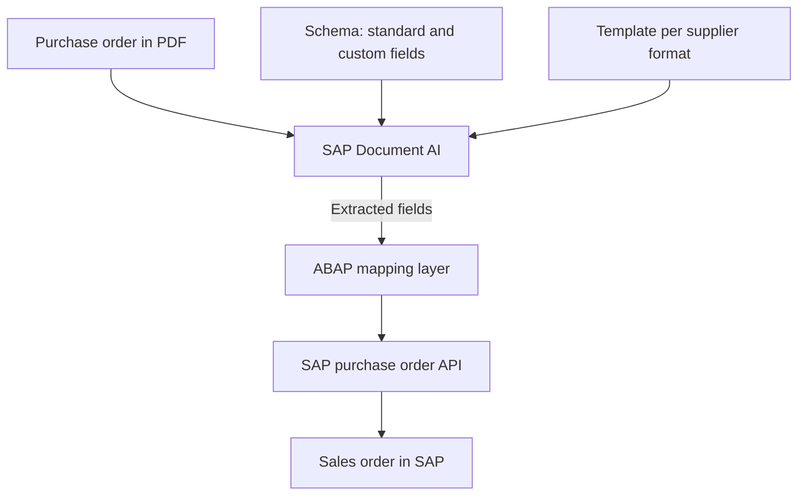
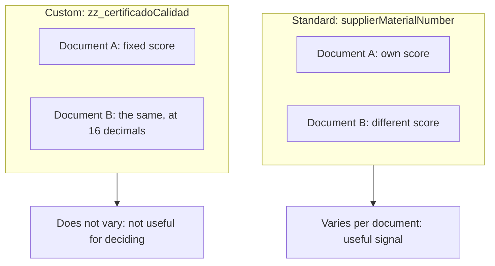

This article tells the story of a specific SAP integration case, but the underlying problem is not specific to SAP: it is what happens when an AI document extraction system gives an answer *and also* a number that says how confident it is in that answer, and that number turns out not to mean what the process design assumed it meant. Anyone automating decisions based on a model's output (not only in procurement, not only in SAP) will run into a version of this same problem. That is why it is worth following the case to the end, including the attempts that did not work.

**Key terms, in case they are not familiar** (the full vocabulary is in [part 1 of the series](/en/blog/what-is-sap-document-ai/)):

- **Document AI / SAP Document Information Extraction:** an SAP service that uses AI models to read documents (PDFs, scans) and extract structured fields; for example, from a purchase order: material number, quantity, price.
- **Schema:** the definition of which fields Document AI extracts from a document and what type each one is (standard, already defined by SAP, or custom, defined for this project).
- **SAP order API:** standard SAP interface for creating or modifying data (here, for creating the sales order) from an external program or from another SAP layer.
- **`MARA-BISMT`:** the field in the SAP material master where the old or cross-reference material code lives, which is what the code arriving in the PDF must be matched against.

## Context: SAP Document AI in multi-supplier orders

We are integrating **SAP Document Information Extraction (Document AI)** to convert PDF purchase orders, in two different supplier formats, into automatic sales orders in SAP. The design is the usual one: a schema with standard and custom fields, a template trained per format, and an ABAP layer that translates what has been extracted into the SAP order API for order creation.

The case worth telling starts when that design, correct on paper, comes up against a real document with 86 order lines (in SAP terms, 86 material items).

### Architecture diagram in SAP BAIP

This is how that design looks in SAP BAIP: the PDF enters Document AI, which extracts it against a schema and a template per supplier format, and delivers the result to the ABAP layer that translates it into the order API. The problem that follows is not in any single component of this diagram, but at the boundary between Document AI and the ABAP layer: in which extraction field the ABAP layer decides to read.

## The specific problem

A sales order in SAP identifies each material line by looking up a code in the material master (`MARA-BISMT`). That code has to come from some field in the extraction. The problem is that **there is no single candidate field**: each line of the PDF has two code columns printed on it (the customer's internal code and the supplier's code), and Document AI maps them to two different fields in the schema (`customerMaterialNumber` and `supplierMaterialNumber`).

### Example of an order line: the two codes competing for the same material

### Confirmed in the standard schema: two separate fields

`customerMaterialNumber` and `supplierMaterialNumber` are already separate fields in the standard schema `SAP_purchaseOrder_schema`:

The question, then, was which of the two fields actually contained the code in each case. Going through the 86 lines of the real document one by one, this is what each field returned:

| Field with code | Lines (out of 86) |
|---|---:|
| Customer code only | 19 |
| Supplier code only | 30 |
| Both codes | 12 |
| **Neither of the two** | **25** |

In other words: depending on the document and the supplier's format, the "good" code for SAP appeared sometimes in one field and sometimes in the other, and in 25 of the 86 lines it appeared in neither, even though on paper the column is printed and legible to the naked eye. Since the order approval control deliberately refuses to create an order while a single line remains without an identified material (the alternative is creating an order with the wrong material, which is worse), the practical result was that **an order of this size could never be approved**.

## The attempts that did not work

**1. Always mapping the same source field.** The first test document, with only two lines, worked by reading a fixed field. When scaling to a real document with 86 lines and two different supplier formats, that assumption broke: the correct code for SAP did not always live in the same field of the schema, so the automatic mapping failed silently depending on which format had generated the document.

**2. Trusting that the SAP layer would resolve it downstream.** The ABAP logic for material mapping already knows how to derive additional fields (such as the unit of measure) from the material master once it finds the corresponding material. But that derivation only acts **after** the material has been identified; if the line does not carry any usable code, there is nothing to start from. Delegating the problem to a later layer of the process did not work because that layer depends on the previous problem already being solved.

**3. Using the confidence score to decide automatically.** The idea was reasonable: if the extraction is not sure, flag the line for manual review instead of blocking the entire order. In this case, the material codes come from standard schema fields (`customerMaterialNumber` and `supplierMaterialNumber`), whose score does vary from one document to another, as the comparison below shows. The problem is that the score accompanies an extracted value: in the 25 lines with no code at all, Document AI does not fill in the schema field, so there is no score either (not even a 0), and those were precisely the ones blocking the order. If the code had come from a custom field, the score would not have helped either: as shown at the end of the article, in those fields the confidence is not recalculated per document (it returns the same value, identical down to the 16th decimal), so a fixed threshold would always classify them the same way, all as doubtful or all as reliable, regardless of the document.

**4. Correcting a document by hand in the review interface, hoping the model would "learn."** As explained in [part 1](/en/blog/what-is-sap-document-ai/), correcting and confirming are two different actions: the manual correction fixes that specific document, but only confirmed documents serve as a reference for subsequent extractions, whether through *instant learning* or as samples for a template. Correcting on screen solves that document, not the underlying problem.

## The solution that worked, and its limits

The part that was resolved was the ambiguity of "which field to look at": a business decision, made together with the functional team (not something that could be deduced from the integration alone), established a single canonical field, the one corresponding to the supplier code, as the one that must always match the internal material, for both document formats. With that, the ABAP layer no longer had to guess based on the source format and simply always reads that field.

This eliminates the mapping inconsistency, but **it does not solve coverage**: the 25 lines out of 86 that did not carry any extracted code still do not carry it. That is a different problem, one of training data rather than mapping design, and its solution involves obtaining several representative sample documents per format and retraining the template.

There is also a more subtle limit, discovered by comparing two documents with no relationship to each other: the **custom** fields of the schema (those that are not part of SAP's standard set) returned exactly the same confidence down to the 16th decimal in both documents. The standard fields, by contrast, varied normally from one to the other. The practical conclusion is that, for custom fields, everything indicates that this number is not calculated per document, but rather inherited from the template, and therefore it is not useful as a signal to automatically decide what to review, even if extraction coverage improves. Any future automation that depends on the confidence score must treat standard and custom fields as two completely different sources of reliability.

## The lesson, outside SAP

None of this is specific to Document AI or purchase orders. The pattern is this: a model returns a response and a number that is supposed to measure how much to trust it, the process design treats that number as if it were homogeneous and comparable across fields, and it is not. Here it broke in two different ways: the score says nothing about the values the model fails to extract (attempt 3), and in custom fields it was not even recalculated per document (final finding). Neither of the two ways is visible by reading the vendor's documentation; both only appeared when comparing real cases against each other.

The practical consequence, for anyone about to automate a decision based on a model's output (not only in SAP, not only with Document AI): before setting a confidence threshold to decide "this goes through automatically, this goes to manual review," you have to verify, field by field, that this number behaves as a real signal and not as an inherited or saturated value. If it is not verified, the threshold you set will not be discriminating what you think it is discriminating.
