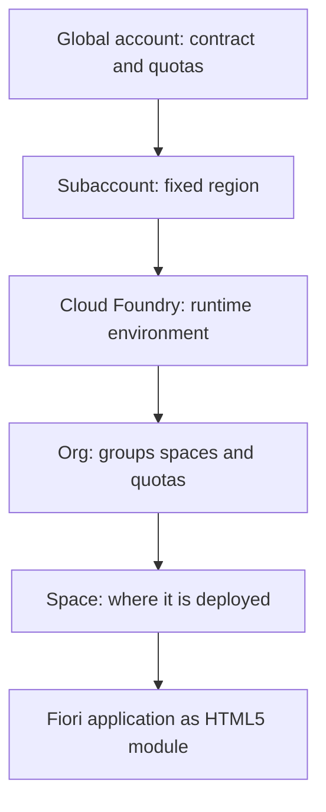
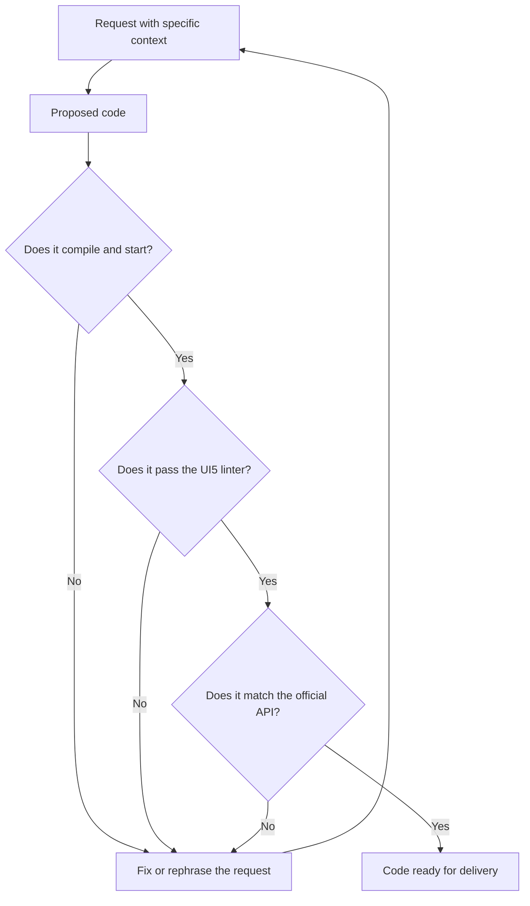

On September 21, 2026, the first class of the Master's in Fiori SAPUI5: Frontend Programming with AI was held. The full recording is published on YouTube and this article condenses its technical content: what environment an SAP frontend developer needs, what decisions are made before writing the first line of code, and how an AI assistant is brought into the project without losing control of the result.

The session does not program anything. Its goal is for each student to finish with the environment set up and verified, because the following eleven classes build a single application on it and an account that has not been created blocks the rest of the program.

## The session video

[](https://www.youtube.com/watch?v=xbBV2ZimRyo)

The session ran past the 90 minutes planned because it includes a comparative tour of several AI development tools, with the same request launched in each one. The following sections cover the essentials in the order in which they were presented.

## What you end up with when you finish

1. An active SAP BTP trial account, with its subaccount and its Cloud Foundry space.
2. SAP Business Application Studio accessible from the browser, with a dev space of type SAP Fiori in RUNNING status.
3. Visual Studio Code with the SAP Fiori Tools extension pack.
4. Node.js, npm and Git installed and verified.
5. A working AI assistant in the editor, with the UI5 MCP server connected.

The closing criterion is not having installed the software, but having run the check for each point. The checklist is at the end of the article.

## SAP BTP: the hierarchy you need to pin down

SAP Business Technology Platform is where the Fiori application is deployed, where connectivity with the backend is configured and where the launchpad is published. Four levels appear in daily work and in the certification exam: **global account**, **subaccount**, **org** and **space**.



The subaccount is born and remains in the data center that was chosen when it was created, and the trial account offers a reduced subset of SAP's data centers: in the session, United States (Amazon Web Services) and Singapore (Microsoft Azure). The details are in [the SAP BTP account hierarchy](/en/blog/btp-admin-jerarquia-cuentas/) and in [the Cloud Foundry org, space and app model](/en/blog/cf-modelo-org-space-app/).

**Trial and free tier are not the same.** The trial account is free, with no contract and limited in time and resources; it is the one used in the master's program. The free tier consists of free plans within a productive account: it does not expire, but it requires a commercial agreement and an associated card, and it is the usual route in a company.

The trial account lasts 90 days in 30-day intervals, renewable by logging in regularly or with the **Extend Trial Account** button. Thirty consecutive days without access delete the account and its contents. Hence the operational rule of the master's program: **log in to the account at least once a week**. The code is not lost if it is in a Git repository, and that is why Git is a requirement from the first class.

| Address | Use |
|---|---|
| `cockpit.hanatrial.ondemand.com/trial/` | Trial accounts |
| `account.hana.ondemand.com` | Productive accounts |
| `cockpit.hana.ondemand.com` | Neo environment, retired. Returns `Service Unavailable` |

Confusing the third address with the first is the main cause of a block in a first session. When faced with that error, the cause is the address, not the account.

## Business Application Studio or Visual Studio Code

In a real project you will find both environments.

**SAP Business Application Studio** runs in the browser from BTP and is built on Code-OSS, the same open source project that Visual Studio Code is based on. It is organized into dev spaces that are created with a specific type, and the type determines which tools come preinstalled. For SAPUI5 and Fiori elements the type is **SAP Fiori**: application generator, UI5 Tooling, annotation editors and preview. A dev space is a Linux machine provisioned in the cloud; the first startup takes one or two minutes and you have to wait for the RUNNING state. On a trial account you can create two, only one can be running and a dev space that is not started within thirty days is deleted.

**Visual Studio Code** is the local environment. It requires Node.js and the extension pack **SAP Fiori Tools - Extension Pack**, from the SAPSE publisher, which installs around ten extensions: Application Wizard, Application Modeler, Service Modeler, Annotation Modeler and UI5 language support. Check from the terminal:

```bash
code --list-extensions | grep -i "sap-ux"
```

On Windows, `grep` does not exist in either PowerShell or the command prompt. The equivalent in PowerShell is `Select-String`:

```powershell
code --list-extensions | Select-String sap-ux
```

The selection criteria: if the company's team does not allow installing software, you work in Business Application Studio from the browser without missing out on anything; if you can install software, Visual Studio Code wins on control and speed; if there is also a BAS subscription in the subaccount, you use both, with the code in Git as the common point. The master works mainly in Visual Studio Code and turns to BAS when direct connectivity with BTP is useful. The Fiori tools in the editor are expanded on in [Fiori tools in VS Code](/en/blog/fe-fiori-tools-vscode/).

## Node.js, Git and the SAPUI5 version

**Node.js** does not run the application in production. The Fiori application runs in the user's browser; Node.js runs everything that builds it: the generator, the preview server, the build, the linter and the tests. Node.js also installs npm, the package manager that downloads the dependencies declared in `package.json`.

```bash
node -v
npm -v
git --version
```

If all three commands return a version, there is nothing else to do. It is advisable to install an **LTS** version of Node.js, because UI5 Tooling and SAP tools are tested against LTS. On Windows, after installation you must close and reopen the terminal so that the `PATH` variable is updated.

**Git** is a requirement for a structural reason. In ABAP the code lives on the application server and the system itself handles concurrency by locking the object. In frontend development the code is on each developer's machine, including when that machine is a Business Application Studio dev space, and synchronization between several people is handled with Git. GitHub, GitLab, Bitbucket or Azure DevOps host the remote repository and are interchangeable.

**The project's SAPUI5 version is pinned**, and an LTS one is chosen. Situation as of the class date:

| Version | Status |
|---|---|
| 1.152 | Latest available, under maintenance |
| 1.148 | LTS |
| 1.136 | LTS |
| 1.120 | LTS |

For on-premise targets the version is not chosen: it is imposed by the target system. The library served by an S/4HANA system has a specific version and the application cannot be built against a higher one. This check is done before starting, by querying the `sap-ui-version.json` file that the server exposes alongside the library. This precaution does not apply to deployment on SAP BTP, where the library is served from SAP's SAPUI5 repository.

## TypeScript vs JavaScript

The master's controllers are written in TypeScript, and the reason is not the syntax but when the error appears. In JavaScript, the error shows up at runtime:

```javascript
function calcularTotal(precio, cantidad) {
    return precio * cantidad;
}
calcularTotal("120,50", 3);   // NaN, detected only at runtime
```

In TypeScript, the error is detected as you type:

```typescript
function calcularTotal(precio: number, cantidad: number): number {
    return precio * cantidad;
}
calcularTotal("120,50", 3);   // Compilation error: string is not number
```

TypeScript is compiled to JavaScript before deployment, so the browser receives the same thing. What you gain is early detection and full autocompletion over an API as extensive as UI5's, because SAP publishes the framework's type definitions. Since version 1.115.0, event handlers have specific types, for example `Button$PressEvent`. Migrating an existing project is covered in [TypeScript in SAPUI5](/en/blog/ui5-typescript/).

## AI assistants: context wins, not power

The master's program integrates AI assistants from the very first class with a rule that governs everything else: **the assistant speeds up writing; the developer is accountable for the code they deliver**.

| Piece | What it is |
|---|---|
| Model | The system that generates the response |
| Harness | The program that directs the model, runs tools and works on the files |
| Context | What the harness puts in front of the model on each request: files, documentation, tools and project memory |

A request to the model has no memory of its own. The harness resends the history, the relevant files and the definition of the registered tools on every call, and for a single developer request it makes dozens of calls until the task is considered complete. In the session, a measured case was shown: a single prompt generated **49 requests** to the model. Settled by API key consumption with a budget model, the whole job cost **0.01 USD**; the same intensive use with a high-end model exhausts a subscription within hours. Hence the usual practice on a team: budget models for long, mechanical tasks, and more capable models for work that requires judgment.

### The demonstration

The same request, a sample SAPUI5 application in TypeScript, was launched on several tools: a Google agent environment, an open-source terminal agent, the OpenAI agent, a local harness connected to DeepSeek via API key, and Claude Code. All of them produced an application that starts. Only one also received the official UI5 MCP server, and it was the only one that delivered the project with the official conventions: TypeScript, base controller and correct folder structure. The difference was not in the model, but in the context it was given.

### MCP, the mechanism that provides context

The **Model Context Protocol** is a standard that connects an assistant with external information sources and tools, in the manner of a universal connection port: the server plugs into the assistant and provides it with capabilities it did not have.

| Without an MCP server | With an MCP server |
|---|---|
| Responds with what it memorized during training | Consults the current official documentation |
| Infers the signature of a control | Reads the API reference for the project version |
| Proposes code and takes it as good | Runs the official linter on what it has written |

The SAPUI5 API reference illustrates why this is needed: much of it is built dynamically in the browser, and an assistant that merely crawls pages does not get what it needs from it.

SAP publishes the official UI5 MCP server at [github.com/UI5](https://github.com/UI5) and it is the only mandatory one in the master's program. Among its tools:

| Tool | What it does |
|---|---|
| `get_guidelines` | Returns SAP's official rules for UI5 development |
| `get_api_reference` | Queries the API for the project's UI5 version |
| `run_ui5_linter` | Runs the official linter, with an option to fix |
| `create_ui5_app` | Generates a UI5 project |
| `get_project_info` | Returns the project configuration, version and libraries |
| `get_version_info` | Lists the available versions and indicates which are LTS |

An MCP server is registered either globally or at project scope, and the recommendation is **project scope**: whatever is registered travels with every request, and a UI5 server registered globally keeps loading its context into projects that have nothing to do with UI5. The configuration is a `.mcp.json` file at the root of the project:

```json
{
  "mcpServers": {
    "ui5": {
      "type": "stdio",
      "command": "npx",
      "args": ["-y", "@ui5/mcp-server"]
    }
  }
}
```

The `stdio` transport indicates that the server runs as a local process. It does not have to be started by hand, but after registering it you must restart the assistant session for it to detect it. In Claude Code there is also an official plugin that installs the same server along with the rest of the UI5 context:

```bash
claude plugin marketplace add anthropics/claude-plugins-official
claude plugin install ui5@claude-plugins-official
claude plugin list
```

Skipping the first command produces the error `Plugin "ui5" not found in marketplace`, which is the most common confusion.

### The rules the server returns

The guidelines delivered by `get_guidelines` are the document SAP publishes so that agents work correctly, and they apply equally to manual development:

- Never access framework objects through global variables. Dependencies are declared with `sap.ui.define` in JavaScript, with `import` in TypeScript and with `core:require` in XML views.
- Never use inline script in HTML, because of the content security policy.
- Always use `sap/ui/core/ComponentSupport` to initialize the application.
- Do not write custom formatters for standard OData types, because the built-in types already resolve them.
- In TypeScript, use the control's specific event type, available since UI5 1.115.0.

The first two are covered in [sap.ui.define and asynchronous loading](/en/blog/ui5-carga-asincrona-define/).

### The files that govern the project

Besides the code, a project worked on with an assistant contains three elements with different roles. The `.mcp.json` file declares the available servers. The project memory file, in Markdown, is loaded on every request, even a four-character greeting, so it should capture decisions and conventions rather than extensive documentation. The assistant configuration folder contains the **skills**, specialized instructions that indicate how a specific task is done well: the MCP server provides tools and data; the skill provides judgment. Logali Tech publishes a [catalog of skills](/ai/skills/) for Fiori and SAPUI5, including those for UI5 best practices, Fiori tools, Fiori elements, annotations, OPA5 tests and tables.

## The verification protocol

This is the part that repeats across the next eleven lessons. Four rules for any code proposed by an assistant:

1. **Run it, do not read it.** Code that compiles and starts, not code that looks correct. A service is verified with a real request.
2. **Demand the confidence level.** Ask the assistant to distinguish which part of the answer is solid and which part requires verification.
3. **Check against the source.** For SAPUI5, the API reference in the Demo Kit. For an OData service, the `$metadata` document.
4. **Pass the linter.** The UI5 linter detects deprecated APIs and discouraged patterns, which is where assistants make the most mistakes by dragging in old code.



An MCP server reduces errors, it does not eliminate them, and the protocol remains mandatory. AI does not reduce the need to know SAPUI5, it shifts it: before you had to know how to write it, and now you have to know how to judge it, and to judge it you have to know it just as well.

## Common mistakes in the first class

| Symptom | Cause | Solution |
|---|---|---|
| `Service Unavailable` when opening the cockpit | Neo environment address, retired | Use `cockpit.hanatrial.ondemand.com/trial/` |
| The trial account has disappeared | Thirty days without any access | Sign up again and log in every week |
| The dev space does not offer the expected tools | Wrong dev space type | Create one of type SAP Fiori |
| A second dev space does not start | The trial account only allows one running | Stop the one you are not using |
| `node` is not recognized as a command | The `PATH` variable has not been updated | Close and reopen the terminal |
| `Plugin "ui5" not found in marketplace` | The marketplace has not been registered | Run the registration command first |
| The assistant suggests obsolete UI5 APIs | It carries over patterns from old versions | Run the UI5 linter and check against the Demo Kit |

## Before class 2

Checklist that every student should be able to confirm:

1. The SAP BTP trial account opens and shows the subaccount, with its org and its space.
2. A dev space of type SAP Fiori exists in RUNNING status.
3. `node -v`, `npm -v` and `git --version` return a version.
4. The SAP Fiori Tools extension pack appears active and the Application Wizard opens from the command palette.
5. The assistant responds inside the editor and the UI5 MCP server shows as connected.

And one task: generate a test application with the Application Wizard, open it in preview, and ask the assistant for an explanation of the generated `manifest.json` file so you can compare it against the official documentation. The goal is twofold: to become familiar with [the descriptor that concentrates all the application configuration](/en/blog/ui5-manifest-descriptor/) and to practice contrasting an answer. Class 2 starts there.

## About the certification

The master covers the areas of the **SAP Certified Associate, SAP Fiori Application Developer** certification, current code **C_FIORD_2502**. The code `C_FIORID` does not exist, even though it circulates in forums, and `C_FIORDEV_20`, `C_FIORDEV_21` and `C_FIORDEV_22` correspond to retired syllabi. Data published by SAP as of the class date: two hours, a 60 percent cut score and a scenario-based assessment, with one activity. A scenario-based assessment is not passed by memorizing answers, and that is why the master builds a real application from start to finish. SAP changes the format, duration and price without prior notice, so it is advisable to confirm the data in [the official certification page](https://learning.sap.com/certifications/sap-certified-associate-sap-fiori-application-developer-1) before booking an exam slot. The exam is not included in the price of the master.

## Summary

1. The first class does not involve programming: it sets up and verifies the environment, because the following eleven build a single application on top of it.
2. In SAP BTP you have to set four levels, global account, subaccount, org and space, and log in to the trial account every week. The address of the trial cockpit contains `hanatrial`.
3. In Business Application Studio the type of dev space determines the tools; for SAPUI5 it is SAP Fiori. Locally, Visual Studio Code with SAP Fiori Tools, Node.js LTS and Git.
4. The SAPUI5 version of the project is pinned to an LTS and, with an on-premise destination, it is imposed by the destination system. The controllers go in TypeScript.
5. With AI assistants, context wins, not model power: UI5 MCP server in the project scope, brief project memory, skills for judgment and the verification protocol in every delivery.

The next article in the master's classes corresponds to class 2, Architecture of a SAPUI5 application. The full program, the calendar and access to the virtual classroom are in [the page for the Master's in Fiori SAPUI5](/masters/fiori-sapui5/).

<figure>
  
  <figcaption>Gheorghe Valer, instructor of the Master's in Fiori SAPUI5.</figcaption>
</figure>
