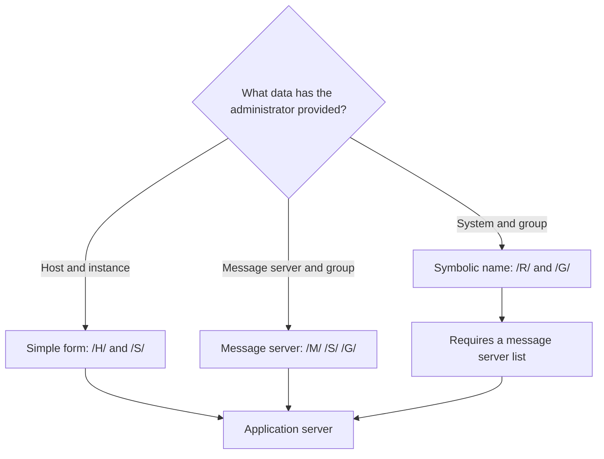

On a Mac, the client for working with an SAP system is **SAP GUI for Java**. Downloading and installing it takes only a few minutes. What really takes effort is the first connection: the administrator provides a host, the **System** tab asks for a system and a group, and there is no way to make one fit with the other.

This article covers a real installation from start to finish. It explains why there is no need to install Java, what the three ways SAP GUI for Java has of addressing a system are and which one corresponds to each situation, and how to diagnose the network when the connection does not respond.

## Test environment

| Item | Value |
|---|---|
| Computer | Mac with an M series processor (ARM64) |
| Operating system | macOS Tahoe 26.6.2 |
| Installed version | SAP GUI for Java 8.10, patch 14 |
| File | `platingui_inst_810_14-80009301.dmg` |
| Browser | Safari |
| Network | VPN connection to the SAP system |
| Dates | October 8 and 9, 2026 |

Before you start, you need:

- an SAP for Me user (S-user) with the **Software Download** authorization: as the portal itself states, you request it from your company's user administrator;
- the system connection data, which the administrator provides (in this case, the application server host and the instance number);
- VPN access, if the system is not reachable from outside the company network.

## Step 1. Download SAP GUI for Java from SAP for Me

In [Software Downloads](https://support.sap.com/en/my-support/software-downloads.html) in SAP Support, the **Software Downloads in SAP for Me** button leads to the SAP ID login. Inside SAP for Me, the search engine finds the component when you type `sap gui for java`. When you expand it, the available version appears, **SAP GUI FOR JAVA 8.10**.


On the **DOWNLOADS** tab of the version, the platform dropdown offers four options: LINUX ON X86_64 64BIT, MACOS ON ARM64 64BIT, MACOS ON X86_64 64BIT and WINDOWS ON X64 64BIT. For a Mac with an M-series processor, you select **MACOS ON ARM64 64BIT**.

The list shows, for each patch, a `.jar` file and a `.dmg` file. You download the `.dmg` of the most recent patch: `platingui_inst_810_14-80009301.dmg`, patch 14, 318623 KB, published on 18.09.2026.


## Step 2. Allow pop-ups and downloads in Safari

When you click the file, the download does not start: Safari's address bar shows **Pop-up blocked**. SAP for Me opens the download in a new window, and Safari blocks it by default.

To allow it:

1. **Safari** menu, **Settings…**
2. **Websites** tab, **Pop-ups** section.
3. For `me.sap.com`, change **Block and Notify** to **Allow**.


When you repeat the download, Safari asks whether to allow downloads from `me.sap.com` and `launchpad.support.sap.com`. Answer **Allow**. The downloaded file is 326.3 MB.


## Step 3. Install from the DMG

When you open the DMG, the installer window appears, **SAP NetWeaver, SAP GUI for the Java Environment 8.10**, with two items: the **SAP Clients** folder and a shortcut to **Applications**. Installation consists of dragging **SAP Clients** onto **Applications**.


The application ends up in `/Applications/SAP Clients/SAPGUI 8.10rev14/` under the name **SAPGUI 8.10rev14**, and you can open it from Spotlight.

## You do not need to install Java: SAP GUI brings its own

SAP GUI for Java is a Java application, and it is easy to assume that Java must first be installed on the Mac. In this installation that was not necessary: the DMG worked with no further steps. The reason lies inside the application itself, which includes its own Java runtime environment:

```bash
grep JAVA_VERSION "/Applications/SAP Clients/SAPGUI 8.10rev14/SAPGUI 8.10rev14.app/Contents/Resources/jre/Contents/Home/release"
```

```text
JAVA_VERSION="21.0.12.1"
```

To verify that SAP GUI uses that Java and not another one, you can check, with SAP GUI open, which Java virtual machine its process has loaded. First you get the process number and then you look, among its open files, for the `libjvm.dylib` library, which is the Java virtual machine:

```bash
pgrep -l SAPGUI
lsof -p <número de proceso> | grep libjvm
```

The output (summarized) points to the application folder:

```text
SAPGUI ... /Applications/SAP Clients/SAPGUI 8.10rev14/SAPGUI 8.10rev14.app/Contents/Resources/jre/Contents/Home/lib/server/libjvm.dylib
```

Two conclusions:

- **Java runs inside the `SAPGUI` process.** That is why a `ps -ax | grep java` shows nothing: there is no process named `java`.
- **SAP GUI uses the Java it brings, not the system one.** On the Mac used for the test there was also an OpenJDK 25 installed separately, and SAP GUI did not use it.

## The three ways to address an SAP system

Before creating the connection, it is worth understanding what SAP GUI for Java expects. According to SAP's documentation on [SAP GUI for Java connection strings](https://help.sap.com/docs/sap_gui_for_java/e665f2b67dbd4328ab6bd9e029b84581/fea559caf24b4af390f75af0a12e0a0b.html?locale=en-US), a system can be addressed in three ways:

| Form | Connection string | What you need to know |
|---|---|---|
| Simple | `/H/<host>/S/<puerto>` | Host and port of the application server |
| Message server | `/M/<host>/S/<puerto>/G/<grupo>` | Host and port of the message server, and the logon group |
| Symbolic name | `/R/<SID>/G/<grupo>` | System name, logon group and a Message Server List |

All three end at an application server, which is where the work is done. The difference lies in who decides which one the user connects to:

- **Simple:** the user connects directly to a specific application server.
- **Message server:** SAP GUI asks the system's message server, which distributes users among the application servers of the specified group.
- **Symbolic name:** SAP GUI looks up the system name in the Message Server List, a text file that translates each name into the address of its message server, and then continues as in the previous form.



## Why the System tab is no good with only a host

The first window of SAP GUI for Java shows the **JavaGUI Services** folder empty. The new connection button, next to **Connect**, opens the **Connection Properties**.


The obvious solution is to fill in the first tab, **System**. Its required fields are **System** and **Group/Server**; the **Message Server** field appears greyed out, with no way to type in it.


Compared with the previous table, this tab corresponds to the **symbolic name** form: it asks for the system name and the logon group. With only the application server host there is no way to fill it in: the logon group is unknown, and the symbolic form also requires the system to appear in a Message Server List.

The administrator's piece of information corresponds to the **simple form**, and that form has no tab of its own: it is typed by hand.

## Step 4. Write the connection string in expert mode

The connection with the simple form is created like this:

1. In the initial window, click the new connection button, next to **Connect**.
2. In **Description**, enter a name to recognize the connection in the list.
3. Open the **Advanced** tab.
4. Select **Expert mode**.
5. In the text box, enter the connection string with the application server host and port: `conn=/H/<host>/S/3200` for instance 00.
6. Check that the lower box shows **All parameters valid**.
7. Click **Save**.

The field validates the string as you type, and a value that does not start correctly is rejected with this message:

```text
El string de conexión debe empezar por /H/, /M/, o /R/.
```


The three supported prefixes are, precisely, the three forms in the table. For the simple form:

```text
conn=/H/<host>/S/3200
```

The port is not arbitrary. The SAP GUI for Java documentation states that, by convention, the port of an application server is 3200 plus the two-digit system number. The SAP page [TCP/IP Ports of All SAP Products](https://help.sap.com/docs/Security/575a9f0e56f34c6e8138439eefc32b16/616a3c0b1cc748238de9c0341b15c63c.html?locale=en-US) lists it as `32NN` for Application Server ABAP, in the range 3200 to 3299. For instance 00, the port is 3200.

The validation confirms the string with the message **All parameters valid**.


One consequence of expert mode: when you later edit a connection created this way, you can only open the **Advanced** tab. The connection string becomes the only definition of the connection.

Entering this string was the step that took the most time in the test, even though it only contains the host and the port.

## Diagnosing the network with nc

When the connection does not respond, it helps to separate two problems: whether the Mac can reach the server and whether the port is the right one. For the first, `nc` from the macOS Terminal is useful:

```bash
nc -vz <host> 3200
```

These are the three results obtained in the test:

| Situation | `nc` result | What it means |
|---|---|---|
| VPN connected, port 3200 | `Connection to <host> port 3200 [tcp/tick-port] succeeded!` | There is network and the port is open |
| VPN disconnected, port 3200 | No response; the command keeps waiting and you have to stop it with Control+C | There is no network to the server |
| VPN connected, port 3201 | `succeeded!` | The port is open, but that does not make it the right one |

The third case is the important one. With port 3201, `nc` reports that the connection opens, but SAP GUI rejects it on connecting: 3201 would correspond to instance 01, which is not the one for the system. **`nc` checks the network, not the correct port.** The instance number is provided by the administrator, and the port is derived from it with the rule `32NN`.

## Step 5. First connection

After clicking **Save**, the connection appears in the **JavaGUI Services** list. When you click **Connect** for the first time, SAP GUI for Java asks you to classify the system: **No trust level specified** for that system. The default option is **Internal: Generally trustworthy; no additional authorizations required**. It was kept and **OK** was clicked.


The login screen then appears, with the fields **Client**, **User**, **Password** and **Language**.


After the copyright notice, the system displays **SAP Easy Access**: the installation and the connection are working.


## Summary

| Obstacle | Solution |
|---|---|
| Safari blocks the download window | Allow pop-ups and downloads on `me.sap.com` |
| Doubt about whether to install Java | Not necessary: SAP GUI comes with its own Java 21 |
| The System tab asks for system and group | It corresponds to `/R/`; with only a host, the simple form is used |
| The connection string is rejected | Start with `/H/`, `/M/` or `/R/` depending on the available data |
| The port is unknown | Calculate it with the `32NN` rule from the instance number |
| The connection does not respond | `nc -vz` to check the network and the VPN |
