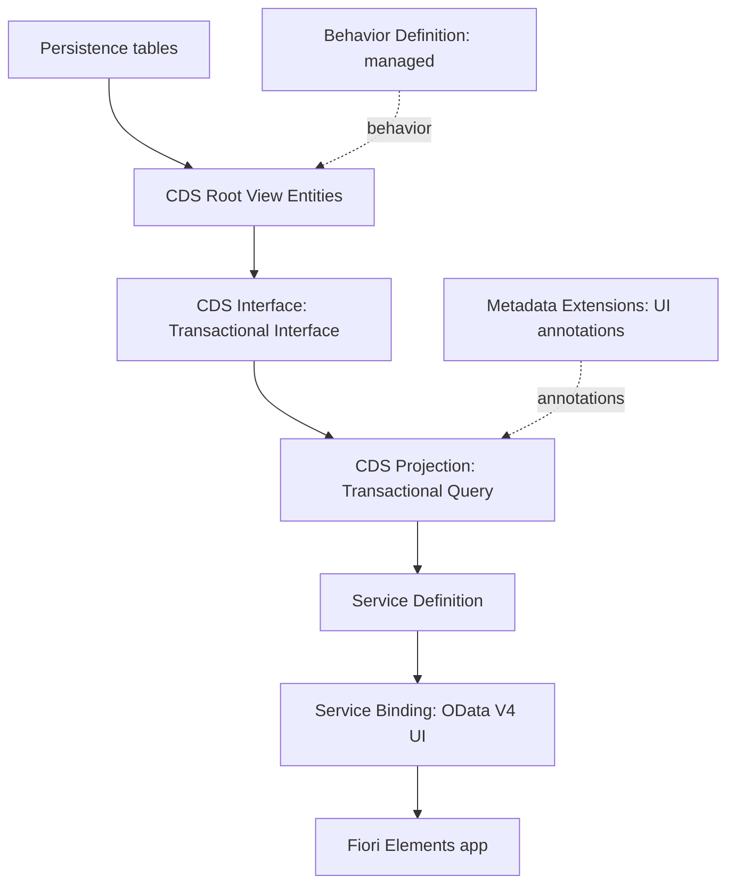

The Logali Tech YouTube channel publishes **"SAP ABAP Cloud RAP from zero to expert"**, a free series on the ABAP RESTful Application Programming Model. The series builds, video by video and on a real SAP BTP system, a transactional travel management application. The videos published so far range from creating the account to the Behavior Definition, covering the CDS data model, OData services and the Fiori Elements interface along the way.

This article summarizes what the series covers, how it is organized and how to make the most of it.

## Key facts about the series

| Concept | Detail |
|---|---|
| Format | YouTube playlist, in Spanish |
| Cost | Free and no registration required |
| Environment | SAP BTP ABAP Environment (trial account) and Eclipse with ABAP Development Tools |
| Practical case | Travel management application with the Travel, Booking and Booking Supplement hierarchy |
| Service type | OData V4 for the user interface, consumed by Fiori Elements |
| Level | From scratch to advanced RAP concepts |

## Why SAP RAP is relevant

RAP is the ABAP Cloud programming model for building transactional SAP Fiori applications and OData-based web APIs. For new developments it replaces earlier approaches, such as OData services created with transaction SEGW or the BOPF-based programming model.

Three reasons explain its current weight in SAP projects:

1. **Clean core.** RAP works with released APIs and development objects with a stable contract. Extensions built this way do not modify the standard and withstand system upgrades. The approach is covered in [Clean Core for developers](/en/blog/clean-core-extending-s4hana-developers/).
2. **A single model for multiple environments.** The same concepts (CDS, Behavior Definition, Service Definition and Service Binding) apply in SAP BTP ABAP Environment and in SAP S/4HANA.
3. **Less infrastructure code.** In the managed scenario, the framework handles persistence, locks and concurrency control. The developer focuses on business logic.

## Architecture built throughout the series

The application is developed in layers. The diagram shows the path from the database to the Fiori Elements app, in the same order in which the series presents it.

The persistence tables correspond to the three entities of the case study: Travel, Booking and Booking Supplement. The root layer defines the composition and the associations between them.

## Full syllabus

The series is organized into five blocks. Each title links to the corresponding video within the playlist.

### Block 1. Development environment (6 videos, 58 min)

Environment setup: SAP BTP account, ABAP Cloud instance, connection from Eclipse, and code backup on GitHub.

| No. | Video | Content | Duration |
|---:|---|---|---:|
| 1 | [SAP BTP account](https://www.youtube.com/watch?v=j5gh1X7w6Jc&list=PLa8oVCEIJRoM&index=1) | Registration of the free trial account, 90-day period, and first tour of the cockpit | 10:57 |
| 2 | [ABAP Cloud instance](https://www.youtube.com/watch?v=rEKvvDtEPh4&list=PLa8oVCEIJRoM&index=2) | Subscription to the ABAP Environment service from the Service Marketplace or with Boosters, and obtaining the Service Key | 6:28 |
| 3 | [ABAP Cloud project](https://www.youtube.com/watch?v=nxBiV43S2Vc&list=PLa8oVCEIJRoM&index=3) | Creation of the ABAP Cloud Project in Eclipse and connection to the instance via browser login | 5:18 |
| 4 | [Enterprise account](https://www.youtube.com/watch?v=25TcMiWwUwM&list=PLa8oVCEIJRoM&index=4) | Differences between trial and enterprise account, and configuration in a productive environment | 9:03 |
| 5 | [abapGit](https://www.youtube.com/watch?v=vUCnTyppVsU&list=PLa8oVCEIJRoM&index=5) | Installation of the abapGit plugin in Eclipse | 5:09 |
| 6 | [Code backup](https://www.youtube.com/watch?v=juz-_d3QhPI&list=PLa8oVCEIJRoM&index=6) | Connecting abapGit to GitHub to version, upload, and retrieve code | 20:41 |

### Block 2. Data model with CDS (11 videos, 1 h 52 min)

Building the data model: tables, test data, and the three CDS layers of the Business Object, along with their relationships.

| No. | Video | Content | Duration |
|---:|---|---|---:|
| 7 | [Table creation](https://www.youtube.com/watch?v=lWB_TiFYWlg&list=PLa8oVCEIJRoM&index=7) | RAP layer architecture and persistence tables with UUID keys, amounts with currency, and audit fields | 15:32 |
| 8 | [Data insertion](https://www.youtube.com/watch?v=RThqQHn9WAE&list=PLa8oVCEIJRoM&index=8) | ABAP class that generates test data from SAP demo tables | 7:46 |
| 9 | [CDS Root](https://www.youtube.com/watch?v=rpb6Mjr0xAw&list=PLa8oVCEIJRoM&index=9) | Root View Entity, audit annotations, and ETag for optimistic concurrency control | 14:21 |
| 10 | [CDS Interface](https://www.youtube.com/watch?v=13P9nv4a4-k&list=PLa8oVCEIJRoM&index=10) | Intermediate layer with the Transactional Interface contract, which decouples the root layer from future changes | 10:40 |
| 11 | [CDS Projection Entity](https://www.youtube.com/watch?v=mmEV_OJmKqE&list=PLa8oVCEIJRoM&index=11) | Consumption layer with the Transactional Query contract | 5:47 |
| 12 | [Composition](https://www.youtube.com/watch?v=wiaOEyUikEo&list=PLa8oVCEIJRoM&index=12) | `composition` and `association to parent` for the Travel, Booking, and Booking Supplement hierarchy | 8:56 |
| 13 | [Redirected](https://www.youtube.com/watch?v=NuLoRFCbpug&list=PLa8oVCEIJRoM&index=13) | Propagation of the composition with `redirected to parent` and `redirected to composition child` | 9:53 |
| 14 | [Relationships](https://www.youtube.com/watch?v=Bq0xATmFq2U&list=PLa8oVCEIJRoM&index=14) | Direct association of Booking Supplement to Travel with 1-to-1 cardinality | 5:28 |
| 15 | [Additional associations](https://www.youtube.com/watch?v=NoMJkZHEJg4&list=PLa8oVCEIJRoM&index=15) | Associations to standard entities (`I_Agency`, `I_Customer`, `I_AirlineCarrier`, `I_Currency`) for search helps and validation | 17:31 |
| 16 | [Metadata Extensions](https://www.youtube.com/watch?v=R9aDID8gPO4&list=PLa8oVCEIJRoM&index=16) | Separation of UI annotations with `@Metadata.allowExtensions` and priority layers | 11:25 |
| 17 | [Abstract entity](https://www.youtube.com/watch?v=werqvG4n7l0&list=PLa8oVCEIJRoM&index=17) | Input form for a discount action, without its own persistence | 5:05 |

### Block 3. Business services (5 videos, 27 min)

Exposing the Business Object as an OData V4 service and initial tests.

| No. | Video | Content | Duration |
|---:|---|---|---:|
| 18 | [Service Definition](https://www.youtube.com/watch?v=rMnFMRhq0as&list=PLa8oVCEIJRoM&index=18) | Exposure of the projection entities with aliases and the main entity of the service | 8:17 |
| 19 | [Service Binding](https://www.youtube.com/watch?v=do58ORk02m4&list=PLa8oVCEIJRoM&index=19) | Consumer types and publication of the OData V4 User Interface service | 5:33 |
| 20 | [Service Endpoint](https://www.youtube.com/watch?v=7xgnWQwtkTI&list=PLa8oVCEIJRoM&index=20) | Real HTTP requests, Service URL, and interpretation of `$metadata` | 5:19 |
| 21 | [Test with Swagger](https://www.youtube.com/watch?v=wknHgRY-5oQ&list=PLa8oVCEIJRoM&index=21) | Testing the OData service with the Swagger Test Client | 5:08 |
| 22 | [Business Services and Fiori Elements](https://www.youtube.com/watch?v=IrAMeVY9DPk&list=PLa8oVCEIJRoM&index=22) | Preview of the application with the Preview option of the Service Binding | 3:02 |

### Block 4. Interface with Fiori Elements (13 videos, 2 h 17 min)

Complete design of the user interface from the ABAP backend, using annotations and without writing SAPUI5 code.

| No. | Video | Content | Duration |
|---:|---|---|---:|
| 23 | [Header](https://www.youtube.com/watch?v=tzDXGYGjeA8&list=PLa8oVCEIJRoM&index=23) | `@UI.headerInfo`, default sort order, and List Report template | 15:47 |
| 24 | [Columns](https://www.youtube.com/watch?v=GfKoB55GYhU&list=PLa8oVCEIJRoM&index=24) | `@UI.lineItem` with position and importance by device | 9:55 |
| 25 | [Selection fields](https://www.youtube.com/watch?v=2KN8XmahWW8&list=PLa8oVCEIJRoM&index=25) | Filters on the selection screen with `@UI.selectionField` | 3:35 |
| 26 | [Tabs](https://www.youtube.com/watch?v=4uT0I_UHmQ0&list=PLa8oVCEIJRoM&index=26) | `@UI.facet` with `IDENTIFICATION_REFERENCE` and `LINEITEM_REFERENCE` | 8:52 |
| 27 | [Detail view](https://www.youtube.com/watch?v=K3-sYPBcirs&list=PLa8oVCEIJRoM&index=27) | `@UI.identification` and responsive behavior on desktop and mobile | 6:31 |
| 28 | [Buttons](https://www.youtube.com/watch?v=rqlrPf32JU8&list=PLa8oVCEIJRoM&index=28) | Accept, Reject, and Discount actions with `FOR_ACTION` and `invocationGrouping` | 12:10 |
| 29 | [Searches](https://www.youtube.com/watch?v=pdt0xQd9aFc&list=PLa8oVCEIJRoM&index=29) | SAP HANA fuzzy search and semantic key | 8:38 |
| 30 | [Search helps: linking](https://www.youtube.com/watch?v=arA1CHviv-s&list=PLa8oVCEIJRoM&index=30) | `@Consumption.valueHelpDefinition` for agency, customer, and status | 16:53 |
| 31 | [Search helps: additional mapping](https://www.youtube.com/watch?v=31_Byx5v1RM&list=PLa8oVCEIJRoM&index=31) | Dependent search helps with `additionalBinding`: airline, connection, date, and price | 12:09 |
| 32 | [UI validations](https://www.youtube.com/watch?v=IfgJPxwM2bw&list=PLa8oVCEIJRoM&index=32) | `useForValidation` and its relationship with backend validations | 7:15 |
| 33 | [Localized](https://www.youtube.com/watch?v=UDj_I3h9KXg&list=PLa8oVCEIJRoM&index=33) | Texts according to the user's language with the `localized` function | 9:49 |
| 34 | [Text configuration](https://www.youtube.com/watch?v=ANW8XCZ0A0s&list=PLa8oVCEIJRoM&index=34) | Names instead of codes with `@ObjectModel.text.element` and `textArrangement` | 14:11 |
| 35 | [Relationships in the interface](https://www.youtube.com/watch?v=6j1k8oC5tH8&list=PLa8oVCEIJRoM&index=35) | Same annotation pattern in Booking and Booking Supplement, and navigation to the parent and grandparent | 11:41 |

### Block 5. Behavior Definition (5 videos, 32 min)

Start of the transactional layer: the object that defines the behavior of the Business Object. The choice between the two implementation types is analyzed in detail in [Managed vs Unmanaged in RAP](/en/blog/rap-managed-unmanaged/).

| No. | Video | Content | Duration |
|---:|---|---|---:|
| 36 | [Creating the Behavior Definition](https://www.youtube.com/watch?v=ThpLCHW4kGs&list=PLa8oVCEIJRoM&index=36) | Generation from the compositions of the CDS model; managed versus unmanaged implementation | 7:45 |
| 37 | [Strict mode](https://www.youtube.com/watch?v=l-IBhRlm2Ak&list=PLa8oVCEIJRoM&index=37) | Differences between `strict` and `strict ( 2 )`, and detection of obsolete syntax | 3:58 |
| 38 | [Persistence table](https://www.youtube.com/watch?v=6gN4kojh8y8&list=PLa8oVCEIJRoM&index=38) | Declaration of `persistent table` in the managed scenario and field mapping | 6:57 |
| 39 | [Instance locking](https://www.youtube.com/watch?v=sXqg1EHcW-w&list=PLa8oVCEIJRoM&index=39) | `lock master` on the root entity and `lock dependent by` on the child entities | 5:14 |
| 40 | [Authorization control](https://www.youtube.com/watch?v=1J7hrt9MNJU&list=PLa8oVCEIJRoM&index=40) | Instance-level and global authorization, and inheritance with `authorization dependent by` | 7:57 |

## Upcoming content

The series is still ongoing. As announced in the series description and in the videos themselves, the upcoming installments cover:

- Field mapping between the CDS view and the persistence table.
- Create, update and delete operations, which in the current state of the service do not yet appear in Swagger.
- The logic of the Accept, Reject and Discount actions, whose buttons are already designed in the interface.
- Backend validations in the Behavior Definition.
- EML (Entity Manipulation Language) and Draft handling.

Until they are published, the blog already covers these topics: [validations and determinations](/en/blog/rap-validaciones-determinaciones/), [EML](/en/blog/rap-eml/) and [Draft](/en/blog/rap-draft/).

## Who it is aimed at

- **ABAP developers** who work with the classic model and need to take the step to ABAP Cloud.
- **Technical consultants** on SAP S/4HANA and SAP BTP projects focused on clean core.
- **People starting out with RAP** who are looking for an orderly journey, from setting up the environment to transactional behavior.

## Requirements to follow the series

- A free SAP BTP trial account with a 90-day period. Its creation is explained in video 1.
- Eclipse with ABAP Development Tools (ADT) installed. The series assumes it is installed and uses it from video 3 onward.
- A GitHub account to back up the code with abapGit (videos 5 and 6).
- ABAP knowledge is recommended, although the series explains each development object from its creation.

## From the trial environment to an enterprise system

All development in the series is done in the SAP BTP trial account, without the need for access to an enterprise SAP system. Video 4 explains the differences with an enterprise account, as a starting point for moving the development to a productive environment.

What you learn is also applicable to SAP S/4HANA: the RAP concepts are the same in SAP BTP ABAP Environment and in SAP S/4HANA, although the availability of some features depends on the system version.

## Recommendations to make the most of the series

1. **Follow the order of the list.** Each video builds on what was created in the previous ones: the data model from block 2 is the foundation of the service, and the service is the foundation of the interface.
2. **Replicate each step in the trial account.** The videos are developed on a real system, so each step can be replicated in your own environment.
3. **Back up the code from the start.** The trial account has a limited period. With the code versioned in GitHub using abapGit, the development can be recovered in a new instance. The basics of the tool are in [abapGit: what it is and why version](/en/blog/git-que-es-abapgit-y-por-que-versionar/).
4. **Review the annotations in the Metadata Extension.** In block 4, each change to the annotations is reflected in the Fiori Elements preview, which lets you check the effect of each one separately.

## Complete training at Logali Tech

The YouTube series covers the main RAP journey. For broader training, Logali Tech offers the RAP Master's program and the SAP ABAP RAP: Cloud Architecture course. Free registration gives access to the first three sections of each course.

- [RAP Master's program](/masters/rap/)
- [SAP ABAP RAP: Cloud Architecture course](/courses/sap-abap-rap-arquitectura-cloud/)
- [Plans and free registration](/pricing/)
- [Training campus](https://training.logalitech.com)

## Access to the series

- [Playlist "SAP ABAP Cloud RAP from zero to expert"](https://www.youtube.com/watch?v=j5gh1X7w6Jc&list=PLa8oVCEIJRoM)
- [Logali Tech channel on YouTube](https://www.youtube.com/@Logali-Tech)
