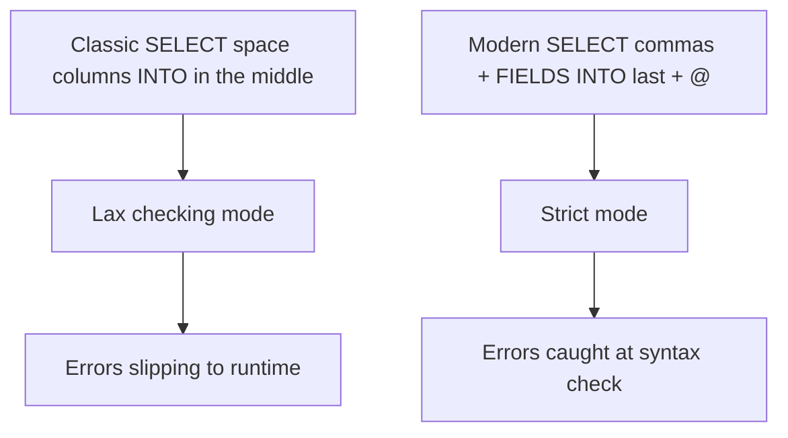

There are still projects writing `SELECT` like it's 2005: columns separated by spaces, `INTO` in the middle of the statement, and ABAP variables dropped in unmarked. It works, sure. It also drags along a lax checking mode that lets through things a modern HANA system should reject outright. The modern ABAP SQL syntax isn't makeup: **it's the switch that turns on the checker's strict mode**.

## The four rules that change everything

- **Commas between columns**: `carrid, connid, price` instead of space-separated columns. No commas, no new syntax.
- **The `INTO` clause goes last**. Since 7.40 SP08, `INTO` sits after the rest of the clauses, because `INTO` isn't part of the SQL standard: it defines the bridge between SQL and ABAP. Pulling it out of the SQL block is what makes `UNION`, `WITH` and the rest possible.
- **Inline declaration with `@DATA(...)`**: you declare the target right where you write it. The compiler infers the type from the selected columns.
- **Host variables with `@`**: every ABAP variable entering the statement is prefixed with `@`. And here's the payoff: **using `@` switches the checker into strict mode**.

## From classic to modern

Look at the difference. Classic, tolerant, with the target declared by hand:

```abap
DATA: gt_flights TYPE STANDARD TABLE OF sflight.

SELECT carrid connid price
  INTO CORRESPONDING FIELDS OF TABLE gt_flights
  FROM sflight
  UP TO 5 ROWS.
```

Modern, with commas, `@DATA` and `INTO` last:

```abap
SELECT FROM sflight
  FIELDS carrid, connid, price, fldate
  INTO TABLE @DATA(gt_flights)
  UP TO 5 ROWS.

IF sy-subrc = 0.
  cl_demo_output=>display( gt_flights ).
ENDIF.
```

It isn't just fewer lines. It's that `gt_flights` is born typed exactly to the `FIELDS` columns, with no separate `TYPES` definition that drifts out of sync the moment someone touches the projection.

## The FIELDS clause and the right mental order

The `SELECT FROM ... FIELDS ...` form puts `FROM` first, and that's not a whim: the editor already knows which table you mean when you type the columns, so autocomplete actually works. If you prefer columns before `FROM`, that's valid too, but then you can't use `FIELDS`. Pick one and be consistent.



## Why strict mode is a gift, not a nuisance

The strict mode that the `@` triggers isn't checker bureaucracy. It's the difference between a type mismatch surfacing at the syntax check (free, on your screen) or in production (expensive, in the dump log). Every host variable marked with `@` is a verified promise that ABAP and the database are talking about the same type.

> Writing `@` costs one character. Not writing it costs the strict check that would have caught the error before you transported it.

Next post: why a database `JOIN` makes a nested loop with a `SELECT` inside look ridiculous, and what that does to the execution plan in HANA.
