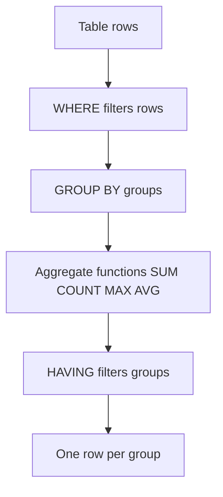

Summing amounts in a `LOOP` with an accumulator variable is a classic that's still alive. The problem isn't that it's badly written: it's that **you fetch ten thousand rows from the database to produce three numbers**. Aggregation is the natural job of a columnar database like HANA. Ask it for the total and it hands it back computed; don't haul it raw to sum it yourself.

## The antipattern: accumulating in ABAP

```abap
" Do NOT do this
SELECT FROM sflight
  FIELDS carrid, price
  INTO TABLE @DATA(gt_flights).

LOOP AT gt_flights INTO DATA(ls_flight).
  " accumulate by carrid into a helper table...
ENDLOOP.
```

Every flight row crosses the network only to end up as part of a sum. That's wasted network, wasted memory and code someone else will have to read.

## GROUP BY: group and aggregate in one trip

With `GROUP BY` you group by whichever columns you want and apply aggregate functions in the same `SELECT`. The database returns one row per group, already with the totals:

```abap
SELECT FROM sflight
  FIELDS carrid,
         connid,
         COUNT(*)      AS num_flights,
         SUM( price )  AS total_revenue,
         MAX( price )  AS max_price,
         AVG( price AS DEC( 15,2 ) ) AS avg_price
  GROUP BY carrid, connid
  ORDER BY carrid, connid
  INTO TABLE @DATA(gt_totals).

cl_demo_output=>display( gt_totals ).
```

Golden rule of `GROUP BY`: **every column in `FIELDS` that isn't inside an aggregate function must appear in the `GROUP BY`**. If you forget it, the checker stops you. That's not a nuisance: it's the guarantee that the result makes sense.

## HAVING: filter on the aggregate

`WHERE` filters rows before grouping. To filter on the aggregation result there's `HAVING`, and confusing them is a frequent mistake:

```abap
SELECT FROM sflight
  FIELDS carrid, SUM( price ) AS total_revenue
  WHERE fldate >= @lv_from
  GROUP BY carrid
  HAVING SUM( price ) > @lv_threshold
  ORDER BY total_revenue DESCENDING
  INTO TABLE @DATA(gt_top).
```

`WHERE fldate >= ...` discards old flights before summing; `HAVING SUM( price ) > ...` discards carriers that don't reach the threshold after summing. Each filter in its place.



## Details that save grief

- `AVG` is best typed with `AS DEC( len, dec )`: without specifying precision, the average can surprise you.
- `COUNT(*)` counts rows; `COUNT( DISTINCT col )` counts distinct values. They aren't the same.
- A `GROUP BY` doesn't guarantee order: if you want order, add an explicit `ORDER BY`.

> Aggregating in the database isn't an expert optimization. It's refusing to transport ten thousand rows when the business only asked for three totals.

Next post: CTEs with `WITH` and subqueries, to chain readable query steps without cluttering the model with throwaway views.
