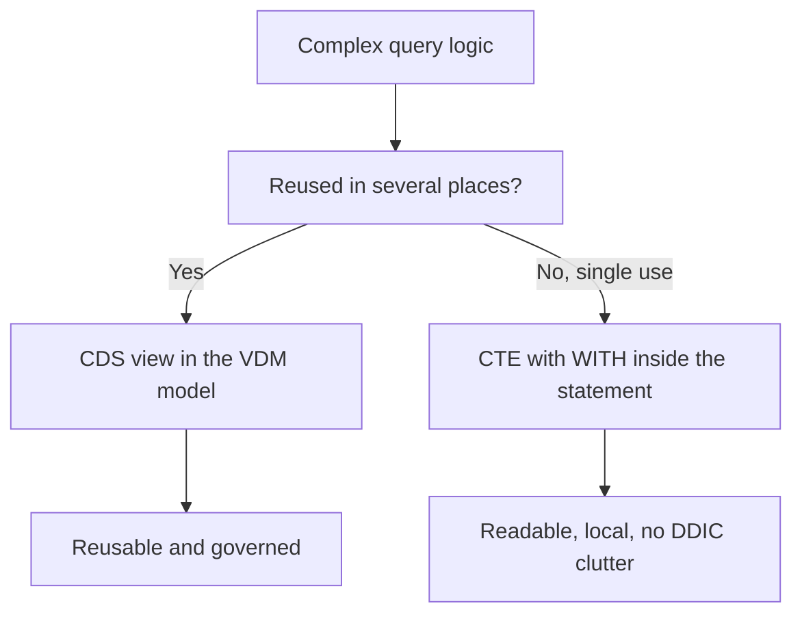

When a query grows, the temptation is to split a three-level `SELECT` into unreadable nested subselects, or worse, create a CDS view just to use it once and leave it there forever. ABAP SQL has a third path since 7.51: the **Common Table Expression** (`WITH`). You break the query into named steps that live inside the statement itself, read top to bottom, and don't clutter the dictionary.

## What a CTE is

A `WITH` defines one or more temporary result sets (the CTEs) that the main query uses as if they were tables. Each CTE has its own name, and that name must start with the `+` character. It's not decorative: **the `+` is part of the name and the checker demands it**.

```abap
WITH +tmp_table AS (
  SELECT FROM scarr
    FIELDS carrname, CAST( '-' AS CHAR( 4 ) ) AS connid,
           '-' AS cityfrom, '-' AS cityto
    WHERE carrid = 'LH'
  UNION
  SELECT FROM spfli
    FIELDS '-' AS carrname, CAST( connid AS CHAR( 4 ) ) AS connid,
           cityfrom, cityto
    WHERE carrid = 'LH' )

  SELECT FROM +tmp_table
    FIELDS *
    ORDER BY carrname DESCENDING, connid, cityfrom, cityto
    INTO TABLE @DATA(lt_result)
    UP TO 10 ROWS.

cl_demo_output=>display( lt_result ).
```

Here the CTE `+tmp_table` combines headers and connections with a `UNION`, and the main query only reads from it. The logic stays in a named block, not scattered across subselects.

## The ENDWITH detail

If the main query's target isn't an internal table (that is, there's no `INTO TABLE`), the `WITH ... SELECT` opens a loop you have to close with `ENDWITH`, just as an `ENDSELECT` closes a row-by-row `SELECT`. With `INTO TABLE @DATA(...)` it isn't needed, because the assignment is a full-set one. It's the number one source of beginner dumps with CTEs: forgetting the `ENDWITH` when it's due.

## When a CTE and when a CDS view



The rule is simple and opinionated: if that logic will be consumed by several programs or services, it deserves a well-named CDS view in the VDM. If it's intermediate and only this query uses it, a CTE keeps it local and in sight, without creating a dictionary object nobody will remember the purpose of.

## Subqueries: the same spirit, another form

A classic subquery (a `SELECT` inside a `WHERE` with `IN` or `EXISTS`) is still valid and often the most direct thing for a correlated filter. The difference is readability: when you chain two or three steps, the CTE wins because each step has a name and reads in order, while nested subselects force you to read from the inside out.

> A CTE isn't a poor man's view: it's a view that didn't need to exist in the dictionary. Using it avoids the graveyard of single-use CDS views.

Next post: host expressions and injection protection, or why the `@` isn't just syntax but your first line of defense.
