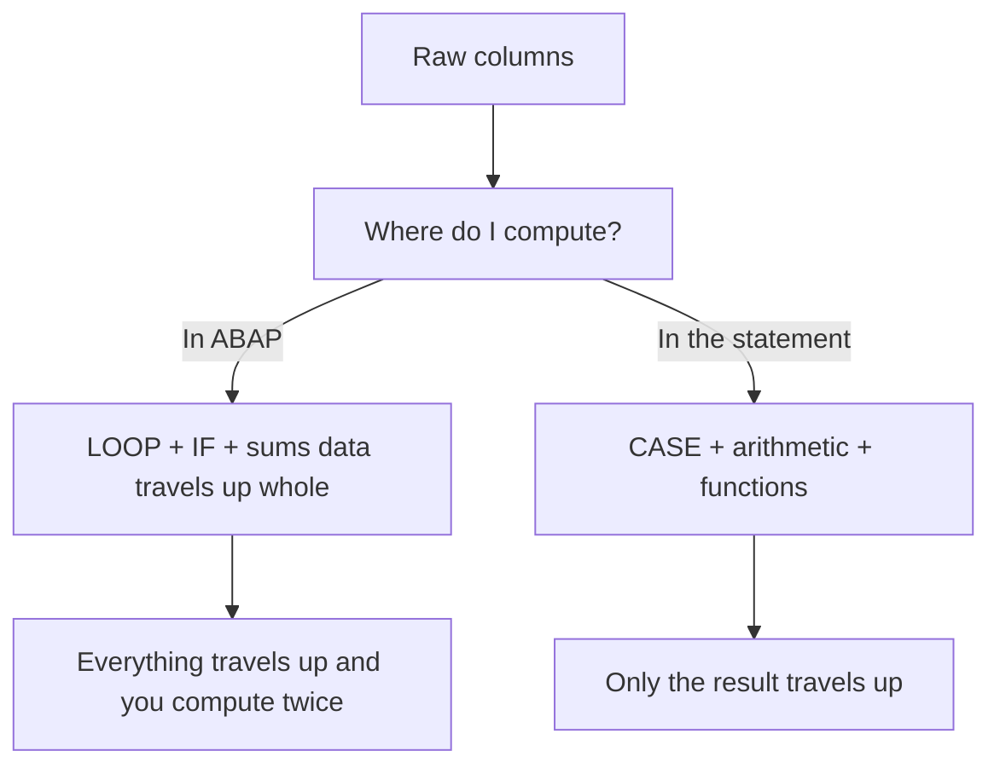

The classic reflex is to read the raw columns and then, in ABAP, build a `LOOP` with `IF`, sums and classifications. Every one of those operations is computation you could have asked for in the statement itself. ABAP SQL brings **expressions inside the `SELECT`**: you compare, compute, classify and format in the database, and only the already-chewed result reaches ABAP. That's real code pushdown, not a slogan.

## CASE: classify without pulling the data up

The complex `CASE` evaluates conditions in order and returns the result of the first true `WHEN`. Classifying records into groups stops being an ABAP loop:

```abap
SELECT FROM demo_expressions
  FIELDS num1, num2,
    CASE WHEN num1 < 50 AND num2 < 50 THEN @lc_both_lower
         WHEN num1 > 50 AND num2 > 50 THEN @lc_both_higher
         WHEN num1 = 50 AND num2 = 50 THEN @lc_both_equal
         ELSE @lc_other
    END AS grupo
  ORDER BY grupo
  INTO TABLE @DATA(lt_results).
```

Notice a detail that makes the difference: the result literals (`@lc_both_lower`, etc.) are host constants prefixed with `@`, not loose strings. If there's no `ELSE`, the default result is the null value, not an empty string. Think about that before you omit it.

## Arithmetic and numeric functions in the statement

Divisions, roundings, modulos, absolute values: it all fits in the `FIELDS`. And when you divide integers, the `CAST` to `FLTP` keeps you from losing the decimals:

```abap
SELECT SINGLE FROM demo_expressions
  FIELDS id, num1, num2,
    CAST( num1 AS FLTP ) / CAST( num2 AS FLTP ) AS ratio,
    division( num1, num2, 2 ) AS division,
    div( num1, num2 ) AS div,
    mod( num1, num2 ) AS mod,
    num1 + num2 + @gv_offset AS sum,
    abs( num1 - num2 ) AS abs,
    round( @gv_decimal, 2 ) AS round
  WHERE num1 = 14 AND num2 = 8
  INTO @DATA(gs_results).
```

`DIVISION( a, b, dec )` gives you the division rounded to the decimals you ask for; `DIV` and `MOD` give you integer quotient and remainder. There's no reason to pull `num1` and `num2` down to ABAP just to divide them.

## String functions: format where the data lives

Concatenate, trim, pad, change case: the database does it in the same trip.

```abap
SELECT SINGLE FROM demo_expressions
  FIELDS id, char1, char2,
    concat( char1, char2 ) AS concat,
    lpad( char2, 18, '0' ) AS lpad,
    replace( char1, 'DD', '__' ) AS replace,
    substring( char1, 3, 2 ) AS substring,
    upper( char1 ) AS upper,
    char1 && char2 && 'HANA-' && @lv_char AS ampersand
  WHERE id = 'L'
  INTO @DATA(ls_result).
```

The `&&` operator concatenates adjacent operands; watch out, it trims trailing spaces and the result must not exceed 255 characters. For cases with controlled spacing, use `CONCAT_WITH_SPACE`.



## The mental rule

Before writing a `LOOP` to transform, ask yourself whether that transformation fits in the `SELECT`. Classifications, computed amounts, formatted strings: they almost always fit. The more you resolve in the database, the less data travels and the less ABAP code there is to maintain.

> Every `IF` you move into a `CASE` is one less line of logic in ABAP and one less value crossing the network. It pays for itself.

Next post: aggregations and `GROUP BY`, so the database hands you the totals already summed instead of a mountain of rows you sum by hand.
