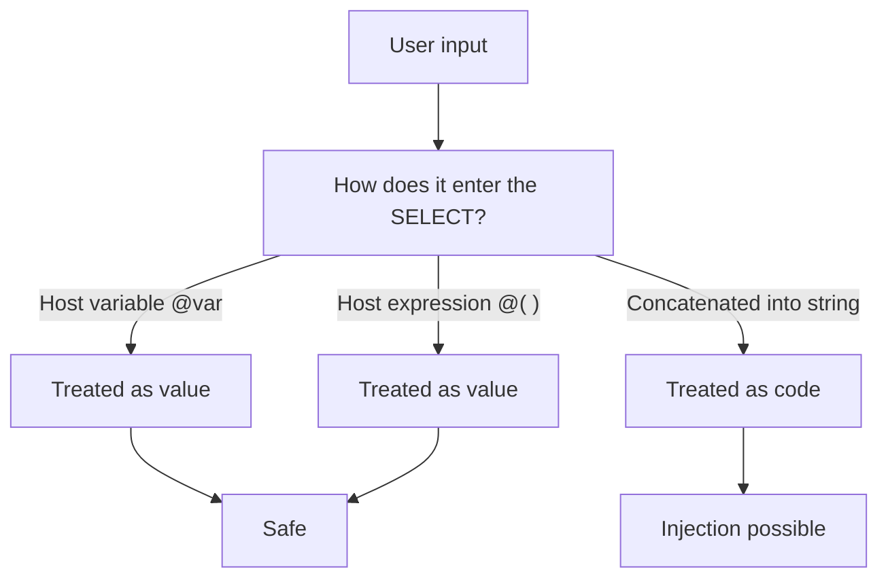

SQL injection isn't a problem for web apps far from SAP. Every time you build a statement by concatenating text that came from the user, you've opened the same door. ABAP SQL gives you the tool to close it and has been using it for years: the **host variable** and the **host expression**, both marked with `@`. The `@` isn't just the strict-mode switch you already know; it's also the boundary between a value and a piece of code.

## Host variable: you pass a value, you don't paste it

A host variable is an ABAP data object entering the statement prefixed with `@`. The engine treats it as a parameterized value, never as part of the SQL syntax. It doesn't matter what it contains:

```abap
DATA lv_carrid TYPE sflight-carrid VALUE 'AA'.

SELECT FROM sflight
  FIELDS carrid, connid, price
  WHERE carrid = @lv_carrid
  INTO TABLE @DATA(gt_flights).
```

Even if `lv_carrid` arrived with junk or a malicious quote, it can't turn into an instruction: it travels as data. That's the whole trick, and it's enough for 99% of cases.

## Host expression: inline computation, also safe

When you don't have a variable but an expression (a `VALUE #( ... )`, a computed constant), you wrap it in `@( ... )`. It's a host expression and enjoys the same protection:

```abap
INSERT demo_expressions FROM TABLE @( VALUE #(
  FOR i = 0 UNTIL i > 9 ( id   = i
                          num1 = lcl_random->get_next( )
                          num2 = lcl_random->get_next( ) ) ) ).
```

Everything entering through `@( ... )` is parameterized data. There's no surface to inject into.

## The sin: dynamic SQL by concatenation

The danger appears when you abandon static SQL and build the condition as a string. This is what you must never do with user input:

```abap
" Do NOT do this with data coming from the user
DATA(lv_where) = |carrid = '{ lv_input }'|.

SELECT FROM sflight
  FIELDS carrid, connid
  WHERE (lv_where)
  INTO TABLE @DATA(gt_flights).
```

If `lv_input` carries `AA' OR '1' = '1`, your `WHERE` becomes a different query. The dynamic condition `WHERE (lv_where)` is a legitimate tool, but **the string you pass it must never be built by concatenating unvalidated input**.



## If you truly need dynamic SQL

Sometimes the table or column name is dynamic and there's no way around it. The defense then isn't the `@`, but:

- Validate the input against a whitelist of allowed names, never accept it as-is.
- Use `cl_abap_dyn_prg` to sanitize identifiers and values before putting them in the statement.
- Keep everything that is a value parameterized with host variables; reserve dynamism only for the structure that genuinely varies.

> The `@` isn't just syntactic sugar for the strict checker. It's the line that separates passing data from pasting code into your own query. Respect it and injection stops being your problem.

This closes the modern ABAP SQL series: syntax, joins, expressions, aggregations, CTEs and security. The through line is always the same: ask for the work in the statement, hand it the data with `@`, and let the database do what the database does best.
