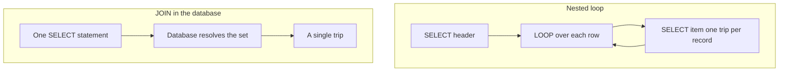

There's an antipattern that survives every trend: read a table, walk it with `LOOP` and, inside, fire a `SELECT` for each row. It reads easy, it writes fast, and **it sends the database one trip per record**. With a hundred rows you barely notice. With a hundred thousand, the user opens a ticket. The alternative has been in the language for twenty years: the `JOIN`.

## The antipattern, exactly as you'll see it

```abap
" Do NOT do this
SELECT FROM demo_join1
  FIELDS a, b, d
  INTO TABLE @DATA(gt_head).

LOOP AT gt_head INTO DATA(ls_head).
  SELECT SINGLE FROM demo_join2
    FIELDS e, f
    WHERE d = @ls_head-d
    INTO @DATA(ls_item).
  " ... combine ls_head and ls_item
ENDLOOP.
```

A `SELECT` inside the `LOOP` means one round trip to the database per iteration. The database is blazingly fast at resolving sets; it's painfully slow answering a thousand small questions one at a time. You're using the tool backwards.

## The JOIN: one trip, one set

The same logic, resolved in the data layer, where it belongs:

```abap
SELECT FROM demo_join1 AS d1
  INNER JOIN demo_join2 AS d2
    ON d1~d = d2~d
  FIELDS d1~a, d1~b, d2~e, d2~f
  INTO TABLE @DATA(gt_result).

cl_demo_output=>display( gt_result ).
```

The database gets a single statement, picks its execution plan, leverages indexes and returns the already-combined set. The alias with `~` (`d1~d = d2~d`) makes explicit which table each column comes from, which is exactly what you want when someone reads this a year from now.



## The JOIN that also writes

The `JOIN` doesn't stop at reading. You can feed an `INSERT` or a `MODIFY` directly from a subquery with a `JOIN`, without materializing anything intermediate in ABAP:

```abap
INSERT demo_join3 FROM ( SELECT FROM demo_join1 AS d1
                                INNER JOIN demo_join2 AS d2
                                  ON d1~d = d2~d
                                FIELDS d1~a, d1~b, d2~e, d2~f ).
```

That write happens entirely in the database. Not a single record travels up to the ABAP layer only to come back down. That's the level of code pushdown HANA rewards.

## The honesty we owe: when the loop is defensible

- When the outer set is tiny and fixed (half a dozen configuration rows), the difference is irrelevant and readability wins.
- When you need complex ABAP logic between reads that can't be expressed in SQL.

Outside of that, the `JOIN` wins. And if the problem is that you already have the data in an internal table, the modern answer is almost never `FOR ALL ENTRIES`: it's global temporary tables, which do accept an `INNER JOIN` in the database.

> A loop with a SELECT inside isn't a syntax error. It's a deferred performance bill that comes due the day of the real load.

Next post: the SQL expressions (CASE, arithmetic, functions) that push computation to the database and empty your ABAP code of trivial logic.
