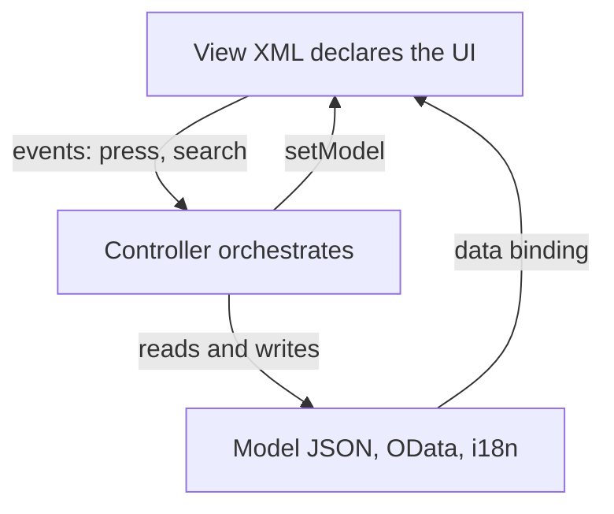

Most SAPUI5 apps we inherit don't fail because of the framework. They fail because **someone dumped into the controller everything they didn't know where to put**: UI logic, data transformation, hardcoded texts, even the model schema. UI5's Model-View-Controller pattern exists precisely to prevent that, and respecting it costs less than skipping it.

## The three pieces and their single responsibility

- **View (`.view.xml`)**: declares *what* you see. Pure XML, no logic. A `<Button>`, a `<List>`, a binding. If you're writing an `if` in the view, something is off.
- **Controller (`.controller.js`)**: reacts to *events*. `onShowHello`, `onFilterInvoices`. It orchestrates, it doesn't hold business state.
- **Model**: is *the data*. A `JSONModel`, an `ODataModel`, or the i18n `ResourceModel`. The view binds to it; the controller reads and writes it.

The rule that saves us arguments in every code review: **the view never knows the model by its internal shape, only by its binding path; the controller never builds HTML.**



## The controller as it should be

Look at this real controller: it declares its dependencies, extends `Controller`, and exposes short handlers. Nothing else.

```javascript
sap.ui.define([
    "sap/ui/core/mvc/Controller",
    "sap/m/MessageToast",
    "sap/ui/model/json/JSONModel"
],
function (Controller, MessageToast, JSONModel) {
    "use strict";
    return Controller.extend("logaligroup.SAPUI5.controller.App", {
        onInit: function () {
            var oModel = new JSONModel({ recipient: { name: "World" } });
            this.getView().setModel(oModel);
        },
        onShowHello: function () {
            var oBundle = this.getView().getModel("i18n").getResourceBundle();
            var sRecipient = this.getView().getModel().getProperty("/recipient/name");
            MessageToast.show(oBundle.getText("helloMsg", [sRecipient]));
        }
    });
});
```

And the view that goes with it, without a single line of logic:

```xml
<mvc:View controllerName="logaligroup.SAPUI5.controller.App"
    xmlns="sap.m" xmlns:mvc="sap.ui.core.mvc">
    <Button text="{i18n>showHelloButtonText}" press=".onShowHello"/>
    <Input value="{/recipient/name}" valueLiveUpdate="true" width="60%"/>
</mvc:View>
```

Three decisions that pay off two years from now:

1. The button text comes from `{i18n>...}`, not a literal. Translating means editing a `.properties` file, not touching the view.
2. The `Input` is bound to `/recipient/name`. Change the model and the UI refreshes on its own, without a single `setText`.
3. The `press` points to `.onShowHello`, a controller function. The view doesn't know *what* that handler does, only that it exists.

## The mistake you'll see in every project

An `App.controller.js` with 800 lines that formats currency, builds filters, holds state and also navigates. It works on demo day and is untouchable on change day. The moment you need to reuse that formatting in another view, you'll have to copy it, and that's where the debt begins.

> MVC separation isn't academic purism. It's what lets another developer walk into your app in six months and know, without asking you, where each thing lives.

When the model grows, move it to its own file (`model/Models.js`). When formatting repeats, move it to a formatter. The controller is left with the only thing it should do: react. In the next post we get into data binding, which is what makes all of this feel like magic.
