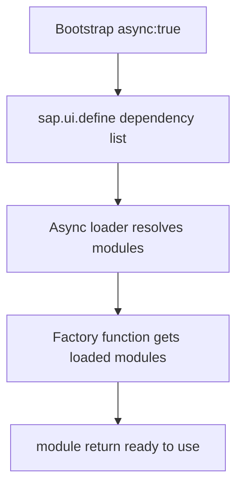

Open an old UI5 app and you'll see `sap.ui.getCore()` hanging off a global variable, scripts loaded in a fragile order, and an `onInit` that assumes everything is already in memory. UI5's modern model is asynchronous and modular: **each file declares its dependencies with `sap.ui.define`, the framework resolves them, and only then runs your code**. No globals, no implicit order.

## sap.ui.define: AMD for UI5

`sap.ui.define` is UI5's AMD implementation. It takes an array of module paths and a factory function whose arguments are those modules, already loaded, in order. That's the contract.

```javascript
sap.ui.define([
    "sap/ui/core/mvc/Controller",
    "sap/m/MessageToast",
    "sap/ui/model/json/JSONModel"
],
function (Controller, MessageToast, JSONModel) {
    "use strict";
    return Controller.extend("logaligroup.SAPUI5.controller.App", {
        onInit: function () {
            this.getView().setModel(new JSONModel({ recipient: { name: "World" } }));
        }
    });
});
```

Three things this pattern guarantees:

1. **Explicit dependencies**: read the array and you know exactly what the file depends on. No hidden imports.
2. **No globals**: `Controller`, `MessageToast` and `JSONModel` are local parameters. They don't pollute `window`.
3. **Guaranteed order**: the factory doesn't run until all three modules are loaded. No more "undefined is not a function" from out-of-order loading.



## The bootstrap: truly async

It all starts in `index.html`. The flag that makes the difference is `data-sap-ui-async="true"`: without it, UI5 loads in legacy synchronous mode, blocking and discouraged.

```xml
<script id="sap-ui-bootstrap"
    src="resources/sap-ui-core.js"
    data-sap-ui-theme="sap_horizon"
    data-sap-ui-resourceroots='{"logaligroup.SAPUI5": "./"}'
    data-sap-ui-async="true"
    data-sap-ui-compatVersion="edge"
    data-sap-ui-oninit="module:sap/ui/core/ComponentSupport">
</script>
```

Notice `data-sap-ui-oninit="module:sap/ui/core/ComponentSupport"`. Instead of an inline `<script>` that starts the component by hand, you delegate startup to `ComponentSupport`. The component is declared with an attribute on the `<body>`:

```xml
<body class="sapUiBody" id="content">
    <div data-sap-ui-component
         data-name="logaligroup.SAPUI5"
         data-id="container"
         data-settings='{"id": "SAPUI5"}'></div>
</body>
```

## Why this is also security

Here's the corollary many overlook: **loading without inline scripts is what makes your app compatible with Content Security Policy (CSP)**. A strict CSP blocks all JavaScript embedded in the HTML. If your startup depends on a `<script>onInit()</script>`, CSP kills it; if it depends on `ComponentSupport` and `sap.ui.define`, there is no inline code to block.

> Async isn't just about performance. It's what lets the same app pass a security audit under strict CSP without rewriting its startup.

Practical rules we always apply:

- Every JS file starts with `sap.ui.define`. Never a global `sap.ui.getCore()`, never `jQuery.sap`.
- Bootstrap with `data-sap-ui-async="true"` and startup via `ComponentSupport`, not inline scripts.
- If you need a module inside a function (not in the header), use `sap.ui.require`, the async variant, not synchronous loading.

Modern UI5 code is async by default. It's not an advanced option: it's the baseline for an app that's maintainable and auditable.
