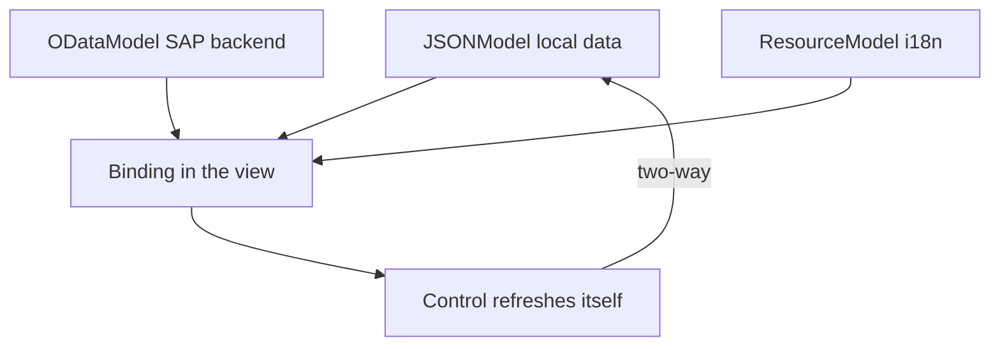

If you see a `setText`, a `setValue`, or a `forEach` painting rows by hand in your controller, you're fighting the framework. UI5 has **data binding**: you declare the relationship between data and control once, and the framework keeps both sides in sync. That's the heart of the house.

## Pick the model by where the data comes from

- **`JSONModel`**: client-side data. A static file, a response already in memory, UI state. Two-way binding for free.
- **`ODataModel` (V2/V4)**: the real backend. It knows metadata, `$batch`, deferred loading. You don't hand-feed JSON: you point to a `dataSource` in the manifest.
- **`ResourceModel`**: the i18n texts. It's a model too, which is why texts bind just like any other data.

Named models (`{invoices>...}`, `{i18n>...}`) avoid collisions. The unnamed model is the view's default.



## The four binding types you'll use daily

**Aggregation binding**: binds a list to a collection. Each item repeats through the template.

```xml
<List items="{invoices>/Invoices}">
    <items>
        <ObjectListItem title="{invoices>Quantity} x {invoices>ProductName}"/>
    </items>
</List>
```

**Property binding with a type**: don't format currency by hand. Declare the type and UI5 does it right, locale included.

```xml
<ObjectListItem
    number="{ parts: [ {path: 'invoices>ExtendedPrice'}, {path: 'currency>/usd'} ],
              type: 'sap.ui.model.type.Currency',
              formatOptions: { showMeasure: false } }"
    numberUnit="{currency>/usd}"/>
```

**Expression binding**: simple logic inline, without dirtying the controller.

```xml
<ObjectListItem
    numberState="{= ${invoices>ExtendedPrice} > 50 ? 'Success' : 'Error' }"/>
```

**Custom formatter**: when the rule doesn't fit in an expression, a dedicated module. Reusable, testable.

```javascript
sap.ui.define([], function () {
    return {
        invoiceStatus: function (sStatus) {
            var oBundle = this.getView().getModel("i18n").getResourceBundle();
            switch (sStatus) {
                case "A": return oBundle.getText("invoiceStatusA");
                case "B": return oBundle.getText("invoiceStatusB");
                case "C": return oBundle.getText("invoiceStatusC");
                default:  return sStatus;
            }
        }
    };
});
```

## Moving to OData is just swapping the source

The elegant part of the design: going from local data to a real backend barely touches the view. In the manifest you define the model once and the view stays bound the same way, only the model name changes from `invoices` to `northwind`.

```json
"models": {
    "northwind": {
        "dataSource": "mainService",
        "preload": true,
        "settings": {
            "defaultBindingMode": "TwoWay",
            "defaultCountMode": "Inline"
        }
    }
}
```

> Declarative binding isn't syntactic sugar. It's the difference between a UI that maintains itself and a controller you rewrite every time a requirement changes.

Filtering isn't array-walking either: you ask the binding to filter and the rest is the framework's job.

```javascript
onFilterInvoices: function (oEvent) {
    var aFilter = [];
    var sQuery = oEvent.getParameter("query");
    if (sQuery) {
        aFilter.push(new Filter("ProductName", FilterOperator.Contains, sQuery));
    }
    this.getView().byId("invoiceList").getBinding("items").filter(aFilter);
}
```

The practical rule: if you find yourself writing code to move a value from the data to the control, stop and ask which of these four bindings does it for free. There's almost always one.
