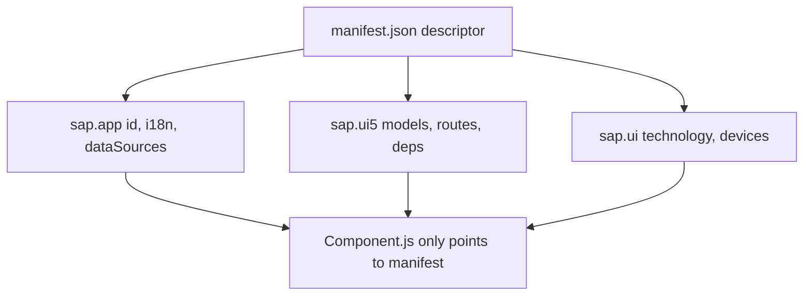

There are two ways to build a SAPUI5 app. The first is to instantiate every model, every route and every i18n bundle by hand in `Component.js`. The second is to **declare it all in `manifest.json` and let the framework assemble it**. The second is the one SAP recommends, the one Fiori tooling understands, and the one that won't embarrass you at the next upgrade.

## What the descriptor is and why it rules

`manifest.json` (the Descriptor for Applications, or `descriptor`) is your app's contract: what it is, what it depends on, which models it uses and how it navigates. `Component.js` just points to it.

```javascript
sap.ui.define([
    "sap/ui/core/UIComponent"
], function (UIComponent) {
    "use strict";
    return UIComponent.extend("logaligroup.SAPUI5.Component", {
        metadata: {
            manifest: "json"
        },
        init: function () {
            UIComponent.prototype.init.apply(this, arguments);
            this.getRouter().initialize();
        }
    });
});
```

That `manifest: "json"` is the key line: it tells UI5 to read the descriptor and build models, routes and dependencies for you. The component stays clean.



## The three sections that matter

The descriptor is organized in three namespaces. Each answers a different question.

```json
{
    "_version": "1.12.0",
    "sap.app": {
        "id": "logaligroup.SAPUI5",
        "type": "application",
        "i18n": "i18n/i18n.properties",
        "dataSources": {
            "mainService": {
                "uri": "Northwind/V2/Northwind/Northwind.svc/",
                "type": "OData",
                "settings": { "odataVersion": "2.0" }
            }
        }
    },
    "sap.ui": {
        "technology": "UI5",
        "deviceTypes": { "desktop": true, "tablet": true, "phone": true }
    },
    "sap.ui5": {
        "rootView": {
            "viewName": "logaligroup.SAPUI5.view.App",
            "type": "XML", "async": true, "id": "App"
        },
        "dependencies": {
            "minUI5Version": "1.60.1",
            "libs": { "sap.ui.core": {}, "sap.m": {}, "sap.ui.layout": {} }
        },
        "models": {
            "i18n": {
                "type": "sap.ui.model.resource.ResourceModel",
                "settings": { "bundleName": "logaligroup.SAPUI5.i18n.i18n" }
            }
        }
    }
}
```

What you gain by declaring it here instead of in code:

- **`sap.app`**: identity, texts and `dataSources`. OData services are named once and referenced from `models`, not repeated as URLs across the project.
- **`sap.ui`**: technology and device types. Declared responsive support lives here.
- **`sap.ui5`**: the heart. `rootView`, `dependencies` with `minUI5Version` (the checker warns you if you use API from a higher version), `models`, and the `routing` block.

## The mistake you pay for at upgrade

Instantiating the `ResourceModel` and the `ODataModel` in the component's `init` looks innocent. But then the minimum UI5 version, the libs and the data sources are scattered across the JavaScript, invisible to the tooling. The day Fiori Tools or the linter needs to read your app, it finds nothing.

> The manifest isn't configuration bureaucracy. It's what turns your app into something SAP's tooling understands without running a line of your code.

Practical rule: if you're writing `new JSONModel(...)` or `new ResourceModel(...)` in `Component.js`, ask whether it shouldn't be an entry in `models`. Almost always yes. The component is for orchestrating startup, not for configuring the app.
