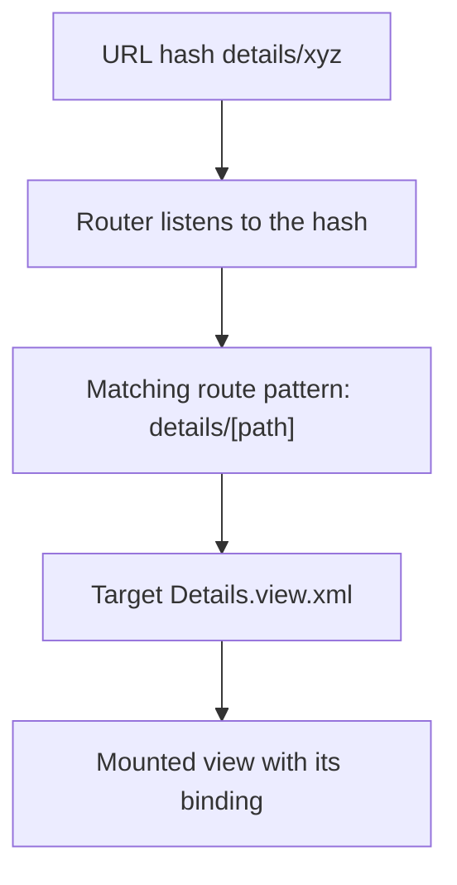

Homegrown navigation in UI5 has a characteristic smell: a pile of `setVisible(true)` and `setVisible(false)` to hide and show pages. It works until the user hits Back in the browser, or shares a link, or reloads. UI5's **router** solves exactly that: it binds the URL hash to a view, and navigation becomes declarative.

## The mental model: hash, route and target

- **Route (`route`)**: a URL pattern. `""` is the home; `details/{invoicePath}` captures a parameter.
- **Target**: the view shown when that route matches.
- **Router**: the object that listens to the hash and mounts the right target.

You declare it all in `manifest.json`, and the component just initializes it.



## Declaring routes in the descriptor

Two routes: the overview at the root and the detail with a parameter in the pattern.

```json
"routing": {
    "config": {
        "routerClass": "sap.m.routing.Router",
        "viewType": "XML",
        "controlId": "app",
        "controlAggregation": "pages",
        "async": true
    },
    "routes": [
        { "name": "RouteApp", "pattern": "",                    "target": ["TargetOverview"] },
        { "name": "Details",  "pattern": "details/{invoicePath}", "target": ["TargetDetails"] }
    ],
    "targets": {
        "TargetOverview": { "viewName": "Overview", "viewId": "Overview" },
        "TargetDetails":  { "viewName": "Details",  "viewId": "Details" }
    }
}
```

The component starts the router in its `init`, a single line:

```javascript
this.getRouter().initialize();
```

## Navigating with a parameter

From the list, when an item is pressed, you ask the router to go to `Details` passing the path of the bound context. No global state: the URL carries the information.

```javascript
navigateToDetails: function (oEvent) {
    var oItem = oEvent.getSource();
    var oRouter = sap.ui.core.UIComponent.getRouterFor(this);
    oRouter.navTo("Details", {
        invoicePath: window.encodeURIComponent(
            oItem.getBindingContext("northwind").getPath().substr(1)
        )
    });
}
```

And in the detail, you listen to `patternMatched` to bind the view to the object arriving in the URL. The view fills itself through binding.

```javascript
onInit: function () {
    var oRouter = sap.ui.core.UIComponent.getRouterFor(this);
    oRouter.getRoute("Details").attachPatternMatched(this._onObjectMatch, this);
},
_onObjectMatch: function (oEvent) {
    this.getView().bindElement({
        path: "/" + window.decodeURIComponent(oEvent.getParameter("arguments").invoicePath),
        model: "northwind"
    });
}
```

## Back navigation that doesn't break the browser

Here's the difference between an amateur app and a professional one. Don't just `navTo` the home: check history. If the user arrived from within the app, `history.go(-1)` respects their path; if they entered through a direct link, then you navigate to the root.

```javascript
onNavBack: function () {
    var oHistory = History.getInstance();
    if (oHistory.getPreviousHash() !== undefined) {
        window.history.go(-1);
    } else {
        UIComponent.getRouterFor(this).navTo("RouteApp", {}, true);
    }
}
```

> When navigation lives in the URL, the browser's Back button, shared links and deep linking work for free. When it lives in `setVisible`, none of them do.

Practical rule: if your app has more than one screen, there's no excuse not to use the router. The cost of declaring two routes in the manifest is five minutes; the cost of not doing it is every navigation bug that shows up later.
