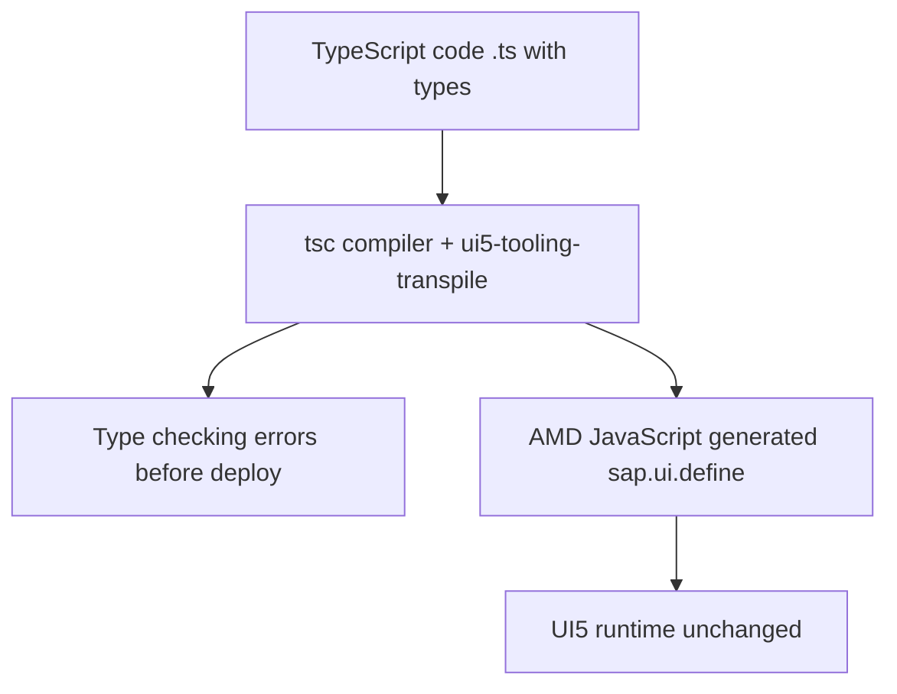

Open almost any UI5 controller from the last few years and you'll find this on line one: `// @ts-nocheck`, followed by JSDoc blocks that declare the dependency types by hand.

```javascript
// @ts-nocheck
sap.ui.define([
    "sap/ui/core/mvc/Controller",
    "sap/m/MessageToast"
],
/**
 * @param {typeof sap.ui.core.mvc.Controller} Controller
 * @param {typeof sap.m.MessageToast} MessageToast
 */
function (Controller, MessageToast) {
    "use strict";
    return Controller.extend("app.controller.App", {});
});
```

Those `@param {typeof ...}` lines aren't decoration: they're an attempt to recover the typing that JavaScript doesn't give you. TypeScript turns that workaround into something real, and the `@ts-nocheck` disappears.

## What a UI5 project gains with TypeScript

- **Real autocompletion**: the editor knows the full UI5 API via `@sapui5/types`. You type `oView.` and see the methods, you don't guess.
- **Errors at compile time, not runtime**: calling a method that doesn't exist or passing the wrong type is caught before deploy.
- **Safe refactoring**: renaming a function or changing a signature propagates errors across the whole project instantly.



## The same controller, in TypeScript

Notice the difference: dependencies are ES6 `import`, the class genuinely extends `Controller`, and there isn't a single type JSDoc because the compiler already knows them.

```typescript
import Controller from "sap/ui/core/mvc/Controller";
import MessageToast from "sap/m/MessageToast";
import JSONModel from "sap/ui/model/json/JSONModel";

/**
 * @namespace logaligroup.SAPUI5.controller
 */
export default class App extends Controller {
    public onInit(): void {
        this.getView()?.setModel(new JSONModel({ recipient: { name: "World" } }));
    }
    public onShowHello(): void {
        MessageToast.show("Hello World");
    }
}
```

The `?.` in `getView()?.` isn't a whim: TypeScript knows `getView()` can return `undefined` and forces you to account for it. That's exactly the kind of bug JavaScript let slip through to runtime.

## The detail that marks professional code: typed events

Since UI5 1.115, every control exposes types for its events. Instead of an opaque `oEvent` you know nothing about, you import the exact type and `getParameter` returns the right value.

```typescript
import Button$PressEvent from "sap/m/Button$PressEvent";
import SearchField$SearchEvent from "sap/m/SearchField$SearchEvent";

public onFilterInvoices(oEvent: SearchField$SearchEvent): void {
    const sQuery: string = oEvent.getParameter("query");
    // sQuery is string, guaranteed by the compiler
}
```

> The `@param {typeof ...}` JSDoc was a patch to fake what TypeScript does natively. When the scaffolding you put up to compensate for missing types is more work than adopting real types, it's time to migrate.

## How to make the jump without drama

You don't need to rewrite the app all at once. The approach that works:

1. Add `@sapui5/types` and `ui5-tooling-transpile` to the project. The transpiler turns your `.ts` into the `sap.ui.define` the runtime expects.
2. Migrate file by file: a new controller in `.ts`, the old ones in `.js` coexist without issue.
3. On each migration, delete the `@ts-nocheck` and let the compiler show you what was wrong.

TypeScript in UI5 is no longer experimental: it's SAP's official direction for new development. The cost of learning it pays off the first afternoon the compiler spares you a broken deploy.
