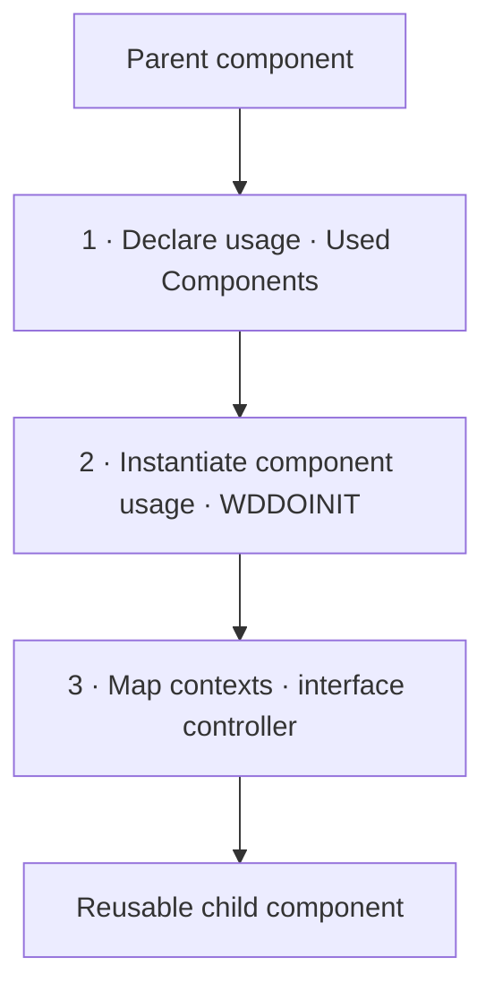

Web Dynpro components are the central entity of the framework precisely because they let you structure complex applications through **reusable entities**. Reuse isn't a luxury: it's the whole point of the component model. But reusing well has a technique, and doing it badly generates a coupling you pay for later.

## The three steps you can't skip

Using an external component from another follows a fixed choreography. Skipping a step is the usual cause of the classic "the component doesn't show up" or the dump when accessing a context that doesn't exist yet:

1. **Declare the usage**: in the container component you add the child component in the *Used Web Dynpro Components* frame, and in the view you reference it in *Displays Component and Controller References*.
2. **Instantiate the component usage**: the usage isn't created on its own. It must be instantiated explicitly, usually in `WDDOINIT`.
3. **Map the contexts**: once instantiated, the context of the child's interface controller becomes available to map nodes between both.



## Instantiating the usage: the step people forget

The framework gives you the reference to the usage, but you are the one who decides to create the instance. This is the canonical pattern, with the check for whether it already exists so you don't instantiate twice:

```abap
" WDDOINIT: instantiate the reused component MY_COMP_USAGE
METHOD wddoinit.
  DATA lo_cmp_usage TYPE REF TO if_wd_component_usage.

  lo_cmp_usage = wd_this->wd_cpuse_my_comp_usage( ).

  IF lo_cmp_usage->has_active_component( ) IS INITIAL.
    lo_cmp_usage->create_component( ).
  ENDIF.
ENDMETHOD.
```

That `IF ... has_active_component( ) IS INITIAL` isn't defensive garnish: it's what stops you from recreating the component on every round trip and wiping the state it already had.

## Context mapping is where you win or lose

As soon as the usage is declared and instantiated, the external interface controller's context is available for mappings. There you define which node of your context maps to which node of the child component. Done right, the child knows nothing about you: it only receives data in its context through binding. Done wrong, you start calling the child's internal methods from the parent and you couple two components that should be independent.

The discipline is the same as in any healthy architecture: **communicate through the contract (the interface controller's context), never through the guts**.

> A reusable component that only works in the app it was born in isn't reusable: it's a dependency with good PR. The litmus test is being able to embed it in another component without touching its code.

Reusing classic components is the natural ceiling of pure Web Dynpro. The next rung is a framework built on top of WD to standardize whole applications: Floorplan Manager versus classic WD, in the next post.
