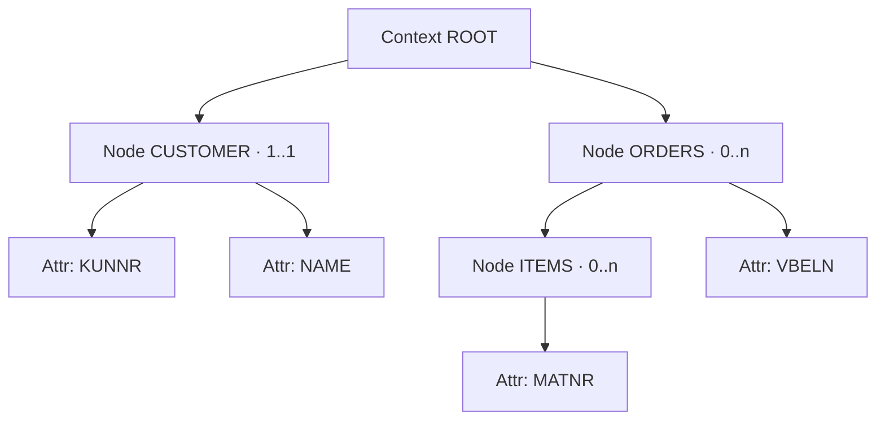

If I had to pick a single Web Dynpro concept you must truly understand, it would be the **context**. Not the view, not the events: the context. It's where the data lives, and its structure decides whether your application is clean or a minefield of broken references.

## What it is and how it's organized

The data used by a component or a view is stored in the context. Read and write access always goes through a controller as its starting point. The structure is hierarchical: a root node and, beneath it, nodes and attributes in a tree.

- **Node**: a data container. It can represent a single instance or a table of instances.
- **Attribute**: an individual data field inside a node, with its dictionary type.
- The rule almost nobody writes down: **the context tree should mirror the structure of the application**, not the database.



## Cardinality is not decoration

Every node declares a cardinality, and getting it wrong is the number one cause of dumps and weird behavior:

- **1..1**: a single instance, instantiated automatically.
- **0..1**: a single instance that must **not** be instantiated on its own. Perfect for an optional detail.
- **1..n**: several instances, at least one always present and instantiated automatically.
- **0..n**: several instances, none mandatory. The typical case of a table that starts empty.

Confusing `1..1` with `0..1` when the data may not exist is the perfect recipe for a lead selection over an empty node.

## The binding that spares you the dirty work

The jewel of Web Dynpro is the automatic data transport between the UI elements and the context. You fill the node; the framework paints the table. And the other way around.

```abap
" Fill a 0..n node with an internal table
DATA lo_node TYPE REF TO if_wd_context_node.
DATA lt_orders TYPE ztt_sales_order.

lt_orders = wd_assist->get_orders( ).

lo_node = wd_context->get_child_node( name = 'ORDERS' ).
lo_node->bind_table( new_items = lt_orders  set_initial_elements = abap_true ).

" Read the element selected by the user (lead selection)
DATA ls_order TYPE zsales_order.
lo_node->get_static_attributes(
  EXPORTING index = lo_node->get_lead_selection_index( )
  IMPORTING static_attributes = ls_order ).
```

A little-known architectural detail: **recursion nodes** let you dynamically nest repeating structures (a bill of materials, a cost-center hierarchy). The recursion node is a reference to an ancestor and assumes its structure. Careful: the root node can never be used for recursion.

> The context isn't a pretty global variable. It's a typed contract between your logic and the screen. Treat it as such and the binding works for you; ignore it and you work for the binding.

With the data in place, it's time to talk about who moves it. Next post: controllers and components, and why the interface controller is the door to the rest of the system.
